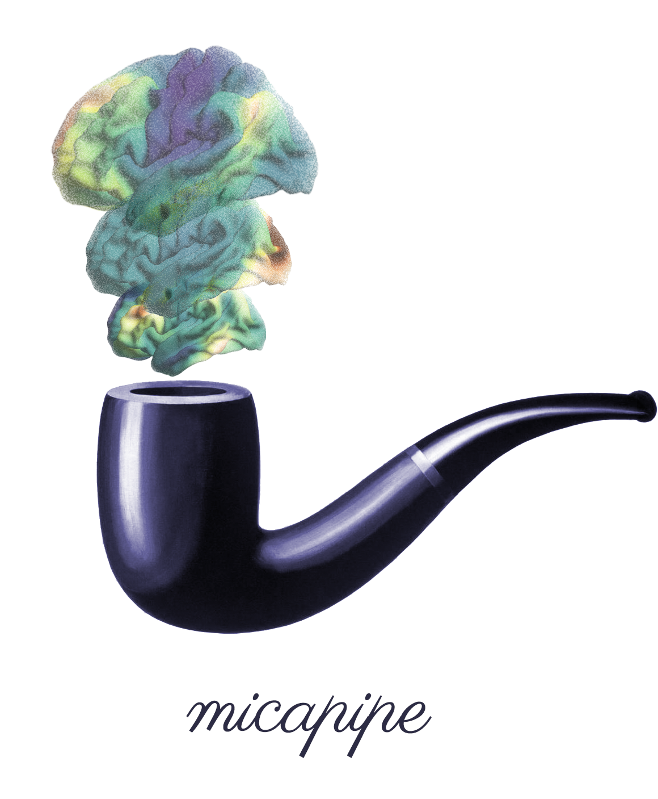

.. MICAPIPE documentation master file, created by
   sphinx-quickstart on Wed Jul 15 16:09:38 2020.
   You can adapt this file completely to your liking, but it should at least
   contain the root `toctree` directive.

.. **micapipe**
   ============================
   *An open source repository about the micapipe, a preprocessing pipeline for structural, diffusion and resting state fMRI data.*

.. title:: micapipe

.. raw:: html

   

**Welcome to the MICA lab pipeline**
==========================================

Getting started
--------------------------------------------------------
One key goal of the **MICAPIPE** is
to harmonize analytical methods both *within* and *across* ENIGMA Working Groups, ultimately facilitating
comparisons of imaging and genetic findings across diseases.

.. raw:: html

    

Main workflow ⚙️
-------------------------------------
Tired of displaying your surface findings in tables? Look no further! The **MICAPIPE** has got you
covered! Check out our :ref:`visualization tools<execution>` and project your cortical and subcortical data to the surface!

.. raw:: html

    

Processing steps 👣
-------------------------------------
Tired of displaying your surface findings in tables? Look no further! The **MICAPIPE** has got you
covered! Check out our :ref:`visualization tools<execution>` and project your cortical and subcortical data to the surface!

.. raw:: html

    

Quality Check
------------------------------------
The **MICAPIPE** has a *No data, No problem* policy! To make things easier, we provide from an individual site
that have been processed according to ENIGMA protocols. Using our example data, previously published summary statistics, or any other ENIGMA-derived
datasets, you can easily complete all of the tutorials!

.. raw:: html

    

Additional tools
-------------------------------------------

.. raw:: html

    

Development and getting involved ⚙️
-------------------------------------------
Should you have any problems, questions, or suggestions about the **MICAPIPE**, please do not
hesitate to post them to our Github `issues <https://github.com/MICA-MNI/micapipe/issues>`_! Or are you interested in collaborating
or sharing your codes/tools? `Noice <https://www.urbandictionary.com/define.php?term=noice>`_!
Make sure you familiarize yourself with our `contributing guidelines <https://github.com/MICA-MNI/micapipe/blob/master/CONTRIBUTING.md>`_
first and then discuss your ideas on our Github `issues <https://github.com/MICA-MNI/micapipe/issues>`_ and
`pull request <https://github.com/MICA-MNI/micapipe/pulls>`_.

.. raw:: html

    

References
-------------------------------------------
Detailed information regarding the software and tools used in this pipeline

.. toctree::
   :maxdepth: 1
   :hidden:
   :caption: Getting started

   pages/01.install/index
   pages/02.whatyouneed/index
   pages/03.execution/index
   pages/09.whatsnew/index

.. toctree::
   :maxdepth: 1
   :hidden:
   :caption: Processing steps

   pages/04.volumetric/index
   pages/05.freesurfer/index
   pages/06.dwi/index
   pages/07.restingstate/index
   pages/08.postmpc/index
   pages/17.geodesic/index

.. toctree::
   :maxdepth: 1
   :hidden:
   :caption: Additional tools

   pages/14.micapipe_anonymize/index
   pages/15.micapipe_cleanup/index
   pages/16.mic2bids/index

.. toctree::
   :maxdepth: 1
   :hidden:
   :caption: References & Acknowledgements

   pages/13.writeitdown/index
   pages/10.citingmicapipe/index
   pages/11.references/index
   pages/12.acknowledge/index

___________________________________________________________________________________________________

Creators 🧠
-------------------------

- **Raúl Rodríguez-Cruces**, *MICA Lab - Montreal Neurological Institute*
- **Jessica Royer**, *MICA Lab - Montreal Neurological Institute*
- **Sara Larivière**, *MICA Lab - Montreal Neurological Institute*
- **Bo-yong Park**, *MICA Lab - Montreal Neurological Institute*
- **Reinder Vos de Wael**, *MICA Lab - Montreal Neurological Institute*
- **Casey Paquola**, *MICA Lab - Montreal Neurological Institute*
- **Oualid Benkarim**, *MICA Lab - Montreal Neurological Institute*
- **Boris Bernhardt**, *MICA Lab - Montreal Neurological Institute*
