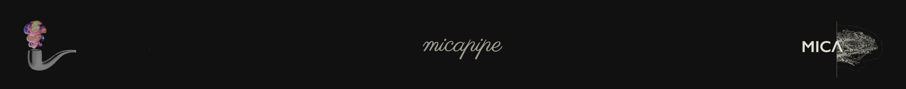

.. MICAPIPE documentation master file, created by
   sphinx-quickstart on Wed Jul 15 16:09:38 2020.
   You can adapt this file completely to your liking, but it should at least
   contain the root `toctree` directive.

**micapipe**
============================
*An open source repository about the micapipe, a preprocessing pipeline for structural, diffusion and resting state fMRI data.*

.. title:: micapipe

.. raw:: html

   

    
.. image:: ./figures/micapipe.png
   :scale: 50 %
   :alt: alternate text
   :align: center
    

**Welcome to the MICA lab pipeline**
==========================================

Advantages
--------------------------------------------------------
Volume and surface based processing.
Ready to use outputs.
Generation of diffusion MRI structural connectomes. 
Generation of resting state functional connectomes. 
Generation of microstructure profile covariance networks. 
Use of multiple parcellations and scales.
Including cerebellum and subcortical areas.
Easy to use and relying on BIDS.
Dependencies on widely used software. 

.. raw:: html

    

Development and getting involved ⚙️
-------------------------------------------
Should you have any problems, questions, or suggestions about the **MICAPIPE**, please do not
hesitate to post them to our Github `issues <https://github.com/MICA-MNI/micapipe/issues>`_! Or are you interested in collaborating
or sharing your codes/tools? `Noice <https://www.urbandictionary.com/define.php?term=noice>`_!
Make sure you familiarize yourself with our `contributing guidelines <https://github.com/MICA-MNI/micapipe/blob/master/CONTRIBUTING.md>`_
first and then discuss your ideas on our Github `issues <https://github.com/MICA-MNI/micapipe/issues>`_ and
`pull request <https://github.com/MICA-MNI/micapipe/pulls>`_.

.. raw:: html

    

Development team 🧠
-------------------------

- **Raúl Rodríguez-Cruces**, *MICA Lab - Montreal Neurological Institute*
- **Jessica Royer**, *MICA Lab - Montreal Neurological Institute*
- **Sara Larivière**, *MICA Lab - Montreal Neurological Institute*
- **Bo-yong Park**, *MICA Lab - Montreal Neurological Institute*
- **Reinder Vos de Wael**, *MICA Lab - Montreal Neurological Institute*
- **Casey Paquola**, *MICA Lab - Montreal Neurological Institute*
- **Oualid Benkarim**, *MICA Lab - Montreal Neurological Institute*
- **Boris Bernhardt**, *MICA Lab - Montreal Neurological Institute*
