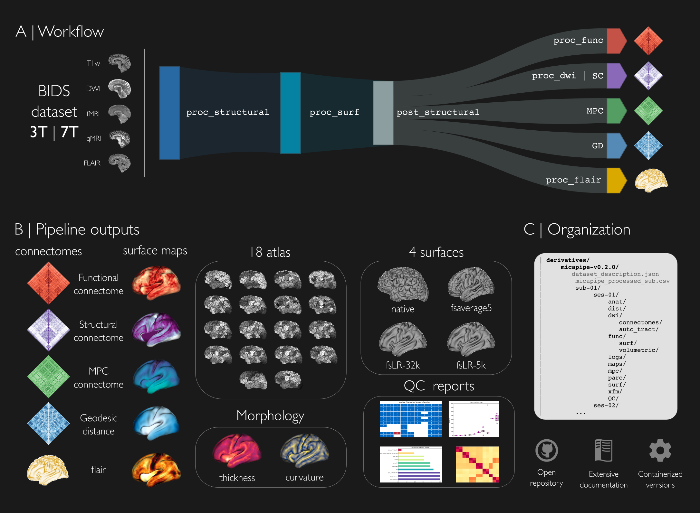

.. MICAPIPE documentation master file, created by
   sphinx-quickstart on Wed Jul 15 16:09:38 2020.
   You can adapt this file completely to your liking, but it should at least
   contain the root `toctree` directive.

.. raw:: html

   

.. .. image:: https://readthedocs.org/projects/micapipe/badge/?version=latest
  :target: https://micapipe.readthedocs.io/en/latest/?badge=latest
  :alt: Documentation Status

**Welcome to micapipe's documentation!**
========================================================

.. image:: https://img.shields.io/badge/version-v0.1.2.RC-blue
  :target: https://github.com/MICA-MNI/micapipe
  :alt: version

.. image:: https://img.shields.io/github/license/MICA-MNI/micapipe
  :target: https://www.gnu.org/licenses/gpl-3.0
  :alt: License: GPL v3

.. image:: https://readthedocs.org/projects/micapipe/badge/?version=latest
  :target: https://micapipe.readthedocs.io/en/latest/?badge=latest
  :alt: Documentation Status

.. image:: https://circleci.com/gh/MICA-MNI/micapipe/tree/master.svg?style=shield
  :target: https://circleci.com/gh/rcruces/MICA-MNI/tree/master
  :alt: CircleCI

.. image:: https://api.codacy.com/project/badge/Grade/7da8a9a3524745bc9616fd465a17f41b
  :target: https://app.codacy.com/gh/rcruces/micapipe?utm_source=github.com&utm_medium=referral&utm_content=rcruces/micapipe&utm_campaign=Badge_Grade
  :alt: Codacy Badge

.. image:: https://img.shields.io/github/stars/MICA-MNI/micapipe
  :target: https://github.com/MICA-MNI/micapipe/stargazers
  :alt: GitHub stars

.. image:: https://img.shields.io/github/issues/MICA-MNI/micapipe
  :target: https://github.com/MICA-MNI/micapipe/issues
  :alt: GitHub issues

.. image:: https://img.shields.io/docker/pulls/micalab/micapipe
  :target: https://hub.docker.com/r/micalab/micapipe
  :alt: Docker Pulls

.. image:: https://img.shields.io/docker/v/micalab/micapipe?color=orange&label=docker%20version
  :target: https://hub.docker.com/r/micalab/micapipe
  :alt: Docker Image Version (latest by date)

*Micapipe* is a processing pipeline providing a robust framework to analyze multimodal MRI data. This pipeline integrates processing streams for *T1-weighted*, *microstructure-sensitive*, *diffusion-weighted*, and *resting-state functional imaging* to facilitate the development of multiscale models of neural organization. For this purpose, we leverage several specialized software packages to bring BIDS-formatted raw MRI data to fully-processed surface-based feature matrices.

.. raw:: html

    

Breaking news ️‍📰
--------------------------------------------------------
`micapipe version 2` soon to be released!! stay tuned!

About 👁️‍🗨️
--------------------------------------------------------
*Micapipe* generates systematic descriptions of cortico-cortical microstructural similarity, functional connectivity, structural connectivity, and spatial proximity. We hope that this open tool will be of use to researchers studying human brain structure and function across different spatial scales. The connectomes can be generated across 18 different cortical parcellations (100-1000 parcels), in addition to subcortical and cerebellar parcellations. Most results are mapped to three different surfaces spaces: native, conte69 and fsaverage5, and all outputs are hierarchically ordered with BIDS conformed naming.

.. raw:: html

    

Reproducibility 👯‍♀️
--------------------------------------------------------
To encourage reproducibility and robustness of investigations using micapipe, we provide a fully containerized version of the pipeline in the form of a `Docker container <https://hub.docker.com/r/micalab/micapipe>`_. Step-by-step tutorials are provided for bare metal and containerized :ref:`installations <download_page>`. We encourage users to use containerized versions, offered through Docker and Singularity, given the large number of :ref:`software dependencies<what_need>` used by the pipeline to handle multiple MRI data modalities.

.. raw:: html

    

Datasets 🕵️‍♀️
--------------------------------------------------------
Micapipe has been tested on several locally acquired datasets, as well as openly available repositories such as `Microstructure-Informed Connectomis (MICA-MICs) <https://doi.org/10.1101/2021.08.04.454795>`_ `Cambridge Centre for Ageing and Neuroscience (Cam-CAN) <https://www.cam-can.org/index.php?content=dataset>`_, `EpiC-UNAM <https://github.com/rcruces/2020_cognition_connectomics_TLE>`_, `Midnight Scan Club  <https://openneuro.org/datasets/ds000224/versions/1.0.3>`_, `Auditory localization with 7T fMRI <https://openneuro.org/datasets/ds001942/versions/1.2.0>`_, `SUDMEX_CONN  <https://openneuro.org/datasets/ds003346/versions/1.1.1>`_ and `HCP <https://www.humanconnectome.org>`.

.. raw:: html

    

Development and getting involved 🙋‍♀️
--------------------------------------------------------
Should you have any problems, questions, or suggestions about micapipe, please post an `issue <https://github.com/MICA-LAB/micapipe/issues>`_ or formulate a `pull request <https://github.com/MICA-LAB/micapipe/pulls>`_ on our repository.

.. toctree::
   :maxdepth: 1
   :hidden:
   :caption: Getting started

   pages/01.install/index
   pages/01.whatyouneed/index
   pages/01.whatsnew/index

.. toctree::
   :maxdepth: 1
   :hidden:
   :caption: Processing modules

   pages/02.structuralproc/index
   pages/02.dwiproc/index
   pages/02.restingstateproc/index
   pages/02.microstructproc/index
   pages/02.qc/index
   pages/02.aslproc/index

.. toctree::
   :maxdepth: 1
   :hidden:
   :caption: Additional tools

   pages/05.mic2bids/index
   pages/05.micapipe_cleanup/index
   pages/05.micapipe_anonymize/index
   pages/05.autotract/index

.. toctree::
   :maxdepth: 1
   :hidden:
   :caption: Tutorials

   pages/04.start2end/index
   pages/04.databases/index
   pages/04.matrices/index
   pages/04.surfaces/index
   pages/04.gradients/index
   pages/04.tckdownsample/index
   pages/04.faq/index

.. toctree::
   :maxdepth: 1
   :hidden:
   :caption: References & Acknowledgements

   pages/06.citingmicapipe/index
   pages/06.references/index
   pages/06.acknowledge/index

--------------------------------------------------------

.. raw:: html

    

Core development team 🧠
--------------------------------------------------------

.. figure:: ./figures/micapipe.png
   :alt: alternate text
   :align: left
   :scale: 20 %

Micapipe is developed by members of the MICA-lab (https://mica-mni.github.io) and collaborators at the McConnell Brain Imaging Centre of the Montreal Neurological Institute.

- **Raúl Rodríguez-Cruces**, *MICA Lab - Montreal Neurological Institute*
- **Jessica Royer**, *MICA Lab - Montreal Neurological Institute*
- **Sara Larivière**, *MICA Lab - Montreal Neurological Institute*
- **Peer Herholz**, *NeuroDataScience, ORIGAMI lab - Montreal Neurological Institute*
- **Bo-yong Park**, *MICA Lab - Montreal Neurological Institute*
- **Reinder Vos de Wael**, *MICA Lab - Montreal Neurological Institute*
- **Casey Paquola**, *MICA Lab - Montreal Neurological Institute*
- **Oualid Benkarim**, *MICA Lab - Montreal Neurological Institute*
- **Boris Bernhardt**, *MICA Lab - Montreal Neurological Institute*
