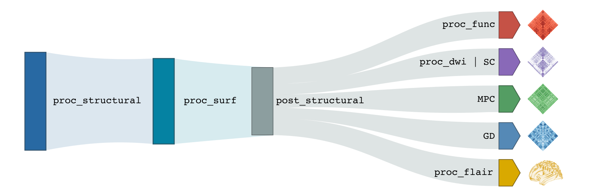

.. _execution:

.. title:: Running micapipe: overview

Micapipe usage overview
============================================================

But how exactly does one run micapipe?

.. admonition:: Help! 🥺

	A list and brief descripton of each argument and flag can be displayed using the command: ``mica-pipe -help`` or ``mica-pipe -h``. It will display something like this:

  .. figure:: help.png
	:height: 480
	:width: 760

Running micapipe
--------------------------------------------------------
Basic usage of micapipe, with no options specified, will look like:

    .. parsed-literal::
        $ mica-pipe **-sub** <subject_id> **-out** <outputDirectory> **-bids** <BIDS-directory> **-ses** <session-name> **-<module-flag>**

It's not necessary to specify ``ses`` if your database does not contain any, and the basic usage will look like:

    .. parsed-literal::
        $ mica-pipe **-sub** <subject_id> **-out** <outputDirectory> **-bids** <BIDS-directory> **-<module-flag>**

Let's break this down:

-sub            Corresponds to subject ID. Even if your data is in BIDS, we exclude the "sub-" substring from the ID code (e.g. sub-HC001 is entered as -sub HC001). However if you forget the ``sub-`` micapipe will manage it.
-out            Output directory path. Following BIDS, this corresponds to the "derivatives" directory associated with your dataset. Inside this directory the pipeline will create a new folder called ``micapipe``, containing all the derivatives.
-bids           Path to rawdata BIDS directory.
-ses            This optional flag allows the user to specify a session name (e.g. 01, 02, pre, post...). If omitted, all processing will be managed as a single session.
-module_flag    Specifies which submodule(s) to run (see next section).

.. admonition:: WARNING: ⚠️ ``-ses`` ⚠️

        if your data contains a session directory (eg. ``sub-01/ses-01``) but you don’t specify the session, the script by default assumes is a single session with the ``sub-01/anat`` structure instead of ``sub-01/ses-01/anat``, this will led to a bunch of errors!

Module flags
--------------------------------------------------------
The processing modules composing micapipe can be run individually or bundled using specific flags. The modular structure of micapipe allows to process different databases with a wide variety of acquisitions. However the backbone of this modular structure is the structural processing. Below you can find a diagram with the processing workflow of micapipe.

T1w Structural Processing
^^^^^^^^^^^^^^^^^^^^^^^^^

Processing modules for :ref:`T1-weighted structural imaging<structproc>` consist of:

-proc_structural     Basic volumetric processing on T1-weighted data.
-proc_freesurfer     Run freesurfer's recon-all pipeline on T1-weighted data.
-post-structural     Further structural processing relying on qualtiy-controlled cortical surface segmentations.
-GD                  Generate geodesic distance matrices from participant's native midsurface mesh.
-Morphology          Registration and smoothing of surface-based morphological features of the cortex.

Quantitative Image Processing
^^^^^^^^^^^^^^^^^^^^^^^^^^^^^

Processing module for :ref:`quantitative T1 imaging<microstructproc>`:

-MPC     Equivolumetric surface mapping and generate microstructural profile covariance matrices `(Paquola et al., 2019) <https://journals.plos.org/plosbiology/article?id=10.1371/journal.pbio.3000284>`_.

DWI Processing
^^^^^^^^^^^^^^

Flags for :ref:`diffusion-weighted imaging<dwiproc>` processing steps:

-proc_dwi     Basic diffusion-weighted imaging processing.
-SC           Diffusion tractography and generate structural connectomes.

Resting State fMRI Processing
^^^^^^^^^^^^^^^^^^^^^^^^^^^^^

Flag to process :ref:`resting-state functional MRI data<restingstateproc>`:

-proc_rsfmri     Resting-state functional processing and generate functional connectomes.

Integrated Quality Control
^^^^^^^^^^^^^^^^^^^^^^^^^^

Flags for :ref:`quality control<qc>`:

-QC_subj     Creates an individual report of the different modules already processed with the different outputs by module.
-QC     Creates a group-level table of the subjects already processed.

Run all the modules
^^^^^^^^^^^^^^^^^^^

Lastly, to run all processing steps while making sure module interdependencies are respected:

-all     Run all the modules! This could take a while...

.. WARNING:: This flag might not be suitable for every database, thus should be use with caution.

More options
--------------------------------------------------------

.. admonition:: But wait... there's more! 🙀

	**Optional arguments** can be specified for some modules. See the ``Usage`` tab of each module's dedicated section for details!

You can specify additional options when running micapipe:

-ses             Specify the session name with this flag (default: processing is performed as a single session).
-h, -help        Print your currently installed software version.
-v, -version     Print your currently installed software version.
-force           Overwrite existing data in the subject directory.
-quiet           Do not print comments and warnings.
-nocleanup       Prevent deletion of temporary directory created for the module.
-threads         Change number of threads (default = 6).
-tmpDir          Specify custom location in with temporary directory will be created (default = /tmp).
-version         Print your currently installed software version.
-slim            Keep only crucial outputs and erase all the intermediary files

.. admonition:: ``micapipe_cleanup``  🧹

	If you have to erase the outputs of a specific module, you don't have to do this task manually. Check `micapipe_cleanup <../05.micapipe_cleanup/index.html>`_ for further information!!

.. admonition:: Slim run 👙 (Work in progress!!)

	Including the **-slim** flag will considerably reduce the number of outputs saved at the end of each module. This can be useful when storage is limited or when processing a very large number of subjects. Files affected by this flag are specified in each module's section.
