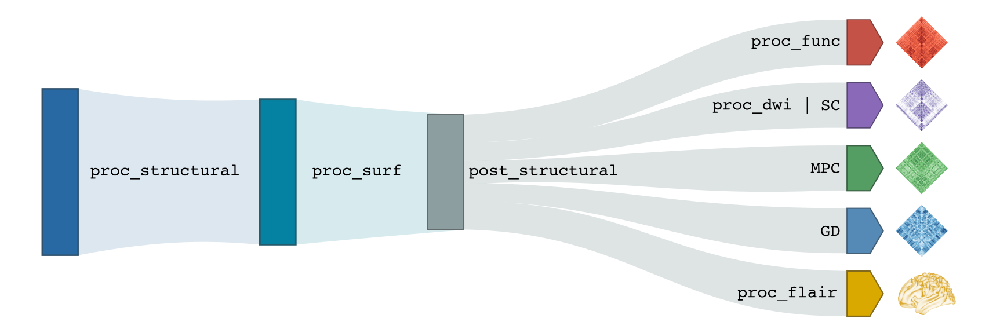

.. _what_need:

.. title:: Getting started

Usages Notes
============================================================

Data format
--------------------------------------------------------
Micapipe requires that your data be formatted in accordance with the `Brain Imaging Data Structure (BIDS) <https://bids.neuroimaging.io>`_ format. You can find the information about the BIDS specification `here <https://bids-specification.readthedocs.io/en/stable/>`_. We strongly recommend that you validate your data structure after the conversion, notably using the `BIDS Validator <https://bids-standard.github.io/bids-validator/>`_.

.. admonition:: DICOM to BIDS: need some help? 🤓

     You can find the function used for BIDS conversion of the MICs dataset on our repository (`mic2bids <https://github.com/MICA-LAB/micapipe/blob/master/functions/mic2bids>`_) and further information here: `From DICOMS to BIDS <../05.mic2bids/index.html>`_. As DICOM naming and sorting can be quite unique to each imaging protocol, you may have to adapt this script to be compatible with your own dataset. First, your DICOMs should be sorted into unique directories for each sequence before running this script. You can then modify the filename strings listed in the script (line 140-146) to correspond to the specific naming scheme of your DICOM directories and their associated BIDS naming convention. Note that you will need `dcm2niix <https://www.nitrc.org/plugins/mwiki/index.php/dcm2nii:MainPage>`_ to convert sorted DICOMs into NifTI files.

Micapipe usage overview
--------------------------------------------------------

But how exactly does one run micapipe?

.. admonition:: Help! 🥺

	A list and brief descripton of each argument and flag can be displayed using the command: ``mica-pipe -help`` or ``mica-pipe -h``. It will display something like this:

  .. figure:: help.png
	:height: 480
	:width: 760

Basic usage of micapipe, with no options specified, will look like:

    .. parsed-literal::
        $ mica-pipe **-sub** <subject_id> **-out** <outputDirectory> **-bids** <BIDS-directory> **-<module-flag>**

If your dataset contains multiple scanning sessions for each subject, you may specify the name of the session (e.g. 01, 02, pre, post...) using the ``-ses`` option, like in the example below:

    .. parsed-literal::
        $ mica-pipe **-sub** <subject_id> **-out** <outputDirectory> **-bids** <BIDS-directory> **-ses** <session-name> **-<module-flag>**

Let's break this down:

.. list-table::
  :widths: 10 1000
  :header-rows: 1

  * - **Options**
    - **Description**
  * - ``-sub``
    - Corresponds to subject ID. Even if your data is in BIDS, we exclude the ``sub-`` substring from the ID code (e.g. to process data for ``sub-HC001``, you would specify ``-sub HC001``). However if you forget the ``sub-`` micapipe will manage it.
  * - ``-out``
    - Output directory path. Following BIDS, this corresponds to the **derivatives** directory associated with your dataset. Inside this directory the pipeline will create a new folder called ``micapipe``, containing all the derivatives.
  * - ``-bids``
    - Path to **rawdata** BIDS directory.
  * - ``-ses``
    - This optional flag allows the user to specify a session name (e.g. 01, 02, pre, post...). If omitted, all processing will be managed as a single session.
  * - ``-module_flag``
    - Specifies which submodule(s) to run (see next section).

.. admonition:: Don't forget to specify ``-ses`` if needed! 💡

        If the dataset contains a session directory (eg. ``/dataset/rawdata/sub-01/ses-01``) but the session flag is omitted during processing, micapipe will assume that the dataset consists of a single session. It will thus use the ``/sub-01/anat`` structure instead of ``/sub-01/ses-01/anat``, and lead to a bunch of errors!

Module flags
--------------------------------------------------------
The processing modules composing micapipe can be run individually or bundled using specific flags. The modular structure of micapipe allows for the processing of different databases with a wide variety of acquisitions. The backbone of this modular structure is the structural processing. Below you can find a diagram with the processing workflow of micapipe.

T1w Structural Processing
^^^^^^^^^^^^^^^^^^^^^^^^^

Processing modules for :ref:`T1-weighted structural imaging<structproc>` consist of:

.. list-table::
  :widths: 10 1000
  :header-rows: 0

  * - ``-proc_structural``
    - Basic volumetric processing on T1-weighted data.
  * - ``-proc_freesurfer``
    - Run freesurfer's recon-all pipeline on T1-weighted data.
  * - ``-post-structural``
    - Further structural processing relying on qualtiy-controlled cortical surface segmentations.
  * - ``-GD``
    - Generate geodesic distance matrices from participant's native midsurface mesh.
  * - ``-Morphology``
    - Registration and smoothing of surface-based morphological features of the cortex.

Microstructure-sensitive Image Processing
^^^^^^^^^^^^^^^^^^^^^^^^^^^^^^^^^^^^^^^^^

Processing module for :ref:`quantitative T1 imaging<microstructproc>`:

.. list-table::
  :widths: 10 1000
  :header-rows: 0

  * - ``-MPC``
    - Equivolumetric surface mapping and computation of microstructural profile covariance matrices `(Paquola et al., 2019) <https://journals.plos.org/plosbiology/article?id=10.1371/journal.pbio.3000284>`_ and `(Wagstyl et al., 2018) <https://github.com/kwagstyl/surface_tools>`_.

DWI Processing
^^^^^^^^^^^^^^

Processing modules for :ref:`diffusion-weighted imaging<dwiproc>` processing steps:

.. list-table::
  :widths: 10 1000
  :header-rows: 0

  * - ``-proc_dwi``
    - Basic diffusion-weighted imaging processing.
  * - ``-SC``
    - Diffusion tractography and generate structural connectomes.

Resting-State fMRI
^^^^^^^^^^^^^^^^^^^^^^^^^^^^^

Processing module for :ref:`resting-state functional MRI data<restingstateproc>`:

.. list-table::
  :widths: 10 1000
  :header-rows: 0

  * - ``-proc_rsfmri``
    - Resting-state functional processing and generate functional connectomes.

Integrated Quality Control
^^^^^^^^^^^^^^^^^^^^^^^^^^

Flags for :ref:`quality control<qc>`:

.. list-table::
  :widths: 10 1000
  :header-rows: 0

  * - ``-QC_subj``
    - Creates an individual report of the different modules already processed with the different outputs by module.
  * - ``-QC``
    - Creates a group-level table of the subjects already processed.

Run all modules
^^^^^^^^^^^^^^^^^^^

Lastly, to run all processing steps while making sure module interdependencies are respected:

.. list-table::
  :widths: 10 1000
  :header-rows: 0

  * - ``-all``
    - Run all the modules! This could take a while...

.. WARNING:: This flag might not be suitable for all databases, and should be use with caution!

More options
--------------------------------------------------------

.. admonition:: But wait... there's more! 🙀

	**Optional arguments** can be specified for some modules. See the ``Usage`` tab of each module's dedicated section for details!

You can specify additional options when running micapipe:

.. list-table::
  :widths: 10 1000
  :header-rows: 0

  * - ``-ses``
    - Specify the session name with this flag (default: processing is performed as a single session).
  * - ``--h``, ``-help``
    - Print your currently installed software version.
  * - ``--v``, ``-version``
    - Print your currently installed software version.
  * - ``-force``
    - Overwrite existing data in the subject directory.
  * - ``-quiet``
    - Do not print comments and warnings.
  * - ``-nocleanup``
    - Prevent deletion of temporary directory created for the module.
  * - ``-threads``
    - Change number of threads (default = 6).
  * - ``-tmpDir``
    - Specify custom location in with temporary directory will be created (default = /tmp).
  * - ``-slim``
    - Keep only crucial outputs and erase all the intermediary files (work in progress - see below)

.. admonition:: Clean up 🧹

	If you have to erase the outputs of a specific module, you don't have to do this task manually. Check `micapipe_cleanup <../05.micapipe_cleanup/index.html>`_ for details!

.. admonition:: Slim run 👙 (Work in progress!)

	Including the **-slim** flag will considerably reduce the number of outputs saved at the end of each module. This can be useful when storage is limited or when processing a very large number of subjects. Files affected by this flag are specified in each module's section.