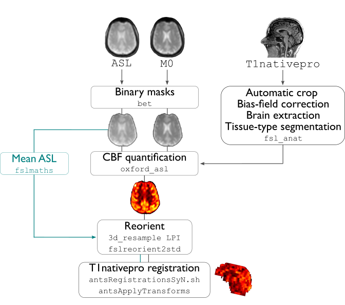

.. _aslproc:

.. title:: ASL

Arterial spin labeling processing
============================================================

This module performs all processing of a subject's perfusion arterial spin labeling MRI (ASL MRI) scan to generate a calibrated map of resting-state cerebral blood flow (CBF). This pipeline is mainly based on a command line tool *oxford_asl* from the BASIL toolset and uses tools from FSL, AFNI, and ANTs for volume processing.

-proc_asl
--------------------------------------------------------

.. admonition:: Prerequisites 🖐🏼

     You need to run ``-proc_structural`` before this stage

.. tabs::

    .. tab:: Processing steps

            - Average ASL timeseries to generate a reference image
            - Calculate binary mask from ASL and M0 calibration scans (separately)
            - Automatically crop, bias-field correct, skull strip and segment structural image (nativepro)
            - Run BASIL's oxford_asl to compute calibrated map of CBF
            - Reorient ASL reference and CBF images to standard orientation (LPI)
            - Compute linear registration between ASL and T1-nativepro space
            - Register processed CBF map to native cortical surface

    .. tab:: Usage

        **Terminal:**

        .. parsed-literal::
            $ mica-pipe **-sub** <subject_id> **-out** <outputDirectory> **-bids** <BIDS-directory> **-proc_asl**

        **Docker command:**

        .. parsed-literal::
            $ docker -proc_asl

        **Optional arguments:**

        ``-proc_asl`` has several optional arguments:

        .. list-table::
            :widths: 100 1000
            :header-rows: 1
            :class: tight-table

            * - **Optional argument**
              - **Description**
            * - ``-aslScanStr`` ``<str>``
              - String to manually identify the main ASL scan for processing (eg. *perf/sub-001_<aslScanStr>.nii.gz*). Default string is *asl*.
            * - ``-m0ScanStr`` ``<str>``
              - String to manually identify the main M0 calibration scan for processing (eg. *perf/sub-001_<m0ScanStr>.nii.gz*). Default string is *m0scan*.

    .. tab:: Outputs

        Directories created or populated by **-proc_asl**:

        .. parsed-literal::

            - <outputDirectory>/micapipe/perf
            - <outputDirectory>/micapipe/xfms

        Files generated by **-proc_asl**:

        .. parsed-literal::
            - All volumetric processing outputs:
                - ASL brain mask:
                    *_desc-asl_brain_mask.nii.gz

                - Skull-stripped mean ASL image (reference image):
                    *_desc-aslref_brain.nii.gz*

                - Calibrated cerebral blood flow image in absolute units (from *oxford_asl*):
                    *_desc-preproc_cbf.nii.gz*

                - Calibrated cerebral blood flow image in absolute units in nativepro space:
                    *_space-nativepro_desc-preproc_cbf.nii.gz*

            - ASL registration files are found in *<outputDirectory>/micapipe//xfms*

                - Affine registration between T1w nativepro and rsfmri space:
                    *_from-asl_to-nativepro_mode-image_desc-affine_0GenericAffine.mat*
                    *_from-asl_to-nativepro_mode-image_desc-affine_InverseWarped.nii.gz*
                    *_from-asl_to-nativepro_mode-image_desc-affine_Warped.nii.gz*
