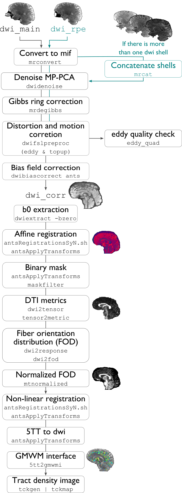

.. _dwiproc:

.. title:: DWI

Diffusion-weighted imaging processing
============================================================

This section describes all DWI-related pre-processing steps implemented in micapipe, which heavily relies on tools from `mrtrix <https://mrtrix.readthedocs.io/en/latest/>`_. This includes image processing in preparation for the construction of tractography-based structural connectivity matrices, as well as associated edge length matrices. This processing pipeline has been optimized for multi-shell DWI, but can also handle single-shell data.

-proc_dwi
--------------------------------------------------------

This module performs required pre-processing of DWI scans, in addition to deriving useful metrics from diffusion images (e.g. fractional anisotropy, mean diffusivity). For multi-shell data, the Dhollander algorithm is applied to estimate response functions of CSF, gray, and white matter, and multi-shell, multi-tissue constrained spherical deconvolution is used to estimate fibre orientation distributions. For single-shell data, the Tournier algorithm and single-shell, single tissue constrained spherical deconvolution are used for these processing steps, respectively.

.. admonition:: Prerequisites 🖐🏼

    You need to run ``-proc_structural`` before this stage

.. tabs::

    .. tab:: Processing steps

        - All DWI scans found in the bids directory are aligned using a rigid-body registration, and concatenated.
        - Concatenated DWI images undergo denoising by MP-PCA and Gibbs ring correction. Residuals are also calculated from denoised images
        - Correction of eddy current-induced distortions and motion
        - Non uniformity bias field correction
        - b0 image is linearly registered to the structural image (nativepro)
        - DWI brain mask is generated by registering MNI152 brain mask to DWI space using previously generated transformations
        - Compute fractional anisotropy and mean diffusivity images
        - Estimate response functions of CSF, gray, and white matter for spherical deconvolution
        - Estimate fibre orientation distributions using spherical deconvolution
        - Compute non-linear transformation from DWI (using white matter fibre orientation distribution image) and structural image aligned to the b0 scan
        - Apply inverse non-linear transformation to 5-tissue-type images for anatomically-constrained tractography
        - Compute track density image with 1 million streamlines using the iFOD1 algorithm. This image is mainly generated for quality control of previous DWI pre-processing.

    .. tab:: Usage

        **Terminal:**

        .. parsed-literal::
            $ mica-pipe **-sub** <subject_id> **-out** <outputDirectory> **-bids** <BIDS-directory> **-proc_dwi**

        **Docker command:**

        .. parsed-literal::
            $ docker -proc_dwi

        **Optional arguments:**

        ``-proc_dwi`` has several optional arguments:

        .. list-table::
            :widths: 75 750
            :header-rows: 1
            :class: tight-table

            * - **Optional argument**
              - **Description**
            * - ``-dwi_main`` ``<path>``
              - Provide path to DWI scans with N number of directions and b0. This will override the default settings: ``<bids>//dwi/*_dir-AP_dwi.nii\*``.
            * - ``-dwi_rpe`` ``<path>``
              - Provide path to b0 DWI scan with reverse phase encoding direction. This will override the default settings: ``<bids>/<subject>/dwi/*_dir-PA_dwi.nii\*``
            * - ``-dwi_processed`` ``<path>``
              - The specified image will be used for further DWI processing, instead of performing pre-processing inside the script.
            * - ``-rpe_all``
              - If all DWI directions and b-values are acquired twice with opposite phase encoding directions this option can be used (This option requires that both encoding direction files contain the same number of directions, bvecs and bvals).
            * - ``-regAffine``
              - Specify this option to perform an Affine registration ONLY from DWI to T1w. By default, DWI processing in micapipe performs a non linear registration using ANTs-SyN. We recommend this option for DWI acquisitions with low resolution and/or low SNR. Or if the non-linear registration is not optimal.

        **Multiple inputs:** ``dwi_main`` **and** ``dwi_rpe``

        If your DWI naming scheme is different than the default, and you want to process multiple shells at the same you can do it using the ``-dwi_main`` and ``-dwi_rpe`` flags. When multiple input scans are provided, seperate the filenames by commas, with no space. Don't forget to specify the full path of the images, as shown below; In this example, the ``shell1`` and ``shell2`` scans of ``sub-01`` will be processed:

        .. code-block:: bash
           :caption: Example
           :linenos:
           :emphasize-lines: 2

            mica-pipe -proc_dwi -sub 01 -out <outputDirectory> -bids <BIDS-directory> \
                      -dwi_main <BIDS-directory>/sub-01/dwi/sub-01_acq-shell1_dwi.nii.gz,<BIDS-directory>/sub-01/dwi/sub-01_acq-shell2_dwi.nii.gz

        .. admonition:: Reverse phase encoding flag ⏮

                If you use the argument ``-dwi_rpe`` but your reverse phase encoding image does not contain a *bval* or *bvec* file, the module will
                assume that all the images are b0s (if more than one). If the file specified under the ``-dwi_rpe`` flag contains any weighted image, it will considerably affect most steps of the processing.

    .. tab:: Outputs

        Directories created or populated by **-proc_dwi**:

        .. parsed-literal::

            - <outputDirectory>/micapipe//dwi
            - <outputDirectory>/micapipe//dwi/eddy
            - <outputDirectory>/micapipe//xfms

        Files generated by **-proc_dwi**:

        .. parsed-literal::
            - DWI pre-processing outputs stored in *<outputDirectory>/micapipe//dwi*. All outputs are in DWI space:

                - Json card with information about DWI processing:
                   *_desc-preproc_dwi.json*

                - DWI residuals from denoising:
                    *_space-dwi_desc-MP-PCA_residuals-dwi.mif*

                - DWI residuals from Gibbs ring correction:
                    *_space-dwi_desc-deGibbs_residuals-dwi.mif*

                - DWI processed with motion, geometric and Bias-field correction:
                    *_space-dwi_desc-dwi_preproc.mif*

                - b0 image used for T1w linear registration to DWI space:
                    *_space-dwi_desc-b0.nii.gz*

                - Subject's T1w image, affine registration to DWI space:
                    *_space-dwi_desc-t1w_nativepro.nii.gz*

                - DWI brain mask, created from MNI152 mask:
                    *_space-dwi_desc-brain_mask.nii.gz*

                - Subject's T1w brain mask, affine registration to DWI space:
                    *_space-dwi_desc-t1w_nativepro-brain.nii.gz*

                - Subject's T1w image, non-linear registration to DWI space:
                    *_space-dwi_desc-t1w_nativepro_NL.nii.gz*

                - 5-tissue-types segmentation, non-linear registration to DWI space:
                    *_space-dwi_desc-5tt.nii.gz*

                - Diffusion tensor image (DTI):
                    *_space-dwi_model-DTI.mif*

                - Fractional anisotropy derived from DTI:
                    *_space-dwi_model-DTI_map-FA.mif*

                - Mean apparent diffusion coefficient (mean diffusivity) derived from DTI:
                    *_space-dwi_model-DTI_map-ADC.mif*

                - Normalized fibre orientation distribution for CSF, gray and white matter:
                    *_space-dwi_model-CSD_map-FOD_desc-csfNorm.mif*
                    *_space-dwi_model-CSD_map-FOD_desc-gmNorm.mif*
                    *_space-dwi_model-CSD_map-FOD_desc-wmNorm.mif*

                - Gray/White matter interface mask:
                    *_space-dwi_desc-gmwmi-mask.mif*

                - Track density image generated from a tractogram of 1 million streamlines, for quality check:
                    *_space-dwi_desc-iFOD1-1M_tdi.mif*
                    *_space-dwi_desc-iFOD1-1M_tractography.json*

            - DWI registration files are found in *<outputDirectory>/micapipe//xfms*

                - Rigid registrations between shells:
                    **_from-acq-<shellN>_to-acq-<shell0>_mode-image_desc-rigid_0GenericAffine.mat
                    **_from-acq-<shellN>_to-acq-<shell0>_mode-image_desc-rigid_InverseWarped.nii.gz
                    **_from-acq-<shellN>_to-acq-<shell0>_mode-image_desc-rigid_Warped.nii.gz

                - Affine registration between T1w nativepro and DWI space:
                    **_space-dwi_from-dwi_to-nativepro_mode-image_desc-affine_0GenericAffine.mat
                    **_space-dwi_from-dwi_to-nativepro_mode-image_desc-affine_InverseWarped.nii.gz
                    **_space-dwi_from-dwi_to-nativepro_mode-image_desc-affine_Warped.nii.gz

                - Non-linear registrations between T1w in dwi space to wmNorm in dwi space:
                    **_space-dwi_from-dwi_to-dwi_mode-image_desc-SyN_0GenericAffine.mat
                    **_space-dwi_from-dwi_to-dwi_mode-image_desc-SyN_1InverseWarp.nii.gz
                    **_space-dwi_from-dwi_to-dwi_mode-image_desc-SyN_1Warp.nii.gz
                    **_space-dwi_from-dwi_to-dwi_mode-image_desc-SyN_InverseWarped.nii.gz
                    **_space-dwi_from-dwi_to-dwi_mode-image_desc-SyN_Warped.nii.gz

            - All outputs from FSL eddy are stored in:
                *<outputDirectory>/micapipe//dwi/eddy*

    .. tab:: TDI quality

        A tract density image (TDI) is a low density snapshot of the tractogram that will be generated in the ``-SC`` module. It is useful in providing a quick overview of the DWI processing quality. We strongly recommend to take your time in checking the quality of the processed DWI before generating the structural connectomes (``-SC``). An abnormal TDI image is a reflection of many different issues with the DWI acquisition or processing, such as:

         - Issues with the DWI DICOMS (missing directions, cropped images, low signal, etc);
         - Low signal to noise ratio (low quality or low resolution);
         - Not enough diffusion directions;
         - Registration errors;
         - Bad encoding of the gradient direction tables (bvecs);
         - Bad encoding of the shell values (bvals);
         - Wrong assignation/encoding of the b0 images (bvals);
         - Large motion artifacts...

        File: ``<outputDirectory>/micapipe//dwi/_space-dwi_desc-iFOD1-1M_tdi.mif``

        .. figure:: tdi_qc.png
            :align: center

-SC
--------------------------------------------------------

This modules computes tractography-based structural connectivity matrices and associated edge length matrices. We apply iFOD2 for this purpose, a probabilistic tractography algorithm.

.. admonition:: Prerequisites 🖐🏼

    You need to run ``-proc_structural``, ``-proc_freesurfer``, ``-post_structural``, and ``-proc_dwi`` before this stage

.. tabs::

    .. tab:: Processing steps

        - Compute tractogram with specified number of streamlines using iFOD2 algorithm
        - Build structural connectomes and edge length matrices from cortical, subcortical, and cerebellar parcellations non-linearly registered to DWI space
        - If requested, compute automatic bundle segmentation using `auto tractography <https://github.com/lconcha/auto_tracto>`_.

    .. tab:: Usage

        **Terminal:**

        .. parsed-literal::
            $ mica-pipe **-sub** <subject_id> **-out** <outputDirectory> **-bids** <BIDS-directory> **-SC**

        **Docker command:**

        .. parsed-literal::
            $ docker -SC

        **Optional arguments:**

        ``-SC`` supports different optional arguments:

        .. list-table::
            :widths: 10 500
            :header-rows: 1
            :class: tight-table

            * - **Optional argument**
              - **Description**
            * - ``-tracts`` ``<num>``
              - Number of streamlines used when computing the tractogram (default is *40M*, where 'M' stands for millions, same as *40,000,000*)
            * - ``-keep_tck``
              - If specified, the tractogram will be copied to *<outputDirectory>/micapipe//dwi/*. By default the tractogram is erased at the end of this module given the large file size.
            * - ``-autoTract``
              - Performs automatic bundle segmentation (optional). See `Automatic Bundle Segmentation <../05.autotract/index.html>`_ for further information.

    .. tab:: Outputs

        Directories created or populated by **-SC**:

        .. parsed-literal::

            - <outputDirectory>/micapipe//dwi
            - <outputDirectory>/micapipe//dwi/connectomes

        Files generated by **-SC**:

        .. parsed-literal::
            - SC processing outputs stored in *<outputDirectory>/micapipe//dwi*:

                - Track density image generated with specified number of streamlines:
                   *_space-dwi_desc-iFOD1-<num>_tdi.mif*

                - Subcortical segmentation in DWI space:
                   *_space-dwi_atlas-subcortical.nii.gz*

                - Cerebellar parcellation in DWI space:
                   *_space-dwi_atlas-cerebellum.nii.gz*

            - Connectome and edge length outputs are stored in *<outputDirectory>/micapipe//dwi/connectomes*:
                - *_space-dwi_atlas-<parcellation>_desc-iFOD2-<tracts>-SIFT2_<nodes>-connectome.txt*
                - *_space-dwi_atlas-<parcellation>_desc-iFOD2-<tracts>-SIFT2_<nodes>-edgeLengths.txt*

                Note on structural connectomes: *<nodes>* can be either...
                   - *cor*: Only cortical nodes are represented in the connectomes/edge length matrix
                   - *sub*: Subcortical and cortical nodes are represented in the the connectomes/edge length matrix
                   - *full*: Subcortical, cerebellar, and cortical nodes are represented in the the connectomes/edge length matrix
