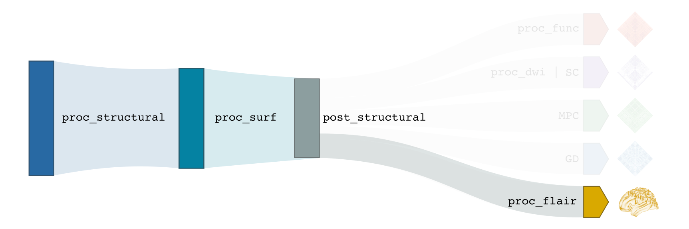

.. _flairproc:

.. title:: FLAIR

Fluid attenuated inversion recovery
============================================================

This module performs normalization of the T2/FLAIR images based on the gray and white matter modes. The image is then registered to nativepro, then mapped to fsnative, fsLR-5k, fsLR-32k, and fsaverage5 surfaces.

-proc_flair
--------------------------------------------------------

.. admonition:: Prerequisites 🖐🏼

    You need to run ``-proc_structural``, ``-proc_surf`` and ``-post_structural`` before this stage

.. tabs::

    .. tab:: Processing steps

        - GM and WM segmentation of flair
        - Bias field correction weighted by white matter
        - Get the mode for each tissue: GM and WM
        - Normalize intensities by peak of WM (mode). This normalization will center the peak of the WM mode intensity at ZERO.
        - Brains mask of the normalized flair
        - Registration of flair to `nativepro`
        - Map flair midthickness to fsLR-32k, fsLR-5k and fsaverage5

    .. tab:: Usage

        **Terminal:**

        .. parsed-literal::
            $ micapipe **-bids** <BIDS-directory> **-sub** <subject_id> **-out** <outputDirectory> **-proc_flair** <options>

        **Optional arguments:**
        ``-proc_flair`` has one optional argument;

        .. list-table::
            :widths: 75 750
            :header-rows: 1
            :class: tight-table

            * - **Optional argument**
              - **Description**
            * - ``-flairScanStr`` ``<path>``
              - String to manually identify the T2/FLAIR scan for processing (eg. anat/sub-001_<flairScanStr>.nii[.gz]) Default='FLAIR'

    .. tab:: Outputs

        Directories created or populated by **-proc_flair**:

        .. parsed-literal::

            - <outputDirectory>/micapipe//maps
            - <outputDirectory>/micapipe//xfm

        Files generated by **-proc_flair**:

        .. parsed-literal::

            - Registration ouputs stored in *<outputDirectory>/micapipe//maps*:

                - _<hemi>_surf-fsaverage5_label-midthickness_flair.func.gii
                - _<hemi>_surf-fsaverage5_label-white_flair.func.gii
                - _<hemi>_surf-fsLR-32k_label-midthickness_flair.func.gii
                - _<hemi>_surf-fsLR-32k_label-white_flair.func.gii
                - _<hemi>_surf-fsLR-5k_label-midthickness_flair.func.gii
                - _<hemi>_surf-fsLR-5k_label-white_flair.func.gii
                - _<hemi>_surf-fsnative_label-midthickness_flair.func.gii
                - _<hemi>_surf-fsnative_label-white_flair.func.gii
                - _space-nativepro_map-flair.json
                - _space-nativepro_map-flair.nii.gz

            - Output stored in *<outputDirectory>/micapipe//xfm*

                - _from-flair_to-nativepro_mode-image_desc-affine_0GenericAffine.mat
