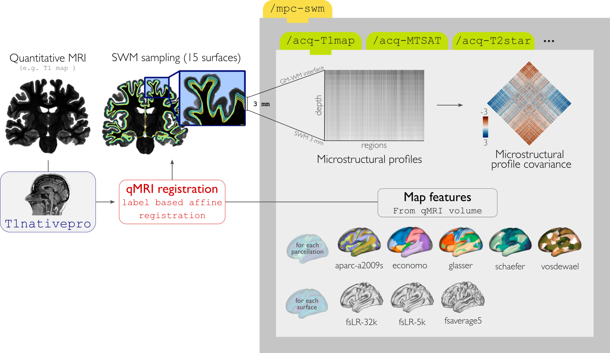

.. _mpcswm:

.. title:: MPC-SWM

Microstructural Superficial White Matter Covariance
============================================================

This module samples superficial white matter intensities from a quantitative MRI in native qMRI space. This is achieved by constructing a series of equivolumetric surfaces between the gray matter boundary and 3 mm below it following a laplacian field.
By parcellating and cross-correlating nodal intensity profiles, this module generates microstructural profile covariance (MPC) matrices describing similiarity in superficial white matter microstructure across the brain.

Superficial white matter surfaces are generated using scripts from the `superficial-white-matter repository <https://github.com/jordandekraker/superficial-white-matter>`_, available via GitHub by Jordan De Kraker.

-MPC_SWM
--------------------------------------------------------

.. admonition:: Prerequisites 🖐🏼

    You need to run ``-proc_structural``, ``-proc_surf`` and ``-post_structural`` before this stage

.. tabs::

    .. tab:: Processing steps

        - Compute registration from qMRI to surface native space.
        - Generate 16 equivolumetric surfaces between the gray matter boundary and 3 mm below it. Surfaces closest to gray matter boundary is then discarded to account for partial volume effects, resulting in 15 surfaces used for further analyses.
        - Perform surface-based registration to fsaverage5, fsLR-32k, fsLR-5k templates
        - Average intensity profiles within parcels defined on the native surface, while excluding outlier vertices
        - Perform partial correlation, controlling for parcel-wide mean profile, across all pairs of intensity profiles

    .. tab:: Usage

        **Terminal:**

        .. parsed-literal::
            $ micapipe **-sub** <subject_id> **-out** <outputDirectory> **-bids** <BIDS-directory> **-MPC_SWM** <options>

        **Optional arguments:**

        ``-MPC_SWM`` has several optional arguments:

        .. list-table::
            :widths: 75 750
            :header-rows: 1
            :class: tight-table

            * - **Optional argument**
              - **Description**
            * - ``-microstructural_img`` ``<path>``
              - Specifies an input quantitative MRI on which to sample intensities for the MPC analysis. By default the pipeline will search this regex `anat/*mp2rage*T1map.nii*` You must specify this flag with the full path to your qMRI (for example, MTR, MTSAT, T2star, T1w/T2w).
            * - ``-microstructural_reg`` ``<path>``
              - Path to scan which will be register to the surface ( e.g INV1, better anatomical contrast ). It MUST be on the same space as the main microstructural image!!.If it is EMPTY will try to find a T1map from here: anat/*mp2rage*T1map.nii*. Set to 'FALSE' to use microstructural_img for registrations.
            * - ``-mpc_acq`` ``<qMRI>``
              - Default=qMRI. Provide a string with this this flag to process new quantitative map. ( this will create a new directory here: mpc-swm/acq-<qMRI> )
            * - ``-regSynth``
              - Specify this option to perform the registration based on synthseg
            * - ``-reg_nonlinear``
              - Specify this option to perform the NON-Linear registration (e.g. MRI with strong geometric distortions).

    .. tab:: Outputs

        Directories created or populated by **-MPC_SWM**:

        .. parsed-literal::

            - <outputDirectory>/micapipe_v0.2.0//mpc-swm/acq_<qMRI>
            - <outputDirectory>/micapipe_v0.2.0//anat
            - <outputDirectory>/micapipe_v0.2.0//xfm

        Files generated by **-MPC_SWM**:

        .. parsed-literal::
            - Microstructural image in native Surfer space:
               *<outputDirectory>/micapipe_v0.2.0//anat/_space-fsnative_<qMRI>.nii.gz*

            - Registration outputs from microstructural image to native FreeSurfer space:
               *<outputDirectory>/micapipe_v0.2.0//xfm/*
                   _from-T1map_to-nativepro_0GenericAffine.mat
                   _from-T1map_to-nativepro_1Warp.nii.gz (optional)
                   _from-T1map_to-nativepro_1InverseWarp.nii.gz (optional)

            - Equivolumetric surface sampling ouputs stored in *<outputDirectory>/micapipe_v0.2.0/mpc-swm/<qMRI>*:

                - MPC-SWM json card:
                   *_MPC-SWM-<qMRI>.json*

                - Native intensity profiles and MPC:
                   *_surf-fsnative_desc-intensity_profiles.shape.gii*

                - fsaverage5 intensity profiles:
                   *_surf-fsaverage5_desc-intensity_profiles.shape.gii*

                - fsLR-32k intensity profiles:
                   *_surf-fsLR-32k_desc-intensity_profiles.shape.gii*

                - fsLR-5k intensity profiles and MPC:
                   *_surf-fsLR-5k_desc-intensity_profiles.shape.gii*
                   *_surf-fsLR-5k_MPC.shape.gii*

                - Parcellated intensity profiles:
                   *_atlas-<atlas>_desc-intensity_profiles.shape.gii*

                - MPC matrices:
                   *_atlas-<atlas>_desc-MPC.shape.gii*
