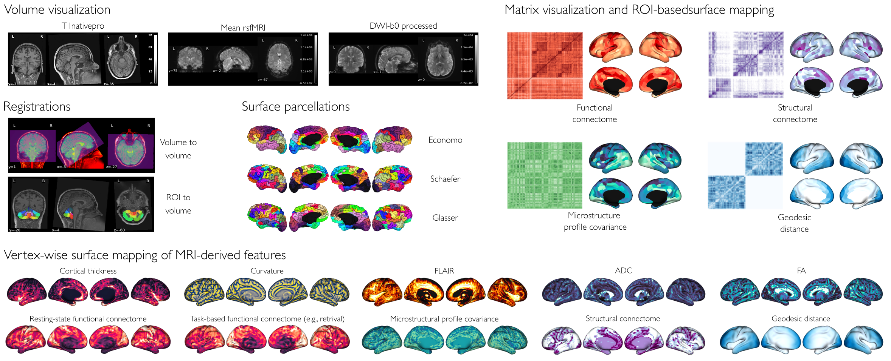
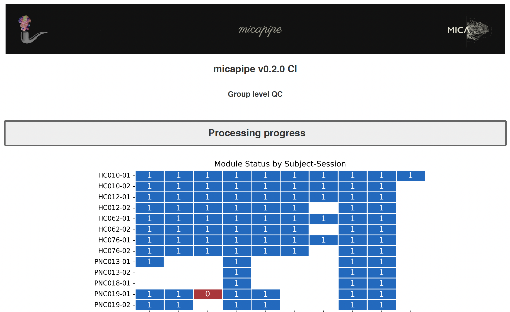

.. _qc:

.. title:: Quality control report

Quality control
============================================================
*micapipe* includes an integrated module for quality control of the outputs, which can be run at any point during processing. This step generates group and individual quality control reports, that will allow you to quickly identify missing files, verify registration performance, and check outputs requiring further inspection.

Individual QC
--------------------------------------------------------

This module generates an individual html report with detailed information of each processing step, which can be used for rapid visualization of the processing status, core registrations, and data matrices by parcellation scheme and module.

There are two ways to run the *individual quality control* module, one is integrated within the main script ``micapipe``. The second is using the stand alone script ``micapipe_qc``. Both options use the same optional arguments.

.. tabs::

    .. tab:: micapipe

        .. code-block:: bash
           :linenos:
           :emphasize-lines: 2

           micapipe -sub <subject_id> -out <outputDirectory> -bids <BIDS-directory> \
           -QC_subj

        **Optional arguments:**

        .. list-table::
            :widths: 75 750
            :header-rows: 1
            :class: tight-table

            * - **Optional argument**
              - **Description**
            * - ``-tracts`` ``<num>``
              - Number of streamlines used when computing the tractograms in ``-SC`` (default is *40M*, where 'M' stands for millions, same as *40,000,000*). If you used a different number of streamlines in your data processing, you should use this flag for the QC and input the same number of streamlines as you previously requested.
            * - ``-ses`` ``<num>`` or ``<str>``
              - Specify the session name with this flag (default: processing is performed as a single session).
            * - ``-tmpDir`` ``<path>``
              - Specify directory for temporary processing outputs.

    .. tab:: Output

        Files created by **-QC_subj**:

        **Main outputs:** ``<outputDirectory>/micapipe_v0.2.0//QC/_module-<proc_module>_qc-report.pdf``

        The subject QC pdf reports contains different tabs, specifically one per module. Under each tab you can find:
          - Main inputs and outputs of each module
          - Main parameters of the processing steps (obtained from the json files)
          - Volume visualization of the main outputs
          - Visualization of the main registrations
          - Different surfaces generated by the pipeline
          - Atlas parcellations plotted on native surface
          - Structural connectome matrices
          - Functional connectome matrices
          - Geodesic distance matrices
          - Microstructural Intensity profiles and connectomes
          - Microstructural profiles (image intensities at each cortical depth) plotted on native surface

        .. parsed-literal::

            - _module-GD_qc-report.pdf
            - _module-MPC-SWM-T1map_qc-report.pdf
            - _module-MPC-T1map_qc-report.pdf
            - _module-post_structural_qc-report.pdf
            - _module-proc_dwi_qc-report.pdf
            - _module-proc_flair_qc-report.pdf
            - _module-proc_func-desc-se_task-rest_acq-AP_bold_qc-report.pdf
            - _module-proc_structural_qc-report.pdf
            - _module-proc_surf-fastsurfer_qc-report.pdf
            - _module-SC-<tracts>_qc-report.pdf
            - _module-SWM_qc-report.pdf

Group level QC
--------------------------------------------------------

The group level quality control generates a report with all completed and processed modules by subjects. The report consists of a color coded table with rows as subjects and columns as the pipeline modules.

- Blue: Completed
- Red: Either incomplete or error
- White: not processed

.. tabs::

    .. tab:: Usage

        .. code-block:: bash
           :linenos:

           micapipe -out <outputDirectory> -QC

        **Optional arguments:**

        There are no optional arguments for this command.

    .. tab:: Output

        The QC table output by ``-QC`` can be found here:

        **Main output:** ``<outputDirectory>/micapipe_v0.2.0/micapipe_group-QC.pdf``
