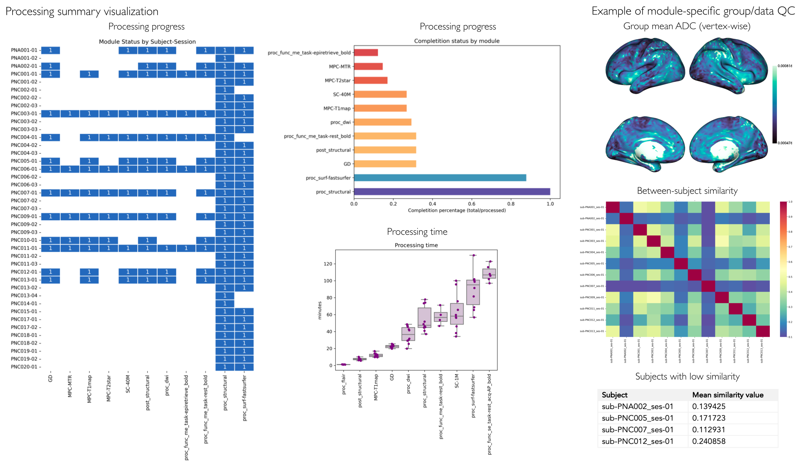

.. _qc:

.. title:: Quality control report

Quality control
============================================================
*micapipe* includes an integrated module for quality control of the outputs, which can be run at any point during processing.
This step generates group and individual quality control reports, that will allow you to quickly identify missing files, registration performance, as well as outputs requiring further inspection (workflow).

Individual QC
--------------------------------------------------------

This module generates an individual html report with detailed information of each processing step, which can be use for rapid visualization of the processing status, core registrations, and data matrices by parcellation scheme and module.

There are two ways to run the *individual quality control* module, one is integrated within the main script ``mica-pipe``. The second is using the stand alone script ``micapipe_qc``. Both options use the same optional arguments.

.. tabs::

    .. tab:: mica-pipe

        .. code-block:: bash
           :linenos:
           :emphasize-lines: 2

           mica-pipe -sub <subject_id> -out <outputDirectory> -bids <BIDS-directory> \
           -QC_subj

        **Optional arguments:**

        -tracts      ``<num>`` Number of streamlines used when computing the tractogram
                     (default is *40M*, where 'M' stands for millions, same as *40000000*).
                     If you used a different number of streamlines you should use this flag for the QC.
        -ses         Specify the session name with this flag (default: processing is performed as a single session).

    .. tab:: micapipe_qc

        .. code-block:: bash
           :linenos:
           :emphasize-lines: 2

           micapipe_qc -sub <subject_id> -out <outputDirectory> -bids <BIDS-directory> \
           -QC_subj

        **Optional arguments:**

        -tracts      ``<num>`` Number of streamlines used when computing the tractogram
                     (default is *40M*, where 'M' stands for millions, same as *40000000*).
                     If you used a different number of streamlines you should use this flag for the QC.
        -ses         Specify the session name with this flag (default: processing is performed as a single session).

    .. tab:: Output

        Directories created or populated by **-QC_subj**:

        .. parsed-literal::

            - <outputDirectory>/micapipe//QC
            - <outputDirectory>/micapipe//QC/QC_png

        **Main output:** ``<outputDirectory>/micapipe//QC/_micapipe_qc.html``

        The subject QC html report contains different tabs, one per module. Under each tab you can find:
          - Main inputs and outputs of each module.
          - Main parameters of the processing steps (obtained from the json files)
          - Volume visualization of the main outputs.
          - Visualization of the main registrations.
          - Different surfaces generated by the pipeline
          - Atlas parcellations plotted on native surface
          - Structural connectome matrices
          - Functional connectome matrices
          - Geodesic distance matrices
          - Microstructural Intensity profiles and connectomes
          - 14 MPC profiles plotted on native surface

        .. figure:: qc_subj_html.png
          :height: 420
          :width: 760

Group level QC
--------------------------------------------------------

The group level quality control, generates a report with all the completed and processed modules by subjects. The report is a color coded table with rows as subjects and columns as the pipeline modules.

- Blue: Completed
- Orange: Either incomplete or error
- Dark gray: not processed

.. tabs::

    .. tab:: Usage

        .. code-block:: bash
           :linenos:

           mica-pipe -out <outputDirectory> -QC

    .. tab:: Output

        **Main output:** ``<outputDirectory>/micapipe/micapipe_progress.html``
