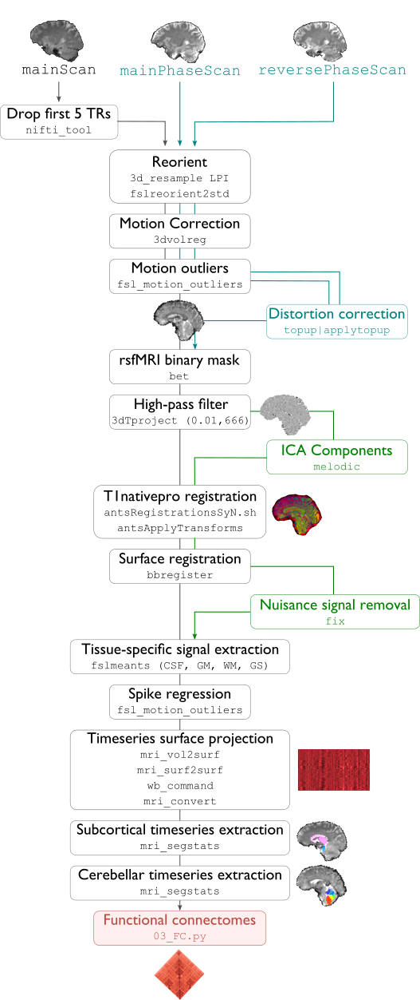

.. _restingstateproc:

.. title:: Functional processing

fMRI processing
============================================================

This module performs all pre-processing of a subject's task or resting-state functional MRI (fMRI) scans, in preparation for the sampling of regional timeseries and construction of functional connectomes. This pipeline is optimized for spin-echo images with reverse phase encoding used for distortion correction. The pipeline is mainly based on tools from FSL and AFNI for volumetric processing, and FreeSurfer and Workbench for surface-based mapping. For increased functionality, micapipe can also handle protocols in which a single fieldmap is acquired.

.. image:: sankey_rsfmri.png
   :align: center

-proc_func
--------------------------------------------------------

.. admonition:: Prerequisites 🖐🏼

     You need to run ``-proc_structural``, ``-proc_freesurfer`` and ``-post_structural`` before this stage

.. tabs::

    .. tab:: Processing steps

            - Remove first five TRs (optional, only if flag ``-dropTR`` is specified) 
            - Reorient input to LPI
            - Perform motion correction within fMRI run and provided fieldmaps by registering each volume to the scan's own average
            - Calculate motion outliers
            - Apply distortion correction to motion-corrected images
            - Calculate binary mask from motion and distortion corrected volume
            - High-pass filtering of functional timeseries to remove frequencies below 0.01Hz
            - Run Multivariate Exploratory Linear Optimized Decomposition into Independent Components (MELODIC) on filtered timeseries
            - Compute linear and non-linear registrations between fMRI and T1-nativepro space, as well as boundary-based registration between fMRI and native Freesurfer space
            - Run FMRIB's ICA-based Xnoiseifier (ICA-FIX) using specified training file. Note that if ICA-FIX is not found on the user's system, or if MELODIC failed, ICA-FIX will be skipped and further processing will be performed using high-pass filtered timeseries
            - Extract global and tissue-specific signal (cerebrospinal fluid, white matter, and gray matter) from processed timeseries
            - Calculate and save motion confounds matrix from processed timeseries
            - Register processed timeseries to the native cortical surface. Minimially pre-processed (i.e. motion and distortion corrected) timeseries are also registered to the native cortical surface to compute statistics such as temporal signal-to-noise
            - Surface-based registration of native surface timeseries to surface templates (fsaverage5, conte69)
            - Native surface, fsaverage5, and conte69-mapped timeseries are each smoothed with a 10mm Gaussian kernel
            - Use previously computed registrations to align cerebellar and subcortical parcellations to fMRI space
            - Concatenate cerebellar, subcortical, and parcellated cortical timeseries
            - Regress motion spikes from cerebellar, subcortical, and cortical timeseries in linear model. If specified using optional flags, regression of tissue-specific signals and six motion confounds (``-NSR``) and global signal (``-GSR``) will also be performed. Following this step, timeseries are saved in two formats: (1) cerebellar regions, subcortical regions, and vertexwise cortical timeseries (conte69), and (2) cerebellar regions, subcortical regions, and parcellated cortical regions.
            - Cross-correlate functional signals across all parcellated regions and output correlation matrix. If flag ``-noFC`` is specified, this step will be skipped.  

    .. tab:: Usage

        **Terminal:**

        .. parsed-literal::
            $ mica-pipe **-sub** <subject_id> **-out** <outputDirectory> **-bids** <BIDS-directory> **-proc_func**

        **Docker command:**

        .. parsed-literal::
            $ docker -proc_func

        .. admonition:: Deprecated ❌

             Note that the flag ``proc_rsfmri`` is deprecated and has been replaced by ``-proc_func``.

        **Optional arguments:**

        ``-proc_func`` has several optional arguments:

        .. list-table:: 
            :widths: 100 1000
            :header-rows: 1
            :class: tight-table

            * - **Optional argument**
              - **Description**
            * - ``-mainScanStr`` ``<str>``
              - String to manually identify the main scan for functional processing (eg. *func/sub-001_<mainScanStr>.nii.gz*). Default string is *task-rest_acq-AP_bold*.
            * - ``-func_pe`` ``<path>``
              - Full path to the main phase encoding scan for functional processing. Default string is *task-rest_acq-APse_bold*.
            * - ``-func_rpe`` ``<path>``
              - Full path to the reverse phase encoding scan for functional processing. If the path is wrong topup will be skipped! Default string is *task-rest_acq-PAse_bold*.
            * - ``-mainScanRun`` ``<num>``
              - If multiple runs of a functional scan with the same identifier exist in the BIDS rawdata, you must specify which scan to process using this flag (e.g. '1').
            * - ``-phaseReversalRun`` ``<num>``
              - If multiple phase encoding runs exist in the BIDS directory (only main phase is checked), you must specify which file to process using this flag (e.g. '1').
            * - ``-topupConfig`` ``<path>``
              - Specify path to config file that should be used for distortion correction using topup. Default is *${FSLDIR}/etc/flirtsch/b02b0_1.cnf*.
            * - ``-smoothWithWB``
              - Specify this option to use workbench tools for surface-based smoothing (more memory intensive). By default, smoothing is performed with freesurfer tools: *mri_surf2surf*.
            * - ``-NSR`` 
              - Specify this option to perform nuisance signal regression, which includes six motion parameters, white matter signal, and CSF signal. By default, this option is set to FALSE (no nuisance signal regression).
            * - ``-GSR``
              - Specify this option to perform global signal regression of timeseries. By default, no global regression is performed.
            * - ``-noFIX``
              - Specify this option to skip ICA-FIX processing. By default, FIX will run with the default training file.
            * - ``-icafixTraining`` ``<path>``
              - Path to specified ICA-FIX training file for nuisance signal regression (file.RData). Default is *${MICAPIPE}/functions/MICAMTL_training_15HC_15PX.RData*.
            * - ``-sesAnat`` ``<str>`` 
              - If longitudinal data is provided, this flag allows to register the current *functional* session to the desired *anatomical* session 
            * - ``-regAffine`` 
              - Specify this option to perform an affine registration ONLY from functional to T1w. By default, functional processing in micapipe performs a non linear registration using ANTs-SyN. We recommend this option for functional acquisitions with low resolution and/or low SNR.
            * - ``-dropTR`` 
              - Specify this option to drop the first five TRs. By default, this option is set to FALSE (all TRs will be processed)
            * - ``-noFC`` 
              - Specify this option to skip the computation of functional connectomes (for example when processing task fMRI data). By default, this option is set to FALSE (functional connectomes are output by default). 

        .. admonition:: Distortion correction ✅

                 If the script can't find the *func_rpe* (reverse phase encoding), or *func_pe* (phase encoding) images, distortion correction will be skipped. If you provide the path to the *func_pe* and *func_rpe* images, make sure the paths are correct! The possible scenarios and conditions in which topup is run (or skipped) are presented in the table below:

                 =========  ========  ======================
                       Inputs                 Output
                 -------------------  ----------------------
                 fmri_rpe   fmri_pe           topup
                 =========  ========  ======================
                    Yes        Yes    runs using pe and rpe
                    Yes        No     runs using main as pe
                    No         No     skipped
                 =========  ========  ======================

        .. admonition:: Notes on ICA-Melodic and ICA-FIX 🛁

                FIX and Melodic are used by default to remove nuisance variable signal. However, our default parameters might not suit all databases. Our default training file used for FIX was trained on resting-state fMRI data from 30 participants (15 healthy controls, 15 patients with drug-resistant epilepsy). Scans were acquired on a 3T Siemens Magnetom Prisma-Fit equipped with a 64-channel head coil. rs-fMRI scans of 7 minutes were acquired using multiband accelerated 2D-BOLD echo-planar imaging (3mm isotropic voxels, TR=600ms, TE=30ms, flip angle=52°, FOV=240×240mm2, slice thickness=3mm, mb factor=6, echo spacing=0.54ms). If your acquisition parameters are similar to this, it may be appropriate for you to use the defaults options in ``-proc_func``. Otherwise, if your acquisition parameters are drastically different, we recommend that you `train your own dataset for FIX <https://fsl.fmrib.ox.ac.uk/fsl/fslwiki/FIX/UserGuide#Training_datasets>`_, or do not use FIX and try a different method for nuisance variable signal removal. In the next example, FIX and Melodic will be skipped, but global signal, white matter and CSF regressions will be applied:

                .. code-block:: bash
                   :caption: Example
                   :linenos:

                   mica-pipe -sub <subject_id> -out <outputDirectory> -bids <BIDS-directory> \
                             -proc_func -noFIX -NSR -GSR

        .. admonition:: Longitudinal acquisitions 👶 👦 👨 👨‍🦳

                 If your database contains multiple sessions (different days) and you wish to register the functional scan to the same
                 anatomical session, you should use the ``-sesAnat`` flag. For example if you database looks like:

                 .. parsed-literal::
                     sub-01
                     ├── ses-func01
                     │   └── func
                     ├── ses-func02
                     │   └── func
                     └── ses-struct01
                         └── anat

                 You should specify ``-sesAnat`` ``struct01`` to register each session to the same anatomical volume. In the next example, sessions ``func01`` and ``func02`` will be registered to the anatomical image in ``struct01``:

                 .. code-block:: bash
                    :caption: Example
                    :linenos:

                     mica-pipe -sub 01 -ses func01 -proc_func -sesAnat struct01 -bids <bidsDir> -out <outDir>
                     mica-pipe -sub 01 -ses func02 -proc_func -sesAnat struct01 -bids <bidsDir> -out <outDir>

    .. tab:: Outputs

        Directories created or populated by **-proc_func**:

        .. parsed-literal::

            - <outputDirectory>/micapipe/func/<mainScanStr>
            - <outputDirectory>/micapipe/func/<mainScanStr>/surfaces
            - <outputDirectory>/micapipe/func/<mainScanStr>/volumetric
            - <outputDirectory>/micapipe/xfms

        Files generated by **-proc_func**:

        .. parsed-literal::
            - All volumetric processing outputs are stored in
                *<outputDirectory>/micapipe/func/<mainScanStr>/volumetric*

                - functional MRI processing json card:
                    *_space-func_desc-se_clean.json*

                - Motion confounds processing (<tag> = reversePhaseScan, mainPhaseScan):
                    *_space-func_desc-se_<tag>.1D*

                - Motion outliers and metric values:
                    *_space-func_desc-se_metric_FD.1D*
                    *_space-func_desc-se_spikeRegressors_FD.1D*

                - Motion and distortion corrected image:
                    *_space-func_desc-se.nii.gz*

                - Mean motion and distortion corrected image:
                    *_space-func_desc-se_mean.nii.gz*

                - Skull-stipped mean motion and distortion corrected image:
                    *_space-func_desc-se_brain.nii.gz*

                - High-pass filtered, motion and distortion corrected image:
                    *_space-func_desc-se_HP.nii.gz*

                - Nuisance-signal regressed timeseries (i.e. output of ICA-FIX) and corresponding json card:
                    *_space-func_desc-se_clean.nii.gz*
                    *_space-func_desc-se_clean.json*

                - Tissue-specific mean signal (<tissue> = CSF, GM, or WM):
                    *_space-func_desc-se_pve_<tissue>.txt*

                - Global mean signal:
                    *_space-func_desc-se_pve_global.txt*

                - Motion outliers and metric values used for motion parameter regression:
                    *_space-func_desc-se_metric_REFMSE.1D*
                    *_space-func_desc-se_spikeRegressors_REFMSE.1D*

                - Subcortical segmentation in fMRI space:
                    *_space-func_desc-se_subcortical.nii.gz*

                - Mean signal in each subcortical parcel:
                    *_space-func_desc-se_timeseries_subcortical.txt*

                - Cerebellar segmentation in fMRI space:
                    *_space-func_desc-se_cerebellum.nii.gz*

                - Mean signal in each cerebellar parcel:
                    *_space-func_desc-se_timeseries_cerebellum.txt*

                - Parcel statistics for cerebellum, to screen for any missing parcels:
                    *_space-func_desc-se_cerebellum_roi_stats.txt*

            - All surface-based metrucs including vertexwise cortical timeseries (<hemi> = rh, lh) are stored in 
            *<outputDirectory>/micapipe/func/<mainScanStr>/surfaces*:

                - Motion and distortion corrected timeseries mapped to native cortical surface:
                    *_func_space-fsnative_<hemi>_NoHP.mgh*

                - Fully pre-processed timeseries mapped to native cortical surface:
                    *_func_space-fsnative_<hemi>.mgh*
                    *_func_space-fsnative_<hemi>_10mm.mgh*

                - Timeseries mapped to fsaverage5 template:
                    *_func_space-fsaverage5_<hemi>.mgh*
                    *_func_space-fsaverage5_<hemi>_10mm.mgh*

                - Timeseries mapped to conte69 template:
                    *_func_space-conte69-32k_<hemi>.mgh*
                    *_func_space-conte69-32k_<hemi>_10mm.mgh*

                - Vertexwise and smoothed timeseries on conte69 template, following regression of specified nuisance variables:
                    *_func_space-conte69-32k_desc-timeseries_clean.txt*

            - Temporal signal-to-noise ratio computed on native cortical surface from motion and distortion correction timeseries:
                *_space-func_desc-se_tSNR.txt*

            - Functional connectome matrices (r-values) generated from smoothed, parcellated timeseries sampled in subcortex, cerebellum, and cortical surface
               <parc> = up to 18 parcellations

                - Conte69 cortical surface:
                    *_func_space-conte69-32k_atlas-<parc>_desc-FC.txt*

                - Native cortical surface:
                    *_func_space-fsnative_atlas-<parc>_desc-FC.txt*

                - Contatenated timeseries sampled in subcortex, cerebellum, and parcellated native cortical surface models:
                    *_func_space-fsnative_atlas-<parc>_desc-timeseries.txt*

            - Registration files to functional imaging space are found in *<outputDirectory>/micapipe//xfms*

                - Boundary based registration from functional space to native freesurfer space:
                    *_from-<mainScanStr>_to-fsnative_bbr_outbbreg_FIX.nii.gz*
                    *_from-<mainScanStr>_to-fsnative_bbr.dat*
                    *_from-<mainScanStr>_to-fsnative_bbr.dat.log*
                    *_from-<mainScanStr>_to-fsnative_bbr.dat.mincost*
                    *_from-<mainScanStr>_to-fsnative_bbr.dat.param*
                    *_from-<mainScanStr>_to-fsnative_bbr.dat.sum*

                - Affine registration between T1w nativepro and functional space:
                    *_from-<mainScanStr>_to-nativepro_mode-image_desc-affine_0GenericAffine.mat*
                    *_from-<mainScanStr>_to-nativepro_mode-image_desc-affine_InverseWarped.nii.gz*
                    *_from-<mainScanStr>_to-nativepro_mode-image_desc-affine_Warped.nii.gz*

                - Non-linear registrations between T1w in dwi space to wmNorm in dwi space:
                    *_from-nativepro_to-<mainScanStr>_mode-image_desc-SyN_0GenericAffine.mat*
                    *_from-nativepro_to-<mainScanStr>_mode-image_desc-SyN_1InverseWarp.nii.gz*
                    *_from-nativepro_to-<mainScanStr>_mode-image_desc-SyN_1Warp.nii.gz*
                    *_from-nativepro_to-<mainScanStr>_mode-image_desc-SyN_InverseWarped.nii.gz*
                    *_from-nativepro_to-<mainScanStr>_mode-image_desc-SyN_Warped.nii.gz*
