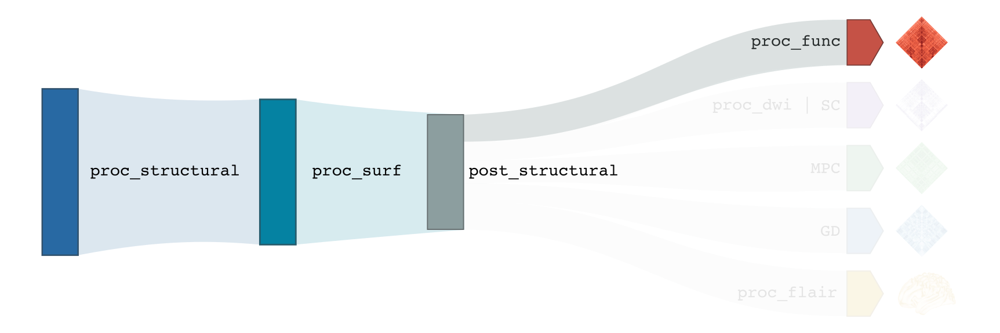
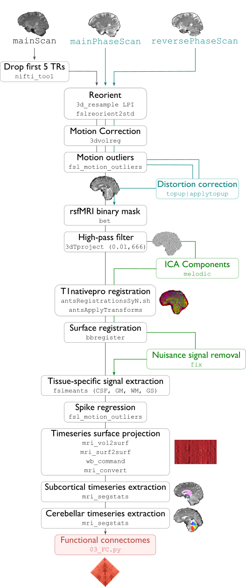

.. _restingstateproc:

.. title:: Functional processing

func processing
============================================================

This module performs all pre-processing of a subject's task or resting-state functional MRI (fMRI) scans, in preparation for the sampling of regional timeseries and construction of functional connectomes. This pipeline is optimized for spin-echo images with reverse phase encoding used for distortion correction and multi echo acquisitionstions. The pipeline is mainly based on tools from FSL and AFNI for volumetric processing, and FreeSurfer and Workbench for surface-based mapping. For increased functionality, micapipe can also handle protocols in which a single fieldmap is acquired.

-proc_func
--------------------------------------------------------

.. admonition:: Prerequisites 🖐🏼

     You need to run ``-proc_structural``, ``-proc_surf`` and ``-post_structural`` before this stage

.. important::
      
    There is **NO inherent smoothing** applied to the fMRI data. If the user desires smoothing, they should customize it according to their preferences and requirements.

.. warning::

   **Nuisance Regression**
   Only the functional connectomes and time series containing the
   string ``clean`` include these confound regressors.  
   All other time series mapped to the surface **do not have nuisance regression applied**.

.. tabs::

    .. tab:: Processing steps

            1. **Drop initial volumes**: Remove the first five TRs (optional, only if ``-dropTR`` flag is specified).

            2. **Reorient images**:  Reorient input fMRI data to LPI orientation.

            3. **Motion correction**: Register each fMRI volume to the scan’s own mean image and apply correction using within-run motion estimates and provided fieldmaps.

            4. **Motion outliers**: Detect framewise motion outliers (spikes), and save outlier regressors for later nuisance regression.

            5. **Distortion correction**: Apply distortion correction to motion-corrected images.

            6. **Masking**: Compute a binary brain mask from motion- and distortion-corrected volume.

            7. **Multi-echo denoising (if applicable)**: If data are multi-echo, run **TEDANA** for echo combination and denoising.

            8. **Temporal filtering**: High-pass filter functional timeseries to remove frequencies below 0.01 Hz.

            9. **Independent component analysis (optional)**: Run **MELODIC** (ICA) on filtered timeseries.

            10. **Nonlinear registration**: Compute nonlinear transforms between fMRI space and T1-nativepro space.

            11. **ICA-based denoising (optional)**: Run **ICA-FIX** with specified training file. If ICA-FIX is not found, or MELODIC failed, skip ICA-FIX and continue using the high-pass filtered timeseries.

            12. **Transform timeseries to functional space**: Apply transformations to resample minimally preprocessed timeseries (``T1nativepro_2mm``) into functional space.

            13. **Extract global and tissue-specific signals**: Compute mean timeseries from **CSF**, **gray matter**, and **white matter** probability maps. Compute **global signal** from the brain mask. Save each as text files.

            14. **Compute motion confounds**: Detect additional motion spikes (framewise reference metrics). Save spike regressors.

            15. **Map to native surface (fsnative)**: Register subject’s cortical surface to functional space. Map functional timeseries from volume to **fsnative surface** (L/R hemispheres).

            16. **Resample to standard surfaces**: Resample fsnative timeseries to ``fsLR-5k``, ``fsLR-32k``, and ``fsaverage5``.

            17. **Temporal SNR (tSNR)**: Compute volumetric tSNR (mean ÷ std). Project tSNR to fsnative surface (per hemisphere).

            18. **Subcortical timeseries**: Transform subcortical segmentation to functional space. Extract mean timeseries for each subcortical structure.

            19. **Cerebellar timeseries**: Transform cerebellar segmentation to functional space. Extract mean timeseries for each cerebellar structure (excluding very small nuclei). Compute ROI statistics.

            20. **Concatenate timeseries**: Align and concatenate **cerebellar**, **subcortical**, and **cortical** parcellated timeseries.

            21. **Nuisance regression**: Always regress motion spikes.
                  - Optional flags:
                  - ``-NSR`` → regress tissue-specific signals and six motion parameters.
                  - ``-GSR`` → regress global signal.

            22. **Save outputs**: Save cleaned timeseries in two formats **Vertexwise cortical timeseries** (``fsLR-32k``) + cerebellar + subcortical and **Parcellated cortical timeseries** + cerebellar + subcortical.

            23. **Functional connectivity**: Cross-correlate parcellated timeseries across all regions. Save the resulting **correlation matrix**. If ``-noFC`` flag is set, skip this step.

    .. tab:: Usage

        **Terminal:**

        .. parsed-literal::
            $ micapipe **-sub** <subject_id> **-out** <outputDirectory> **-bids** <BIDS-directory> **-proc_func**

        **Optional arguments:**

        ``-proc_func`` has several optional arguments:

        .. list-table::
            :widths: 100 1000
            :header-rows: 1
            :class: tight-table

            * - **Optional argument**
              - **Description**
            * - ``-mainScanStr`` ``<str>``
              - String to manually identify the main scan for functional processing (eg. *func/sub-001_<mainScanStr>.nii.gz*). Default string is *task-rest_acq-AP_bold*.
            * - ``-func_pe`` ``<path>``
              - Full path to the main phase encoding scan for functional processing. Default string is *task-rest_acq-APse_bold*.
            * - ``-func_rpe`` ``<path>``
              - Full path to the reverse phase encoding scan for functional processing. If the path is wrong topup will be skipped! Default string is *task-rest_acq-PAse_bold*.
            * - ``-mainScanRun`` ``<num>``
              - If multiple runs of a functional scan with the same identifier exist in the BIDS rawdata, you must specify which scan to process using this flag (e.g. '1').
            * - ``-phaseReversalRun`` ``<num>``
              - If multiple phase encoding runs exist in the BIDS directory (only main phase is checked), you must specify which file to process using this flag (e.g. '1').
            * - ``-topupConfig`` ``<path>``
              - Specify path to config file that should be used for distortion correction using topup. Default is *${FSLDIR}/etc/flirtsch/b02b0_1.cnf*.
            * - ``-NSR``
              - Specify this option to perform nuisance signal regression, which includes six motion parameters, white matter signal, and CSF signal. By default, this option is set to FALSE (no nuisance signal regression).
            * - ``-GSR``
              - Specify this option to perform global signal regression of timeseries. By default, no global regression is performed.
            * - ``-noFIX``
              - Specify this option to skip ICA-FIX processing. By default, FIX will run with the default training file.
            * - ``-icafixTraining`` ``<path>``
              - Path to specified ICA-FIX training file for nuisance signal regression (file.RData). Default is *${MICAPIPE}/functions/MICAMTL_training_15HC_15PX.RData*.
            * - ``-sesAnat`` ``<str>``
              - If longitudinal data is provided, this flag allows to register the current *functional* session to the desired *anatomical* session
            * - ``-dropTR``
              - Specify this option to drop the first five TRs. By default, this option is set to FALSE (all TRs will be processed)
            * - ``-noFC``
              - Specify this option to skip the computation of functional connectomes (for example when processing task fMRI data). By default, this option is set to FALSE (functional connectomes are output by default).

        .. admonition:: Distortion correction ✅

                 If the script can't find the *func_rpe* (reverse phase encoding), or *func_pe* (phase encoding) images, distortion correction will be skipped. If you provide the path to the *func_pe* and *func_rpe* images, make sure the paths are correct! The possible scenarios and conditions in which topup is run (or skipped) are presented in the table below:

                 =========  ========  ======================
                       Inputs                 Output
                 -------------------  ----------------------
                 fmri_rpe   fmri_pe           topup
                 =========  ========  ======================
                    Yes        Yes    runs using pe and rpe
                    Yes        No     runs using main as pe
                    No         No     skipped
                 =========  ========  ======================

        .. admonition:: Notes on ICA-Melodic and ICA-FIX 🛁

                FIX and Melodic are used by default to remove nuisance variable signal. However, our default parameters might not suit all databases. Our default training file used for FIX was trained on resting-state fMRI data from 30 participants (15 healthy controls, 15 patients with drug-resistant epilepsy). Scans were acquired on a 3T Siemens Magnetom Prisma-Fit equipped with a 64-channel head coil. rs-fMRI scans of 7 minutes were acquired using multiband accelerated 2D-BOLD echo-planar imaging (3mm isotropic voxels, TR=600ms, TE=30ms, flip angle=52°, FOV=240×240mm2, slice thickness=3mm, mb factor=6, echo spacing=0.54ms). If your acquisition parameters are similar to this, it may be appropriate for you to use the defaults options in ``-proc_func``. Otherwise, if your acquisition parameters are drastically different, we recommend that you `train your own dataset for FIX <https://fsl.fmrib.ox.ac.uk/fsl/fslwiki/FIX/UserGuide#Training_datasets>`_, or do not use FIX and try a different method for nuisance variable signal removal. In the next example, FIX and Melodic will be skipped, but global signal, white matter and CSF regressions will be applied:

                .. code-block:: bash
                   :caption: Example
                   :linenos:

                   micapipe -sub <subject_id> -out <outputDirectory> -bids <BIDS-directory> \
                             -proc_func -noFIX -NSR -GSR

        .. admonition:: Longitudinal acquisitions 👶 👦 👨 👨‍🦳

                 If your database contains multiple sessions (different days) and you wish to register the functional scan to the same
                 anatomical session, you should use the ``-sesAnat`` flag. For example if you database looks like:

                 .. parsed-literal::
                     sub-01
                     ├── ses-func01
                     │   └── func
                     ├── ses-func02
                     │   └── func
                     └── ses-struct01
                         └── anat

                 You should specify ``-sesAnat`` ``struct01`` to register each session to the same anatomical volume. In the next example, sessions ``func01`` and ``func02`` will be registered to the anatomical image in ``struct01``:

                 .. code-block:: bash
                    :caption: Example
                    :linenos:

                     micapipe -sub 01 -ses func01 -proc_func -sesAnat struct01 -bids <bidsDir> -out <outDir>
                     micapipe -sub 01 -ses func02 -proc_func -sesAnat struct01 -bids <bidsDir> -out <outDir>

    .. tab:: Outputs

        Directories created or populated by **-proc_func**:

        .. parsed-literal::

            - <outputDirectory>/micapipe_v0.2.0/func/<mainScanStr>
            - <outputDirectory>/micapipe_v0.2.0/func/<mainScanStr>/surf
            - <outputDirectory>/micapipe_v0.2.0/func/<mainScanStr>/volumetric
            - <outputDirectory>/micapipe_v0.2.0/xfm

        Files generated by **-proc_func**:

        The string `desc-` will be `se` for single echo and `me` for multi-echo fMRI.
        In the example below, we will use `desc-se`.

        - All volumetric processing outputs are stored in:
            `<outputDirectory>/micapipe_v0.2.0/func/<mainScanStr>/volumetric`

        .. parsed-literal::

            **Nifti GZ files**

            - functional MRI processing json card:

            - Motion and distortion corrected image and corresponding json card:
                  *_space-func_desc-se_preproc.nii.gz*
                  *_space-func_desc-se_preproc.json*

            - Skull-stripped mean motion and distortion corrected image:
                  *_space-func_desc-se_brain.nii.gz*

            - T1w nativepro in fMRI space:
                  *_space-func_desc-T1w.nii.gz*

            - Subcortical segmentation in fMRI space:
                  *_space-func_desc-se_subcortical.nii.gz*

            - Cerebellar segmentation in fMRI space:
                  *_space-func_desc-se_cerebellum.nii.gz*

            - Signal to Noise Ratio in fMRI space:
                  *_space-func_desc-se_tSNR.nii.gz*

            **1D files**

            - Motion confounds processing:
                  *_space-func_desc-se_<tag>.1D*

            - Motion outliers and metric values:
                  *_space-func_desc-se_metric_FD.1D*
                  *_space-func_desc-se_spikeRegressors_FD.1D*

            - Motion outliers and metric values used for motion parameter regression:
                  *_space-func_desc-se_metric_REFMSE.1D*
                  *_space-func_desc-se_spikeRegressors_REFMSE.1D*

            **txt files**

            - Tissue-specific mean signal per time point (<tissue> = CSF, GM, or WM):
                  *_space-func_desc-se_pve_<tissue>.txt*

            - Global mean signal:
                  *_space-func_desc-se_global.txt*

            - Mean signal in each subcortical parcel:
                  *_space-func_desc-se_timeseries_subcortical.txt*

            - Mean signal in each cerebellar parcel:
                  *_space-func_desc-se_timeseries_cerebellum.txt*

            - Parcel statistics for cerebellum, to screen for any missing parcels:
                  *_space-func_desc-se_cerebellum_roi_stats.txt*

        - All surface-based metrics including vertexwise cortical timeseries (<hemi> = L, R) are stored in
            `<outputDirectory>/micapipe_v0.2.0/func/<mainScanStr>/surf`

            .. parsed-literal::

              - Functional connectome matrices (r-values) generated from parcellated timeseries sampled in subcortex, cerebellum, and cortical surface
                  <parc> = up to 18 parcellations
                  *_atlas-<parc>_desc-FC.shape.gii*

              - Native midthickness surface on func space:
                  *_hemi-?_space-func_surf-fsnative_label-midthickness.surf.gii*

              - Motion and distortion corrected timeseries mapped to native surface, fsaverage5, fsLR-32k and fsLR-5k:
                  *_hemi-?_surf-fsaverage5.func.gii*
                  *_hemi-?_surf-fsLR-32k.func.gii*
                  *_hemi-?_surf-fsLR-5k.func.gii*
                  *_hemi-?_surf-fsnative.func.gii*

              - Vertexwise timeseries on fsLR-32k surface, following regression of specified nuisance variables:
                  *_surf-fsLR-32k_desc-timeseries_clean.shape.gii*

              - Temporal signal-to-noise ratio computed on native cortical surface from motion and distortion correction timeseries:
                  *_surf-fsnative_hemi-?_tSNR.shape.gii*

        - Registration files to functional imaging space are found in `<outputDirectory>/micapipe_v0.2.0//xfm`

            .. parsed-literal::

              - Affine registration between T1w nativepro and functional space e.g func_acq="se_task-epiencode_bold":
                  *_from-<func_acq>_to-nativepro_mode-image_desc-affine_0GenericAffine.mat*

              - Non-linear registrations between T1w in func space to mean func in func space:
                  *_from-nativepro_to-<func_acq>_mode-image_desc-SyN_0GenericAffine.mat*
                  *_from-nativepro_to-<func_acq>_mode-image_desc-SyN_1InverseWarp.nii.gz*
                  *_from-nativepro_to-<func_acq>_mode-image_desc-SyN_1Warp.nii.gz*
