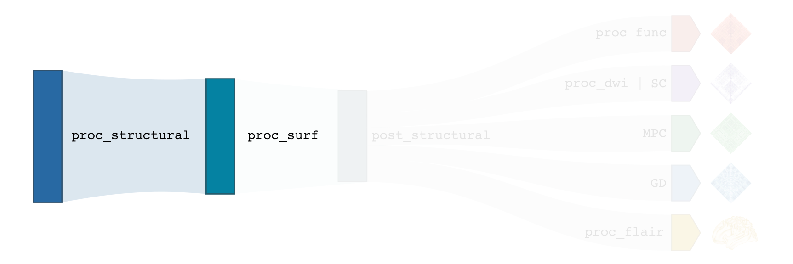

.. _structproc:

.. title:: Structural processing

*********************
Structural processing
*********************

.. contents:: Table of Contents

This section describes all structural processing modules, which include pre-processing and post-processing of T1-weighted images found in the BIDS directory. Structural processing modules perform volumetric (``-proc_structural``) and surface-based (``-proc_surf``, ``-post_structural``, ``-GD``) processing. These modules map subject data to volumetric and surface templates providing several useful structural metrics for further analyses, including geodesic distance matrices mapped to multiple parcellation schemes as well as vertexwise cortical thickness and curvature data.

-proc_structural
============================================================

This module performs initial structural pre-processing, keeping data in volumetric format. Two main spaces are found in this stream: *nativepro* as well as *MNI152*.

.. admonition:: Nativepro?! 🤨

    Nativepro stands for **native** **pro**\cessing space. This denomination is used to distinguish the space occupied by the main scan from standard native space. Indeed, as micapipe supports the alignment and averaging of several distinct T1w acquisitions, we opted to refer to the resulting space using a different term, so not to confuse this space with the native space of each original T1w scan.

.. tabs::

    .. tab:: Processing steps

        - Each T1-weighted run is LPI-reoriented, deobliqued, and oriented to standard space (MNI152).
        - If an MP2RAGE uni image is used an algorithm to denoise the salt and pepper backgroun noise is applied here
        - Create the T1-weighted image used in all downstream processing: ``T1_nativepro``. If multiple T1w scans are found in the raw data, they are aligned to the first run and averaged.
        - Intensity non-uniformity correction (N4)
        - Intensity rescaling [100,0]
        - Create brain mask (mri_synthstrip)
        - Subcortical structure segmentation using FSL FIRST
        - Tissue type segmentation (Gray matter, white matter, CSF) using FSL FAST
        - White matter weighted intensity normalization
        - Non-linear registration to MNI152 (0.8mm and 2mm resolutions)
        - Five-tissue-type image segmentation (5ttgen, used for anatomically constrained tractography)

    .. tab:: Usage

        **Terminal:**

        .. parsed-literal::
            $ micapipe **-sub** <subject_id> **-out** <outputDirectory> **-bids** <BIDS-directory> **-proc_structural** **<options>**

        **Optional arguments**

        ``-proc_structural`` only has one optional argument, which specifies the string name(s) of the T1w image(s) you want to process.

        .. tabularcolumns:: |>{\centering\arraybackslash}\X{1}{5}|>{\raggedleft\arraybackslash}\X{2}{5}|

        .. list-table::
            :widths: 10 500
            :header-rows: 1
            :class: tight-table

            * - **Optional argument**
              - **Description**
            * - ``-T1wStr`` ``<str>``
              - This option allows manual selection of the main scan(s) for structural processing. It should be separated by a comma, with no blank spaces: eg. ``-T1wStr`` ``run-02_T1w``. By default the pipeline uses the string ``T1w.nii``. This option can be useful if the user wishes to exclude one or several T1w scans from further processing.
            * - ``-uni``
              - Special workflow to use the UNI-T1map image as the structural reference (eg. 7T UNI-T1map). Default = no processing of UNI-T1maps.
            * - ``-mf`` ``<int>``
              - Multiplying factor for the mp2rage denoising. Greater value removes more noise (eg. UNI-T1map use with -uni). Default = 3 (7T), recomended value of 45 for 3T MP2RAGE.

        In the following example, if multiple T1w are found inside the *BIDS//anat* directory, only the MRI volume containing the string ``run-02_T1w`` will be processed:

        .. code-block:: bash
           :caption: Example
           :linenos:
           :emphasize-lines: 2

            micapipe -sub <subject_id> -out <outputDirectory> -bids <BIDS-directory> \
                      -proc_structural -T1wStr run-02_T1w

    .. tab:: Outputs

        Directories created or populated by **-proc_structural** will be under each ``SubjectDir`` which is ``<outputDirectory>/micapipe/``.

        .. parsed-literal::

            - <SubjectDir>/anat
            - <SubjectDir>/xfm

        Files generated by **-proc_structural**:

        .. parsed-literal::
            - **Main structural scan:**
                - <SubjectDir>/anat/_space-nativepro_T1w.nii.gz

            - **Brain extracted main structural scan**:
                - *<SubjectDir>/anat/_space-nativepro_T1w_brain.nii.gz*

            - **Brain-mask for main structural scan**:
                - *<SubjectDir>/anat/_space-nativepro_T1w_brain_mask.nii.gz*

            - **FSL FAST outputs** stored in *<SubjectDir>/anat/*:
                - _space-nativepro_T1w_brain_pve_0.nii.gz
                - _space-nativepro_T1w_brain_pve_1.nii.gz
                - _space-nativepro_T1w_brain_pve_2.nii.gz

            - **Main structural scan non-linear transformations to MNI152 0.8mm:** *<SubjectDir>/xfm/*
                - _from-nativepro_brain_to-MNI152_0.8mm_mode-image_desc-SyN_0GenericAffine.mat
                - _from-nativepro_brain_to-MNI152_0.8mm_mode-image_desc-SyN_1InverseWarp.nii.gz
                - _from-nativepro_brain_to-MNI152_0.8mm_mode-image_desc-SyN_1Warp.nii.gz
                - _from-nativepro_brain_to-MNI152_0.8mm_mode-image_desc-SyN_InverseWarped.nii.gz

            - **Main structural scan non-linear transformations to MNI152 2mm:** *<SubjectDir>/xfm/*
                - _from-nativepro_brain_to-MNI152_2mm_mode-image_desc-SyN_0GenericAffine.mat
                - _from-nativepro_brain_to-MNI152_2mm_mode-image_desc-SyN_1InverseWarp.nii.gz
                - _from-nativepro_brain_to-MNI152_2mm_mode-image_desc-SyN_1Warp.nii.gz
                - _from-nativepro_brain_to-MNI152_2mm_mode-image_desc-SyN_InverseWarped.nii.gz

            - **Final 5ttgen output**:
                - *<SubjectDir>/anat/_space-nativepro_T1w_5TT.nii.gz*

            - **Json cards** are in *<SubjectDir>/anat/*:
                - _space-nativepro_T1w_brain_mask.json
                - _space-nativepro_T1w.json

    .. tab:: Multiplying factor (-mf)

        .. image:: denoise_mp2rage.png
            :align: center

-proc_surf
============================================================

This modules performs cortical surface segmentation from all native T1w acquisitions stored in the subject's BIDS directory.

.. admonition:: Quality control 💅🏻

    We recommend that users carefully inspect FastSurfer/FreeSurfer-generated cortical surface segmentations. As micapipe relies heavily on surface-based processing, poor segmentation quality may compromise the validity of downstream results. FreeSurfer provides comprehensive tutorials for manual correction of surface segmentations: See tutorials `'Control Points' <https://surfer.nmr.mgh.harvard.edu/fswiki/FsTutorial/ControlPoints_freeview>`_, `'White matter' <https://surfer.nmr.mgh.harvard.edu/fswiki/FsTutorial/WhiteMatterEdits_freeview>`_, and `'Pial edits' <https://surfer.nmr.mgh.harvard.edu/fswiki/FsTutorial/PialEdits_freeview>`_ explaining different types of corrections that can be applied to cortical surfaces.

    FastSurfer has this entry on manual edits for the mask: https://github.com/engrosamaali91/FastSurfer/blob/m-reuter-editing-1/EDITING.md

.. tabs::

    .. tab:: Processing steps

        - Run surface reconstruction (fastsurfer or freesurfer) pipeline will all T1-weighted scans found in raw data directory

    .. tab:: Usage

        **Terminal:**

        .. parsed-literal::
            $ micapipe **-sub** <subject_id> **-out** <outputDirectory> **-bids** <BIDS-directory> **-proc_surf** **<options>**

        **Optional arguments**

        ``-proc_surf`` has a few optional arguments, including an option for T1w scan selection as in ``proc_volumetric``.

        .. list-table::
            :widths: 10 500
            :header-rows: 1
            :class: tight-table

            * - **Optional argument**
              - **Description**
            * - ``-T1wStr`` ``<str>``
              - Same option as in ``-proc_structural``, this will allow to manually select the main scan(s) for structural processing.
            * - ``-freesurfer`` ``<path>``
              - Use this option to reconstruct the cortical surface with Freesurfer 7. Default surface reconstruction uses 'FastSurfer'
            * - ``-surf_dir`` ``<path>``
              - This option will copy existing FreeSurfer outputs in the provided path to the appropriate location. This way, if the cortical segmentations of your dataset have already been quality controlled, results can be easily integrated within the pipeline's directory structure.
            * - ``-fs_licence``
              - Provide the full path to the freesurface licence. e.g. /home/documents/licence.txt'. If you don't have a licence you can get one here: https://surfer.nmr.mgh.harvard.edu/registration.html
            * - ``-T1``
              - Overwrite the t1 input, MUST be 'nii.gz'. Use the full path to a T1w image to be processed. By default micapipe uses t1nativepro to generate the surfaces.

    .. tab:: Outputs

        Directories created or populated by **-proc_surf**:

        .. parsed-literal::

            - <outputDirectory>/freesurfer/
            - <outputDirectory>/fastsurfer/

        Files generated by **-proc_surf**:

        .. parsed-literal::
            - A list of all recon-all output files can be found here: `ReconAllOutputFiles <https://surfer.nmr.mgh.harvard.edu/fswiki/ReconAllOutputFiles>`_.

-post_structural
============================================================

This first structural post-processing module registers native FreeSurfer-space cortical surfaces to a standard template, in addition to mapping all cortical parcellation schemes to the subject's native surface space and volumetric nativepro space.

.. admonition:: Prerequisites 🖐🏼

     You need to run ``-proc_structural`` and ``-proc_surf`` before this stage.

.. tabs::

    .. tab:: Processing steps

            - Compute affine registration from native Surfer space to nativepro space
            - Register cerebellar atlas (MNI152) to subject's nativepro space using affine transformation
            - Perform surface-based registration of fsaverage5 annotation labels to native surface
            - Register native surface parcellations to native Surfer volume
            - Apply linear registrations to bring volumetric parcellations to nativepro space
            - Apply linear registrations to bring surfaces to nativepro space
            - Register thickness and curvature to nativepro space
            - Build fsLR-32k sphere and resample white and pial surfaces to fsLR-32k and fsLR-5k template
            - Create midthickness surface from native surface and resampled fsLR-32k and fsLR-5k template

    .. tab:: Usage

        **Terminal:**

        .. parsed-literal::
            $ micapipe **-sub** <subject_id> **-out** <outputDirectory> **-bids** <BIDS-directory> **-post_structural** **<options>**

        **Optional arguments**:

        ``-post_structural`` only has one optional argument:

        .. list-table::
            :widths: 10 500
            :header-rows: 1
            :class: tight-table

            * - **Optional argument**
              - **Description**
            * - ``-atlas`` ``<str>``
              - Registers only selected parcellations to subject space (e.g. *economo,aparc*). By default, all 18 parcellations included in the pipeline will be registered to the subject's native volumetric and surface space. Below is the list of all the possible options:

        The following parcellations are available in micapipe:

        .. hlist::
            :columns: 3

            - aparc-a2009s
            - aparc
            - economo
            - glasser-360
            - schaefer-1000
            - schaefer-100
            - schaefer-200
            - schaefer-300
            - schaefer-400
            - schaefer-500
            - schaefer-600
            - schaefer-700
            - schaefer-800
            - schaefer-900
            - vosdewael-100
            - vosdewael-200
            - vosdewael-300
            - vosdewael-400

        The next example will only process the three selected parcellations (``schaefer-200,economo,aparc``)

        .. code-block:: bash
           :caption: Example
           :linenos:
           :emphasize-lines: 2

            micapipe -sub <subject_id> -out <outputDirectory> -bids <BIDS-directory> \
                      -post_structural -atlas schaefer-200,economo,aparc

        .. admonition:: Thinking ahead ☂️

             Functional and structural connectomes, microstructural profile covariance, and geodesic distance matrices will be calculated only on the parcellations selected in this step. If another parcellation should be added after this module, ``-post_structural`` and its dependent modules have to be re-run.

    .. tab:: Outputs

        Directories created or populated by ``-post_structural`` will be under each ``SubjectDir`` which is ``<outputDirectory>/micapipe/`` and ``freesurferDir`` which is ``<outputDirectory>/freesurfer/``:

        .. parsed-literal::

            - <SubjectDir>/anat
            - <SubjectDir>/surf
            - <SubjectDir>/maps
            - <SubjectDir>/parc
            - <SubjectDir>/xfm

        Files generated by ``-post_structural``:

        .. parsed-literal::
            - Main structural scan (nativepro) in FreeSurfer space:
                - *<SubjectDir>/anat/_space-fsnative_T1w.nii.gz*

            - Surface files resampled to fsaverage5, fsLR-32k and fsLR-5k templates, stored in <SubjectDir>/surf:
                - Pial
                    - *_hemi-L_space-nativepro_surf-<template>_label-pial.surf.gii*
                - White matter
                    - *_hemi-L_space-nativepro_surf-<template>_label-white.surf.gii*
                - Midsurface
                    - *_hemi-L_space-nativepro_surf-<template>_label-midthickness.surf.gii*
                - Sphere
                    - *_hemi-L_surf-fsnative_label-sphere.surf.gii*

            - Maps mapped to surface template, stored in <SubjectDir>/surf L-left and R-right:
                - *<SubjectDir>_hemi-L_surf-fsaverage5_label-thickness.func.gii*
                - *<SubjectDir>_hemi-L_surf-fsLR-32k_label-thickness.func.gii*
                - *<SubjectDir>_hemi-L_surf-fsLR-5k_label-thickness.func.gii*
                - *<SubjectDir>_hemi-L_surf-fsnative_label-thickness.func.gii*

            - Native surface mapped annotation labels:
                - *<freesurferDir>/parc/<hemi>.<parcellation>_mics.annot*

            - Native midsurface:
                - *<freesurferDir>/surf/<hemi>.midthickness.surf.gii*

            - Volumetric parcellation files:
                - *<c>/parc/_space-nativepro_T1w_atlas-<parcellation>.nii.gz*

            - Files generated for affine registration between native FreeSurfer space and nativepro:
                - *<SubjectDir>/xfms/_from-fsnative_to_nativepro_T1w_0GenericAffine.mat*

        ``<parcellation>`` stands for the name of each of the 18 parcellations. ``<hemi>`` is either ``lh`` or ``rh``.

    .. tab:: Surfaces

        Surfaces generated by this module:

        .. image:: brain_surfaces.png
            :align: center

-GD
============================================================

.. image:: sankey_GD.png
   :align: center

.. figure:: gd.png
    :align: left
    :scale: 20 %

This module calculates geodesic distance between all cortical parcels from the subject's native midsurface mesh using Dijkstra’s algorithm.

.. admonition:: Prerequisites 🖐🏼

     You need to run ``-proc_structural``, ``-proc_surf`` and ``-post_structural`` before this stage

.. tabs::

    .. tab:: Processing steps

        - Identify centre vertex for each parcel, based on the vertex with the shortest summed Euclidean distance to all other vertices in the same parcel
        - Calculate geodesic distance from centre vertex to all other vertices on the midsurface mesh using `workbench -surface-geodesic-distance <https://www.humanconnectome.org/software/workbench-command/-surface-geodesic-distance>`_
        - Average computed distances within parcels

    .. tab:: Usage

        **Terminal:**

        .. parsed-literal::
            $ micapipe **-sub** <subject_id> **-out** <outputDirectory> **-bids** <BIDS-directory> **-GD**

        **No optional arguments**

    .. tab:: Outputs

        Directories created or populated by **-GD**:

        .. parsed-literal::

            - <SubjectDir>/dist/

        One file per parcellation is generated by **-GD**:

        .. parsed-literal::
            - Square matrix of average parcel-to-parcel geodesic distances:
                - *_atlas-<parcellation>_GD.shape.gii*

        ``<parcellation>`` stands for the name of each of the 18 parcellations.
