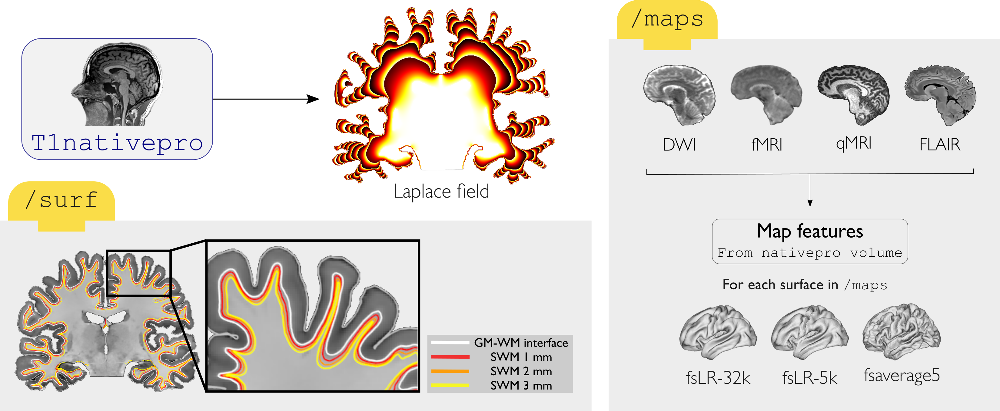
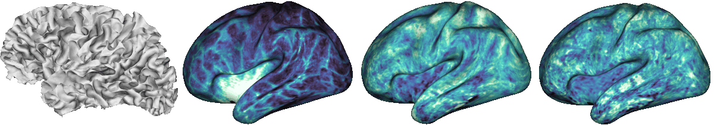

.. _supwm:

.. title:: SWM

Superficial White Matter
============================================================

This module samples superficial white matter intensities from a quantitative MRI in nativepro space. This is achieved by constructing a series of equivolumetric surfaces between the gray matter boundary and 3 mm below it following a laplacian field.

Superficial white matter surfaces are generated using scripts from the `superficial-white-matter repository <https://github.com/jordandekraker/superficial-white-matter>`_, available via GitHub by Jordan De Kraker.

-SWM
--------------------------------------------------------

.. admonition:: Prerequisites 🖐🏼

    You need to run ``-proc_structural``, ``-proc_surf`` and ``-post_structural`` before this stage

.. tabs::

    .. tab:: Processing steps

        - Generate 3 equivolumetric SWM surfaces between the gray matter boundary and 3 mm below it.
        - Map qMRI SWM surfaces to fsLR-32k, fsLR-5k and fsaverage5.

    .. tab:: Usage

        **Terminal:**

        .. parsed-literal::
            $ micapipe **-sub** <subject_id> **-out** <outputDirectory> **-bids** <BIDS-directory> **-SWM**

        **Optional arguments:**

        ``-SWM`` does not optional arguments:

    .. tab:: Outputs

        Directories created or populated by **-SWM**:

        .. parsed-literal::

            - <outputDirectory>/micapipe_v0.2.0//surf
            - <outputDirectory>/micapipe_v0.2.0//maps

        Files generated by **-SWM**:

        .. parsed-literal::
            - Surfaces:
               *<outputDirectory>/micapipe_v0.2.0//surf/*
                   _<ses>_<hemi>_space_fsnative_label_swm1.0mm.surf.gii
                   _<ses>_<hemi>_space_fsnative_label_swm2.0mm.surf.gii
                   _<ses>_<hemi>_space_fsnative_label_swm3.0mm.surf.gii

            - Maps:
               *<outputDirectory>/micapipe_v0.2.0//maps/*
                   _<ses>_<hemi>_surf_fsnative_label_1.0mm_<qMRI>.func.gii
                   _<ses>_<hemi>_surf_fsnative_label_2.0mm_<qMRI>.func.gii
                   _<ses>_<hemi>_surf_fsnative_label_3.0mm_<qMRI>.func.gii
