.. _fetch:

.. title:: fetch connectomes

Fetch parcellations and matrix indexing
#######################################

Matrix Indexing and Coverage
============================

`micapipe v0.2.3` generates several connectivity matrices, all saved as `GIFTI` files.  
The size of each matrix depends on the method used to generate it and on the matrix type.

GD and MPC
^^^^^^^^^^

- Indices correspond **only to cortical regions**.
- The **midwall** is always assigned index ``0``.
- These matrices **exclude subcortical and cerebellar connections**; only cortical nodes are represented.
- These matrices reflect **cortical connectivity**, suitable for GD/MPC analyses.

SC: Structural Connectomes
^^^^^^^^^^^^^^^^^^^^^^^^^^

- Indices **0–47** correspond to **subcortical and cerebellar nodes**.
- These indices match the labels in the lookup table: ``lut_subcortical-cerebellum_mics.csv``.
- Cortical regions follow after the first 48 indices.
- Structural connectomes include **both cortical and subcortical/cerebellar nodes**.

FC: Functional Connectomes
^^^^^^^^^^^^^^^^^^^^^^^^^^

- Functional connectomes usually have **one ROI fewer than structural connectomes**.
- The left and right midwall regions are merged into a single label during FC calculation.
- Only cortical and subcortical/cerebellar ROIs are included according to the parcellation scheme used.

.. list-table:: Connectome dimensions
  :widths: 12 10 10 10 10 10 10
  :header-rows: 1

  * - parc
    - GD shape
    - MPC shape
    - SC shape
    - FC shape
    - SC sub/cerb
    - FC sub/cerb
  * - ``fsLR-5k``
    - 9684 x 9684
    - 9684 x 9684
    - 9684 x 9684
    - 9684 x 9684
    - 0
    - 0
  * - ``aparc-a2009s``
    - 150 x 150
    - 150 x 150
    - 198 x 198
    - 199 x 199
    - 48
    - 49
  * - ``aparc``
    - 72 x 72
    - 72 x 72
    - 120 x 120
    - 119 x 119
    - 48
    - 47
  * - ``economo``
    - 88 x 88
    - 88 x 88
    - 136 x 136
    - 135 x 135
    - 48
    - 47
  * - ``glasser-360``
    - 362 x 362
    - 362 x 362
    - 410 x 410
    - 409 x 409
    - 48
    - 47
  * - ``schaefer-100``
    - 102 x 102
    - 102 x 102
    - 150 x 150
    - 149 x 149
    - 48
    - 47
  * - ``schaefer-200``
    - 202 x 202
    - 202 x 202
    - 250 x 250
    - 249 x 249
    - 48
    - 47
  * - ``schaefer-300``
    - 302 x 302
    - 302 x 302
    - 350 x 350
    - 349 x 349
    - 48
    - 47
  * - ``schaefer-400``
    - 402 x 402
    - 402 x 402
    - 450 x 450
    - 449 x 449
    - 48
    - 47
  * - ``schaefer-500``
    - 502 x 502
    - 502 x 502
    - 550 x 550
    - 549 x 549
    - 48
    - 47
  * - ``schaefer-600``
    - 602 x 602
    - 602 x 602
    - 650 x 650
    - 649 x 649
    - 48
    - 47
  * - ``schaefer-700``
    - 702 x 702
    - 702 x 702
    - 750 x 750
    - 749 x 749
    - 48
    - 47
  * - ``schaefer-800``
    - 802 x 802
    - 802 x 802
    - 850 x 850
    - 849 x 849
    - 48
    - 47
  * - ``schaefer-900``
    - 902 x 902
    - 902 x 902
    - 950 x 950
    - 949 x 949
    - 48
    - 47
  * - ``schaefer-1000``
    - 1002 x 1002
    - 1002 x 1002
    - 1050 x 1050
    - 1048 x 1048
    - 48
    - 46
  * - ``vosdewael-100``
    - 102 x 102
    - 102 x 102
    - 150 x 150
    - 149 x 149
    - 48
    - 47
  * - ``vosdewael-200``
    - 202 x 202
    - 202 x 202
    - 250 x 250
    - 249 x 249
    - 48
    - 47
  * - ``vosdewael-300``
    - 302 x 302
    - 302 x 302
    - 350 x 350
    - 349 x 349
    - 48
    - 47
  * - ``vosdewael-400``
    - 402 x 402
    - 402 x 402
    - 450 x 450
    - 449 x 449
    - 48
    - 47

.. warning::

   ⚠️ **Known Issues / Indexing Errors**
      
      - GD, SC, and MPC ``fsLR-32k``:

        -  **schaefer-700** → Indexing errors in both hemispheres.
        -  **schaefer-900** → Indexing errors in both hemispheres.
        -  **schaefer-1000** → Indexing errors in the **right hemisphere only**.
        -  **aparc-a2009s** → ``ValueError: There are more target labels than source values``.

      - FC ``fsaverage5``:

        -  **schaefer-1000** → ``ValueError: There are more target labels than source values``.
        -  **aparc-a2009s** → Indexing inconsistencies (“weird indexing”).

Subcortical and Cerebellar Lookup Table
=======================================

The lookup table for the subcortical and cerebellar labels used in connectome construction is stored in the file:

``lut_subcortical-cerebellum_mics.csv``

relative to the `micapipe/parcellations/lut/ <https://github.com/MICA-MNI/micapipe/blob/master/parcellations/lut/lut_subcortical-cerebellum_mics.csv>`_ repository.

.. code:: ipython3

    import pandas as pd

    # micapipe URL
    micapipe = 'https://raw.githubusercontent.com/MICA-MNI/micapipe/refs/heads/master'

    # Load the subcortical/cerebellar lookup table as a pandas DataFrame
    parc_subcer = pd.read_csv(
        f'{micapipe}/parcellations/lut/lut_subcortical-cerebellum_mics.csv'
    )

    # Display the lookup table
    parc_subcer

Cortical labels
===============

.. code:: ipython3

    # Set the environment
    import os
    import glob
    import numpy as np
    import nibabel as nib
    from brainspace.plotting import plot_hemispheres
    from brainspace.mesh.mesh_io import read_surface
    from brainspace.datasets import load_conte69
    from brainspace.gradient import GradientMaps
    from brainspace.utils.parcellation import map_to_labels
    import matplotlib.pyplot as plt
    import cmocean
    
    # Add cmocean maps to cmaps variable
    cmaps = cmocean.cm.cmap_d
    
    # Set the working directory to the 'out' directory
    out='/data_/mica3/BIDS_PNI/derivatives'
    os.chdir(out)     # <<<<<<<<<<<< CHANGE THIS PATH
    
    # This variable will be different for each subject
    sub='PNC019' # <<<<<<<<<<<< CHANGE THIS SUBJECT's ID
    ses='a1'    # <<<<<<<<<<<< CHANGE THIS SUBJECT's SESSION
    subjectID=f'sub-{sub}_ses-{ses}'           
    subjectDir=f'micapipe_v0.2.0/sub-{sub}/ses-{ses}' 
    
    # Path to MICAPIPE from global enviroment
    micapipe=os.popen("echo $MICAPIPE").read()[:-1] # <<<<<<<<<<<< CHANGE THIS PATH
    
    # All parcelations list
    parc = ['aparc-a2009s', 'aparc', 'economo', 'glasser-360',
             'schaefer-100','schaefer-200','schaefer-300','schaefer-400',
             'schaefer-500','schaefer-600','schaefer-700','schaefer-800',
             'schaefer-900','schaefer-1000','vosdewael-100','vosdewael-200',
             'vosdewael-300','vosdewael-400']

**Load the standard inflated surfaces**

.. code:: ipython3

    # Load fsLR-5k inflated (9684 vertices both hemispheres)
    f5k_lh = read_surface(f'{micapipe}/surfaces/fsLR-5k.L.inflated.surf.gii', itype='gii')
    f5k_rh = read_surface(f'{micapipe}/surfaces/fsLR-5k.R.inflated.surf.gii', itype='gii')
    
    # Load fsLR-32k inflated (64984 vertices both hemispheres)
    f32k_lh = read_surface(f'{micapipe}/surfaces/fsLR-32k.L.inflated.surf.gii', itype='gii')
    f32k_rh = read_surface(f'{micapipe}/surfaces/fsLR-32k.R.inflated.surf.gii', itype='gii')
    
    # Load fsaverage5 inflated (20484 vertices both hemispheres)
    fs5_lh = read_surface(f'{micapipe}/surfaces/fsaverage5/surf/lh.inflated', itype='fs')
    fs5_rh = read_surface(f'{micapipe}/surfaces/fsaverage5/surf/rh.inflated', itype='fs')

.. code:: ipython3

    def load_annot(atlas, surf='fsaverage5'):
        '''
        Script that loads the labels of an specific parcellation and generates a midwall mask
        '''
        
        # Load LEFT annotation file in fsaverage5
        annot_lh_fs5= nib.freesurfer.read_annot(f'{micapipe}/parcellations/lh.{atlas}_mics.annot')
    
        # Unique number of labels of a given atlas
        Ndim = max(np.unique(annot_lh_fs5[0]))
        
        if surf == 'fsaverage5':
    
            # Load RIGHT annotation file in fsaverage5
            annot_rh_fs5= nib.freesurfer.read_annot(f'{micapipe}/parcellations/rh.{atlas}_mics.annot')[0]+Ndim
    
            # replace with 0 the medial wall of the right labels
            annot_rh_fs5 = np.where(annot_rh_fs5==Ndim, 0, annot_rh_fs5) 
    
            # fsaverage5 labels
            labels = np.concatenate((annot_lh_fs5[0], annot_rh_fs5), axis=0)
        
        else:
            # Read label for fsLR-32k
            labels = np.loadtxt(open(f'{micapipe}/parcellations/{atlas}_conte69.csv'), dtype=int)
    
        # mask of the medial wall
        mask = labels != 0
        
        # Midwall labels of aparc-a2009s are lh=42 and rh=117
        if atlas == 'aparc-a2009s' and surf == 'fsaverage5':
            mask[(labels == 117) | (labels == 42)] = 0
        
        return(labels, mask, Ndim)

**Create a function that loads the parcellations**

.. code:: ipython3

    # Empty list of surface plots
    surf_fs5 = [None] * len(parc)
    surf_32k = [None] * len(parc)
    
    # NaN color
    nan_col = (0.8, 0.8, 0.8, 1)
    
    # Iterate over each parcellation to create a list of surface plots
    for i, g in enumerate(parc):
        
        # Load fsaverage5 labels
        labels_fs5, mask_fs5, _ = load_annot(g, surf='fsaverage5')
        # Load fsLR-32k labels
        labels_32k, mask_32k, _ = load_annot(g, surf='fsLR-32k')
    
        # Map labels to surface fsaverage5
        surf_fs5[i] = map_to_labels(np.unique(labels_fs5.astype(float)), labels_fs5,  fill=np.nan, mask=mask_fs5)
        # Map labels to surface fsLR-32k
        surf_32k[i] = map_to_labels(np.unique(labels_fs5.astype(float)), labels_32k,  fill=np.nan, mask=mask_32k)

Anatomy based parcellations
^^^^^^^^^^^^^^^^^^^^^^^^^^^^

**Desikan-Killiany (aka Freesurfer aparc)**

   Desikan, R. S., Ségonne, F., Fischl, B., Quinn, B. T., Dickerson, B.
   C., Blacker, D., … & Albert, M. S. (2006). An automated labeling
   system for subdividing the human cerebral cortex on MRI scans into
   gyral based regions of interest. Neuroimage, 31(3), 968-980.

**Dextrieux (aka Freesurfer aparc-a2009s)**

   Destrieux, C., Fischl, B., Dale, A., & Halgren, E. (2010). Automatic
   parcellation of human cortical gyri and sulci using standard
   anatomical nomenclature. Neuroimage, 53(1), 1-15.

.. code:: ipython3

    # fsaverage5 | Plot parcellations
    plot_hemispheres(fs5_lh, fs5_rh, array_name=surf_fs5[0:2], size=(600, 175), cmap='tab20b',
                     embed_nb=True, label_text={'left':parc[0:2]}, color_bar='right',
                     zoom=1.5, nan_color=nan_col)

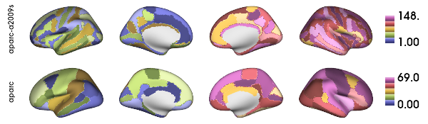

.. code:: ipython3

    # fsLR-32k | Plot parcellations
    plot_hemispheres(f32k_lh, f32k_rh, array_name=surf_32k[0:2], size=(600, 175), cmap='tab20b',
                     embed_nb=True, label_text={'left':parc[0:2]}, color_bar='right',
                     zoom=1.5, nan_color=nan_col)

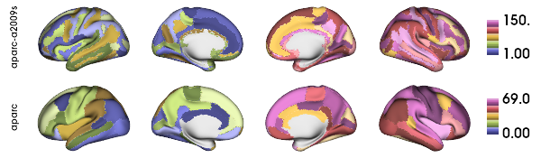

Histology based parcellation
^^^^^^^^^^^^^^^^^^^^^^^^^^^^

**Economo-Koskinas**

   Scholtens, L. H., de Reus, M. A., de Lange, S. C., Schmidt, R., & van
   den Heuvel, M. P. (2018). An mri von economo–koskinas atlas.
   NeuroImage, 170, 249-256.

.. code:: ipython3

    # Plot parcellations fsaverage5
    plot_hemispheres(fs5_lh, fs5_rh, array_name=surf_fs5[2], size=(600, 87), cmap='tab20',
                     embed_nb=True, label_text={'left':[parc[2]]}, color_bar='right',
                     zoom=1.5, nan_color=nan_col)

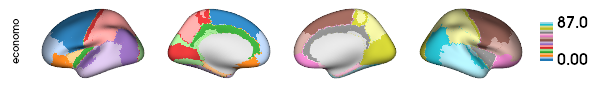

.. code:: ipython3

    # Plot parcellations fsLR32k
    plot_hemispheres(f32k_lh, f32k_rh, array_name=surf_32k[2], size=(600, 87), cmap='tab20',
                     embed_nb=True, label_text={'left':[parc[2]]}, color_bar='right',
                     zoom=1.5, nan_color=nan_col)

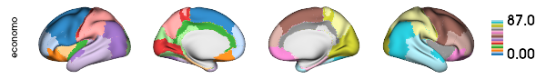

Multimodal based parcellation
^^^^^^^^^^^^^^^^^^^^^^^^^^^^^

**Glasser**

   Glasser, M. F., Coalson, T. S., Robinson, E. C., Hacker, C. D.,
   Harwell, J., Yacoub, E., … & Smith, S. M. (2016). A multi-modal
   parcellation of human cerebral cortex. Nature, 536(7615), 171-178.

.. code:: ipython3

    # Plot parcellations
    plot_hemispheres(fs5_lh, fs5_rh, array_name=surf_fs5[3], size=(600, 87), cmap='tab20c',
                     embed_nb=True, label_text={'left':[parc[3]]}, color_bar='right',
                     zoom=1.5, nan_color=nan_col)

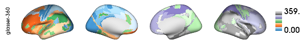

.. code:: ipython3

    # Plot parcellations
    plot_hemispheres(f32k_lh, f32k_rh, array_name=surf_32k[3], size=(600, 87), cmap='tab20c',
                     embed_nb=True, label_text={'left':[parc[3]]}, color_bar='right',
                     zoom=1.5, nan_color=nan_col)

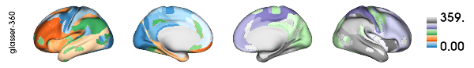

Functional based parcellation
^^^^^^^^^^^^^^^^^^^^^^^^^^^^^^

**Schaefer 100-1000**

   Schaefer, A., Kong, R., Gordon, E. M., Laumann, T. O., Zuo, X. N.,
   Holmes, A. J., … & Yeo, B. T. (2018). Local-global parcellation of
   the human cerebral cortex from intrinsic functional connectivity MRI.
   Cerebral cortex, 28(9), 3095-3114.

.. code:: ipython3

    # Plot parcellations
    plot_hemispheres(fs5_lh, fs5_rh, array_name=surf_fs5[4:9], size=(600, 437), cmap='cmo.curl',
                     embed_nb=True, label_text={'left':parc[4:9]}, color_bar='right',
                     zoom=1.5, nan_color=nan_col)

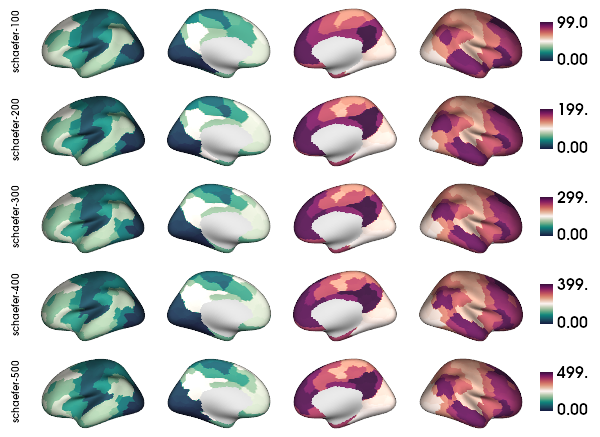

.. code:: ipython3

    # Plot parcellations
    plot_hemispheres(f32k_lh, f32k_rh, array_name=surf_32k[4:9], size=(600, 437), cmap='cmo.curl',
                     embed_nb=True, label_text={'left':parc[4:9]}, color_bar='right',
                     zoom=1.5, nan_color=nan_col)

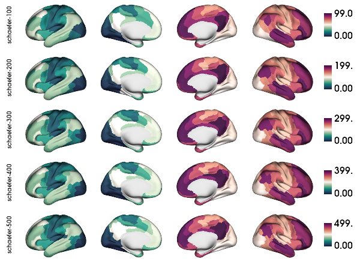

.. code:: ipython3

    # Plot parcellations
    plot_hemispheres(fs5_lh, fs5_rh, array_name=surf_fs5[9:14], size=(600, 437), cmap='cmo.curl',
                     embed_nb=True, label_text={'left':parc[9:14]}, color_bar='right',
                     zoom=1.5, nan_color=nan_col)

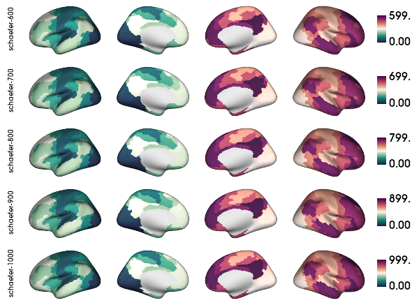

.. code:: ipython3

    # Plot parcellations
    plot_hemispheres(f32k_lh, f32k_rh, array_name=surf_32k[9:14], size=(600, 437), cmap='cmo.curl',
                     embed_nb=True, label_text={'left':parc[9:14]}, color_bar='right',
                     zoom=1.5, nan_color=nan_col)

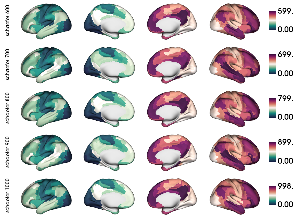

Pseudo-random parcellation based on ``Desikan Killiany``
^^^^^^^^^^^^^^^^^^^^^^^^^^^^^^^^^^^^^^^^^^^^^^^^^^^^^^^^

**DK-random 100-500**

vosdewael parcellations are semi-random subparcellations of Desikan
Killiany, obtained by spliting in two the bigest parcel iterativelly
until the desired number of parcels is reached.

.. code:: ipython3

    # Plot parcellations
    plot_hemispheres(fs5_lh, fs5_rh, array_name=surf_fs5[14:18], size=(600, 350), cmap='cmo.tarn',
                     embed_nb=True, label_text={'left':parc[14:18]}, color_bar='right',
                     zoom=1.5, nan_color=nan_col)

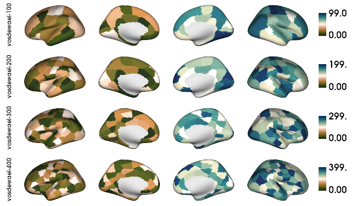

.. code:: ipython3

    # Plot parcellations
    plot_hemispheres(f32k_lh, f32k_rh, array_name=surf_32k[14:18], size=(600, 350), cmap='cmo.tarn',
                     embed_nb=True, label_text={'left':parc[14:18]}, color_bar='right',
                     zoom=1.5, nan_color=nan_col)

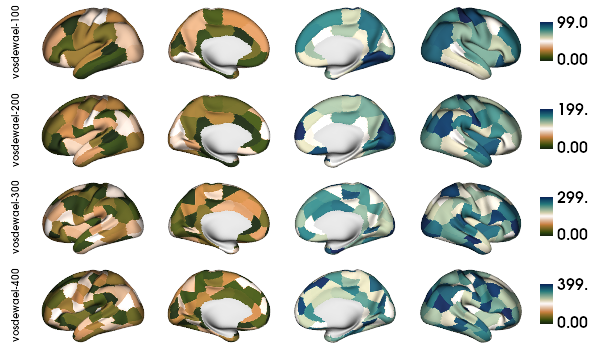

Parcellated Connectomes
=======================

**Define functions to load each connectome**

.. code:: ipython3

    def load_mpc(File, Ndim):
        """Loads and process a MPC"""
    
        # load the matrix
        mtx_mpc = nib.load(File).darrays[0].data
    
        # Mirror the matrix
        MPC = np.triu(mtx_mpc,1)+mtx_mpc.T
    
        # Remove the medial wall
        MPC = np.delete(np.delete(MPC, 0, axis=0), 0, axis=1)
        MPC = np.delete(np.delete(MPC, Ndim, axis=0), Ndim, axis=1)
        
        return(MPC)
    
    def load_fc(File, Ndim, parc=''):
        """Loads and process a functional connectome"""
    
        # load the matrix
        mtx_fs = nib.load(File).darrays[0].data
    
        # slice the matrix remove subcortical nodes and cerebellum
        FC = mtx_fs[49:, 49:]
        
        # Fisher transform
        FCz = np.arctanh(FC)
    
        # replace inf with 0
        FCz[~np.isfinite(FCz)] = 0
    
        # Mirror the matrix
        FCz = np.triu(FCz,1)+FCz.T
        return(FCz)
    
    def load_gd(File, Ndim):
        """Loads and process a GD"""
    
        # load the matrix
        mtx_gd = nib.load(File).darrays[0].data
    
        # Remove the Mediall Wall
        mtx_gd = np.delete(np.delete(mtx_gd, 0, axis=0), 0, axis=1)
        GD = np.delete(np.delete(mtx_gd, Ndim, axis=0), Ndim, axis=1)
    
        return(GD)
    
    def load_sc(File, Ndim, log_transform=True):
        """Loads and process a structura connectome"""
    
        # load the matrix
        mtx_sc = nib.load(File).darrays[0].data
    
        # Mirror the matrix
        if log_transform != True:
            mtx_sc = np.triu(mtx_sc,1)+mtx_sc.T
        else:
            mtx_sc = np.log(np.triu(mtx_sc,1)+mtx_sc.T)
        mtx_sc[np.isneginf(mtx_sc)] = 0
    
        # slice the matrix remove subcortical nodes and cerebellum
        SC = mtx_sc[49:, 49:]
        SC = np.delete(np.delete(SC, Ndim, axis=0), Ndim, axis=1)
    
        # replace 0 values with almost 0
        SC[SC==0] = np.finfo(float).eps
        
        return(SC)

**Load connectomes function**

Now, let’s create a function to load the connectomes and get the column
mean of each modality including the ``FC``.

.. code:: ipython3

    def load_connectomes(connectome_type, parc, subjectDir, subjectID):
        """
        Load the specified connectome type and return roi_32k and roi_fs5.
    
        Parameters:
        connectome_type (str): Type of connectome to load. Options are 'GD', 'SC', 'MPC', 'FC'.
        subjectDir (str): Directory containing the subject data.
        subjectID (str): Subject ID.
    
        Returns:
        tuple: roi_32k and roi_fs5 arrays if successful, None otherwise.
        """
        
        # Empty list of surface plots
        roi_fs5 = [None] * len(parc)
        roi_32k = [None] * len(parc)
    
        for i, atlas in enumerate(parc):
    
            # Load fsaverage5 labels
            labels_fs5, mask_fs5, Ndim = load_annot(atlas, surf='fsaverage5')
    
            # Load fsLR-32k labels
            labels_32k, mask_32k, _ = load_annot(atlas, surf='fsLR-32k')
    
            try:
                if connectome_type == 'GD':
                    # Load Geodesic Distance connectome
                    file = f'{subjectDir}/dist/{subjectID}_atlas-{atlas}_GD.shape.gii'
                    mtx = load_gd(file, Ndim)
                elif connectome_type == 'SC':
                    # Load Structural Connectome
                    file = f'{subjectDir}/dwi/connectomes/{subjectID}_space-dwi_atlas-{atlas}_desc-iFOD2-40M-SIFT2_full-connectome.shape.gii'
                    mtx = load_sc(file, Ndim)
                elif connectome_type == 'MPC':
                    # Load MPC
                    acq_mpc = 'T1map'
                    file = f'{subjectDir}/mpc/acq-{acq_mpc}/{subjectID}_atlas-{atlas}_desc-MPC.shape.gii'
                    mtx = load_mpc(file, Ndim)
                elif connectome_type == 'FC':
                    # Load Functional Connectome
                    acq_func = 'desc-me_task-rest_bold'
                    file = f'{subjectDir}/func/{acq_func}/surf/{subjectID}_atlas-{atlas}_desc-FC.shape.gii'
                    mtx = load_fc(file, Ndim)
                else:
                    raise ValueError("Invalid connectome type. Choose from 'GD', 'SC', 'MPC', 'FC'.")
                    
                # Column sum
                mtx_s = np.sum(mtx, axis=0)
    
                # Map labels to surface fsaverage5
                roi_fs5[i] = map_to_labels(mtx_s, labels_fs5, fill=np.nan, mask=mask_fs5)
    
                # Map labels to surface fsLR-32k
                roi_32k[i] = map_to_labels(mtx_s, labels_32k, fill=np.nan, mask=mask_32k)
            
            except Exception as e:
                print(f"Error loading {connectome_type} connectome for atlas {atlas}: {e}")
                continue
                
        return roi_fs5, roi_32k

GD Connectomes ``fsLR-32k``
^^^^^^^^^^^^^^^^^^^^^^^^^^^

.. code:: ipython3

    # Parcellations to load
    parc = ['aparc', 'economo', 'glasser-360', 'schaefer-400', 'vosdewael-400']
    N = len(parc)
    
    # Load the connectome row sum for each parcellation
    roi_fs5, roi_32k = load_connectomes('GD', parc, subjectDir, subjectID)
    
    # Plot parcellations
    plot_hemispheres(f32k_lh, f32k_rh, array_name=roi_32k[0:N], size=(600, 88*N), cmap='RdBu_r',
                     embed_nb=True, label_text={'left':parc[0:N]}, color_bar='right',
                     zoom=1.5, nan_color=nan_col)

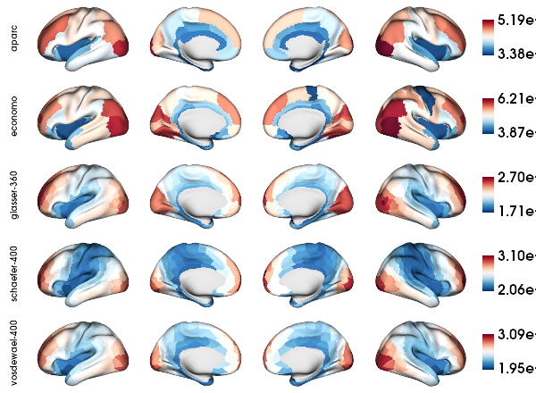

GD Connectomes ``fsaverage5``
^^^^^^^^^^^^^^^^^^^^^^^^^^^^^

.. code:: ipython3

    # Plot parcellations
    plot_hemispheres(fs5_lh, fs5_rh, array_name=roi_fs5[0:N], size=(600, 88*N), cmap='RdBu_r',
                     embed_nb=True, label_text={'left':parc[0:N]}, color_bar='right',
                     zoom=1.5, nan_color=nan_col)

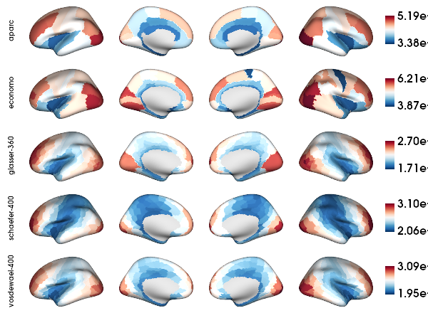

Structural Connectomes ``fsLR-32k``
^^^^^^^^^^^^^^^^^^^^^^^^^^^^^^^^^^^

.. code:: ipython3

    # Load the connectome row sum for each parcellation
    roi_fs5, roi_32k = load_connectomes('SC', parc, subjectDir, subjectID)
    
    # Plot parcellations
    plot_hemispheres(f32k_lh, f32k_rh, array_name=roi_32k[0:N], size=(600, 88*N), cmap='RdBu_r',
                     embed_nb=True, label_text={'left':parc[0:N]}, color_bar='right',
                     zoom=1.5, nan_color=nan_col)

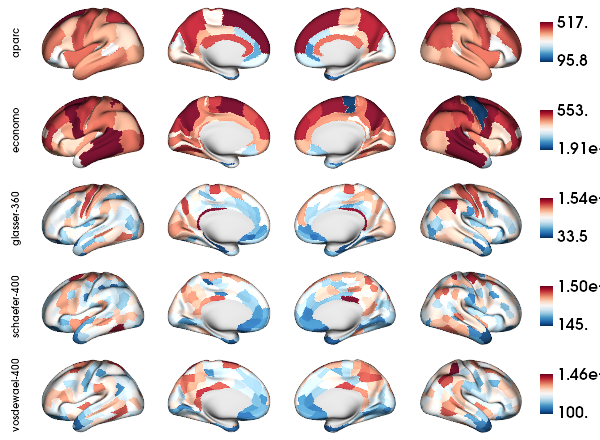

Structural Connectomes ``fsaverage5``
^^^^^^^^^^^^^^^^^^^^^^^^^^^^^^^^^^^^^

.. code:: ipython3

    # Plot parcellations
    plot_hemispheres(fs5_lh, fs5_rh, array_name=roi_fs5[0:N], size=(600, 88*N), cmap='RdBu_r',
                     embed_nb=True, label_text={'left':parc[0:N]}, color_bar='right',
                     zoom=1.5, nan_color=nan_col)

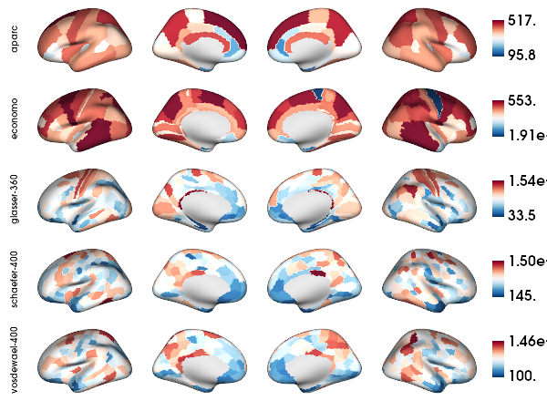

MPC Connectomes ``fsLR-32k``
^^^^^^^^^^^^^^^^^^^^^^^^^^^^

.. code:: ipython3

    # Load the connectome row sum for each parcellation
    roi_fs5, roi_32k = load_connectomes('MPC', parc, subjectDir, subjectID)
    
    # Plot parcellations
    plot_hemispheres(f32k_lh, f32k_rh, array_name=roi_32k[0:N], size=(600, 88*N), cmap='RdBu_r',
                     embed_nb=True, label_text={'left':parc[0:N]}, color_bar='right',
                     zoom=1.5, nan_color=nan_col)

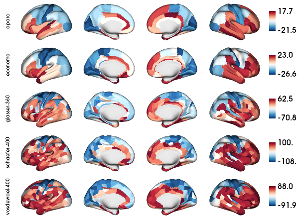

MPC Connectomes ``fsaverage5``
^^^^^^^^^^^^^^^^^^^^^^^^^^^^^^

.. code:: ipython3

    # Plot parcellations
    
    plot_hemispheres(fs5_lh, fs5_rh, array_name=roi_fs5[0:N], size=(600, 88*N), cmap='RdBu_r',
                     embed_nb=True, label_text={'left':parc[0:N]}, color_bar='right',
                     zoom=1.5, nan_color=nan_col)

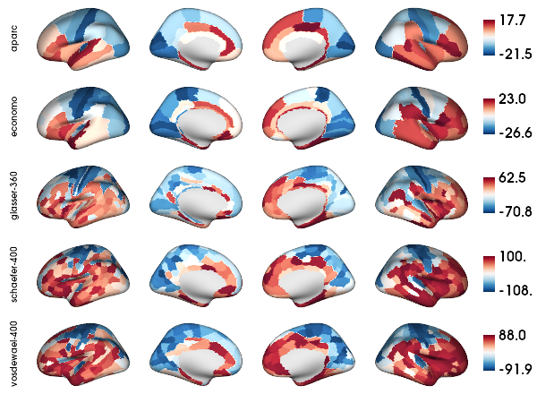

FC Connectomes ``fsLR-32k``
^^^^^^^^^^^^^^^^^^^^^^^^^^^

.. code:: ipython3

    # Load the connectome row sum for each parcellation
    roi_fs5, roi_32k = load_connectomes('FC', parc, subjectDir, subjectID)
    
    # Plot parcellations
    plot_hemispheres(f32k_lh, f32k_rh, array_name=roi_32k[0:N], size=(600, 88*N), cmap='RdBu_r',
                     embed_nb=True, label_text={'left':parc[0:N]}, color_bar='right',
                     zoom=1.5, nan_color=nan_col)

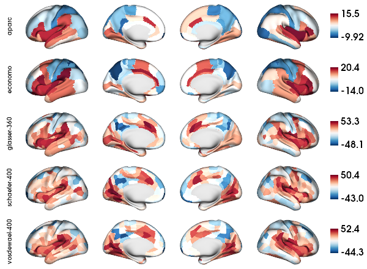

FC Connectomes ``fsaverage5``
^^^^^^^^^^^^^^^^^^^^^^^^^^^^^

.. code:: ipython3

    # Plot parcellations
    
    plot_hemispheres(fs5_lh, fs5_rh, array_name=roi_fs5[0:N], size=(600, 88*N), cmap='RdBu_r',
                     embed_nb=True, label_text={'left':parc[0:N]}, color_bar='right',
                     zoom=1.5, nan_color=nan_col)

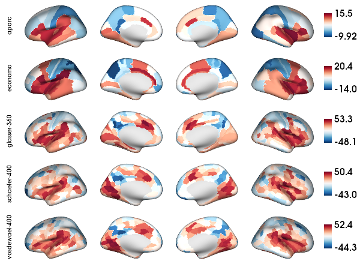

