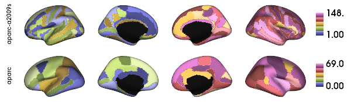
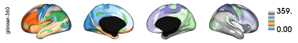

.. _multiatlas:

.. title:: Multi-altas

Multi atlas on surface
======================

Set the environment
~~~~~~~~~~~~~~~~~~~

.. code:: ipython3

    # Set the environment
    import os
    import glob
    import numpy as np
    import nibabel as nib
    from brainspace.plotting import plot_hemispheres
    from brainspace.mesh.mesh_io import read_surface
    from brainspace.datasets import load_conte69
    from brainspace.gradient import GradientMaps
    from brainspace.utils.parcellation import map_to_labels
    import matplotlib.pyplot as plt
    import cmocean

    # Add cmocean maps to cmaps variable
    cmaps = cmocean.cm.cmap_d

    # Set the working directory to the 'out' directory
    out='/data_/mica3/BIDS_MICs/derivatives'
    os.chdir(out)     # <<<<<<<<<<<< CHANGE THIS PATH

    # This variable will be different for each subject
    sub='HC001' # <<<<<<<<<<<< CHANGE THIS SUBJECT's ID
    ses='01'    # <<<<<<<<<<<< CHANGE THIS SUBJECT's SESSION
    subjectID=f'sub-{sub}_ses-{ses}'
    subjectDir=f'micapipe_v0.2.0/sub-{sub}/ses-{ses}'

    # Path to MICAPIPE from global enviroment
    micapipe=os.popen("echo $MICAPIPE").read()[:-1] # <<<<<<<<<<<< CHANGE THIS PATH

    # All parcelations list
    parc = ['aparc-a2009s', 'aparc', 'economo', 'glasser-360',
             'schaefer-100','schaefer-200','schaefer-300','schaefer-400',
             'schaefer-500','schaefer-600','schaefer-700','schaefer-800',
             'schaefer-900','schaefer-1000','vosdewael-100','vosdewael-200',
             'vosdewael-300','vosdewael-400']

.. raw:: html

    

Load the standard inflated surfaces
~~~~~~~~~~~~~~~~~~~~~~~~~~~~~~~~~~~

.. code:: ipython3

    # Load fsLR-5k inflated
    f5k_lh = read_surface(f'{micapipe}/surfaces/fsLR-5k.L.inflated.surf.gii', itype='gii')
    f5k_rh = read_surface(f'{micapipe}/surfaces/fsLR-5k.R.inflated.surf.gii', itype='gii')

    # Load fsLR-32k inflated
    f32k_lh = read_surface(f'{micapipe}/surfaces/fsLR-32k.L.inflated.surf.gii', itype='gii')
    f32k_rh = read_surface(f'{micapipe}/surfaces/fsLR-32k.R.inflated.surf.gii', itype='gii')

    # Load fsaverage5 inflated
    fs5_lh = read_surface(f'{micapipe}/surfaces/fsaverage5/surf/lh.inflated', itype='fs')
    fs5_rh = read_surface(f'{micapipe}/surfaces/fsaverage5/surf/rh.inflated', itype='fs')

Parcellated matrices
====================

+---------------------+----------------+-----------------+----------------+----------------+
| **parc**            | **GD shape**   | **MPC shape**   | **SC shape**   | **FC shape**   |
+=====================+================+=================+================+================+
| ``fsLR-5k``         | 9684 x 9684    | 9684 x 9684     | 9684 x 9684    | 9684 x 9684    |
+---------------------+----------------+-----------------+----------------+----------------+
| ``aparc-a2009s``    | 150 x 150      | 150 x 150       | 198 x 198      | 199 x 199      |
+---------------------+----------------+-----------------+----------------+----------------+
| ``aparc``           | 72 x 72        | 72 x 72         | 120 x 120      | 119 x 119      |
+---------------------+----------------+-----------------+----------------+----------------+
| ``economo``         | 88 x 88        | 88 x 88         | 136 x 136      | 135 x 135      |
+---------------------+----------------+-----------------+----------------+----------------+
| ``glasser-360``     | 362 x 362      | 362 x 362       | 410 x 410      | 409 x 409      |
+---------------------+----------------+-----------------+----------------+----------------+
| ``schaefer-100``    | 102 x 102      | 102 x 102       | 150 x 150      | 149 x 149      |
+---------------------+----------------+-----------------+----------------+----------------+
| ``schaefer-200``    | 202 x 202      | 202 x 202       | 250 x 250      | 249 x 249      |
+---------------------+----------------+-----------------+----------------+----------------+
| ``schaefer-300``    | 302 x 302      | 302 x 302       | 350 x 350      | 349 x 349      |
+---------------------+----------------+-----------------+----------------+----------------+
| ``schaefer-400``    | 402 x 402      | 402 x 402       | 450 x 450      | 449 x 449      |
+---------------------+----------------+-----------------+----------------+----------------+
| ``schaefer-500``    | 502 x 502      | 502 x 502       | 550 x 550      | 549 x 549      |
+---------------------+----------------+-----------------+----------------+----------------+
| ``schaefer-600``    | 602 x 602      | 602 x 602       | 650 x 650      | 649 x 649      |
+---------------------+----------------+-----------------+----------------+----------------+
| ``schaefer-700``    | 702 x 702      | 702 x 702       | 750 x 750      | 749 x 749      |
+---------------------+----------------+-----------------+----------------+----------------+
| ``schaefer-800``    | 802 x 802      | 802 x 802       | 850 x 850      | 849 x 849      |
+---------------------+----------------+-----------------+----------------+----------------+
| ``schaefer-900``    | 902 x 902      | 902 x 902       | 950 x 950      | 949 x 949      |
+---------------------+----------------+-----------------+----------------+----------------+
| ``schaefer-1000``   | 1002 x 1002    | 1002 x 1002     | 1050 x 1050    | 1048 x 1048    |
+---------------------+----------------+-----------------+----------------+----------------+
| ``vosdewael-100``   | 102 x 102      | 102 x 102       | 150 x 150      | 149 x 149      |
+---------------------+----------------+-----------------+----------------+----------------+
| ``vosdewael-200``   | 202 x 202      | 202 x 202       | 250 x 250      | 249 x 249      |
+---------------------+----------------+-----------------+----------------+----------------+
| ``vosdewael-300``   | 302 x 302      | 302 x 302       | 350 x 350      | 349 x 349      |
+---------------------+----------------+-----------------+----------------+----------------+
| ``vosdewael-400``   | 402 x 402      | 402 x 402       | 450 x 450      | 449 x 449      |
+---------------------+----------------+-----------------+----------------+----------------+

    For ``GD`` and ``MPC`` their indices correspond only to cortical
    regions. In both matrices the midwall indices is 0.

.. code:: ipython3

    def load_annot(atlas, surf='fsaverage5'):
        '''
        Script that loads the labels of an specific parcellation and generates a midwall mask
        '''

        # Load LEFT annotation file in fsaverage5
        annot_lh_fs5= nib.freesurfer.read_annot(f'{micapipe}/parcellations/lh.{atlas}_mics.annot')

        # Unique number of labels of a given atlas
        Ndim = max(np.unique(annot_lh_fs5[0]))

        if surf == 'fsaverage5':

            # Load RIGHT annotation file in fsaverage5
            annot_rh_fs5= nib.freesurfer.read_annot(f'{micapipe}/parcellations/rh.{atlas}_mics.annot')[0]+Ndim

            # replace with 0 the medial wall of the right labels
            annot_rh_fs5 = np.where(annot_rh_fs5==Ndim, 0, annot_rh_fs5)

            # fsaverage5 labels
            labels = np.concatenate((annot_lh_fs5[0], annot_rh_fs5), axis=0)

        else:
            # Read label for fsLR-32k
            labels = np.loadtxt(open(f'{micapipe}/parcellations/{atlas}_conte69.csv'), dtype=int)

        # mask of the medial wall
        mask = labels != 0

        # Midwall labels of aparc-a2009s are lh=42 and rh=117
        if atlas == 'aparc-a2009s' and surf == 'fsaverage5':
            mask[(labels == 117) | (labels == 42)] = 0

        #print(f'{atlas}; midwall = {Ndim}, length = {str(labels.shape)}')

        return(labels, mask, Ndim)

.. code:: ipython3

    # Empty list of surface plots
    surf_fs5 = [None] * len(parc)
    surf_32k = [None] * len(parc)

    # Iterate over each parcellation to create a list of surface plots
    for i, g in enumerate(parc):

        # Load fsaverage5 labels
        labels_fs5, mask_fs5, _ = load_annot(g, surf='fsaverage5')
        # Load fsLR-32k labels
        labels_32k, mask_32k, _ = load_annot(g, surf='fsLR-32k')

        # Map labels to surface fsaverage5
        surf_fs5[i] = map_to_labels(np.unique(labels_fs5.astype(float)), labels_fs5,  fill=np.nan, mask=mask_fs5)
        # Map labels to surface fsLR-32k
        surf_32k[i] = map_to_labels(np.unique(labels_fs5.astype(float)), labels_32k,  fill=np.nan, mask=mask_32k)

Anatomy based parcellations
---------------------------

Desikan-Killiany (aka Freesurfer aparc)
~~~~~~~~~~~~~~~~~~~~~~~~~~~~~~~~~~~~~~~

    Desikan, R. S., Ségonne, F., Fischl, B., Quinn, B. T., Dickerson, B.
    C., Blacker, D., ... & Albert, M. S. (2006). An automated labeling
    system for subdividing the human cerebral cortex on MRI scans into
    gyral based regions of interest. Neuroimage, 31(3), 968-980.

Dextrieux (aka Freesurfer aparc-a2009s)
~~~~~~~~~~~~~~~~~~~~~~~~~~~~~~~~~~~~~~~

    Destrieux, C., Fischl, B., Dale, A., & Halgren, E. (2010). Automatic
    parcellation of human cortical gyri and sulci using standard
    anatomical nomenclature. Neuroimage, 53(1), 1-15.

.. code:: ipython3

    # Plot parcellations
    plot_hemispheres(fs5_lh, fs5_rh, array_name=surf_fs5[0:2], size=(600, 175), cmap='tab20b',
                     embed_nb=True, label_text={'left':parc[0:2]}, color_bar='right',
                     zoom=1.5, nan_color=(0, 0, 0, 1))

.. code:: ipython3

    # Plot parcellations
    plot_hemispheres(f32k_lh, f32k_rh, array_name=surf_32k[0:2], size=(600, 175), cmap='tab20b',
                     embed_nb=True, label_text={'left':parc[0:2]}, color_bar='right',
                     zoom=1.5, nan_color=(0, 0, 0, 1))

Histology based parcellation
----------------------------

Economo-Koskinas
~~~~~~~~~~~~~~~~

    Scholtens, L. H., de Reus, M. A., de Lange, S. C., Schmidt, R., &
    van den Heuvel, M. P. (2018). An mri von economo–koskinas atlas.
    NeuroImage, 170, 249-256.

.. code:: ipython3

    # Plot parcellations
    plot_hemispheres(fs5_lh, fs5_rh, array_name=surf_fs5[2], size=(600, 87), cmap='tab20',
                     embed_nb=True, label_text={'left':[parc[2]]}, color_bar='right',
                     zoom=1.5, nan_color=(0, 0, 0, 1))

.. code:: ipython3

    # Plot parcellations
    plot_hemispheres(f32k_lh, f32k_rh, array_name=surf_32k[2], size=(600, 87), cmap='tab20',
                     embed_nb=True, label_text={'left':[parc[2]]}, color_bar='right',
                     zoom=1.5, nan_color=(0, 0, 0, 1))

Multimodal based parcellation
-----------------------------

Glasser
~~~~~~~

    Glasser, M. F., Coalson, T. S., Robinson, E. C., Hacker, C. D.,
    Harwell, J., Yacoub, E., ... & Smith, S. M. (2016). A multi-modal
    parcellation of human cerebral cortex. Nature, 536(7615), 171-178.

.. code:: ipython3

    # Plot parcellations
    plot_hemispheres(fs5_lh, fs5_rh, array_name=surf_fs5[3], size=(600, 87), cmap='tab20c',
                     embed_nb=True, label_text={'left':[parc[3]]}, color_bar='right',
                     zoom=1.5, nan_color=(0, 0, 0, 1))

.. code:: ipython3

    # Plot parcellations
    plot_hemispheres(f32k_lh, f32k_rh, array_name=surf_32k[3], size=(600, 87), cmap='tab20c',
                     embed_nb=True, label_text={'left':[parc[3]]}, color_bar='right',
                     zoom=1.5, nan_color=(0, 0, 0, 1))

Functional based parcellation
-----------------------------

Schaefer 100-1000
~~~~~~~~~~~~~~~~~

    Schaefer, A., Kong, R., Gordon, E. M., Laumann, T. O., Zuo, X. N.,
    Holmes, A. J., ... & Yeo, B. T. (2018). Local-global parcellation of
    the human cerebral cortex from intrinsic functional connectivity
    MRI. Cerebral cortex, 28(9), 3095-3114.

.. code:: ipython3

    # Plot parcellations
    plot_hemispheres(fs5_lh, fs5_rh, array_name=surf_fs5[4:9], size=(600, 437), cmap='cmo.curl',
                     embed_nb=True, label_text={'left':parc[4:9]}, color_bar='right',
                     zoom=1.5, nan_color=(0, 0, 0, 1))

.. code:: ipython3

    # Plot parcellations
    plot_hemispheres(f32k_lh, f32k_rh, array_name=surf_32k[4:9], size=(600, 437), cmap='cmo.curl',
                     embed_nb=True, label_text={'left':parc[4:9]}, color_bar='right',
                     zoom=1.5, nan_color=(0, 0, 0, 1))

.. code:: ipython3

    # Plot parcellations
    plot_hemispheres(fs5_lh, fs5_rh, array_name=surf_fs5[9:14], size=(600, 437), cmap='cmo.curl',
                     embed_nb=True, label_text={'left':parc[9:14]}, color_bar='right',
                     zoom=1.5, nan_color=(0, 0, 0, 1))

.. code:: ipython3

    # Plot parcellations
    plot_hemispheres(f32k_lh, f32k_rh, array_name=surf_32k[9:14], size=(600, 437), cmap='cmo.curl',
                     embed_nb=True, label_text={'left':parc[9:14]}, color_bar='right',
                     zoom=1.5, nan_color=(0, 0, 0, 1))

Random parcellation based on ``Desikan Killiany``
-------------------------------------------------

Vosdevael 100-500
~~~~~~~~~~~~~~~~~

vosdewael parcellations are semi-random subparcellations of Desikan
Killiany, obtained by spliting in two the bigest parcel iterativelly
until the desired number of parcels is reached.

.. code:: ipython3

    # Plot parcellations
    plot_hemispheres(fs5_lh, fs5_rh, array_name=surf_fs5[14:18], size=(600, 350), cmap='cmo.tarn',
                     embed_nb=True, label_text={'left':parc[14:18]}, color_bar='right',
                     zoom=1.5, nan_color=(0, 0, 0, 1))

.. code:: ipython3

    # Plot parcellations
    plot_hemispheres(f32k_lh, f32k_rh, array_name=surf_32k[14:18], size=(600, 350), cmap='cmo.tarn',
                     embed_nb=True, label_text={'left':parc[14:18]}, color_bar='right',
                     zoom=1.5, nan_color=(0, 0, 0, 1))

Load a connectome from different parcellations
==============================================

.. code:: ipython3

    parc = ['aparc', 'economo', 'glasser-360',
             'schaefer-100','schaefer-200','schaefer-300','schaefer-400',
             'schaefer-500','schaefer-600','schaefer-800',
             'vosdewael-100','vosdewael-200',
             'vosdewael-300','vosdewael-400']

.. code:: ipython3

    def load_mpc(File, Ndim):
        """Loads and process a MPC"""

        # load the matrix
        mtx_mpc = nib.load(File).darrays[0].data

        # Mirror the matrix
        MPC = np.triu(mtx_mpc,1)+mtx_mpc.T

        # Remove the medial wall
        MPC = np.delete(np.delete(MPC, 0, axis=0), 0, axis=1)
        MPC = np.delete(np.delete(MPC, Ndim, axis=0), Ndim, axis=1)

        return(MPC)

    def load_fc(File, Ndim, parc=''):
        """Loads and process a functional connectome"""

        # load the matrix
        mtx_fs = nib.load(File).darrays[0].data

        # slice the matrix remove subcortical nodes and cerebellum
        FC = mtx_fs[49:, 49:]

        # Fisher transform
        FCz = np.arctanh(FC)

        # replace inf with 0
        FCz[~np.isfinite(FCz)] = 0

        # Mirror the matrix
        FCz = np.triu(FCz,1)+FCz.T
        return(FCz)

    def load_gd(File, Ndim):
        """Loads and process a GD"""

        # load the matrix
        mtx_gd = nib.load(File).darrays[0].data

        # Remove the Mediall Wall
        mtx_gd = np.delete(np.delete(mtx_gd, 0, axis=0), 0, axis=1)
        GD = np.delete(np.delete(mtx_gd, Ndim, axis=0), Ndim, axis=1)

        return(GD)

    def load_sc(File, Ndim, log_transform=True):
        """Loads and process a structura connectome"""

        # load the matrix
        mtx_sc = nib.load(File).darrays[0].data

        # Mirror the matrix
        if log_transform != True:
            mtx_sc = np.triu(mtx_sc,1)+mtx_sc.T
        else:
            mtx_sc = np.log(np.triu(mtx_sc,1)+mtx_sc.T)
        mtx_sc[np.isneginf(mtx_sc)] = 0

        # slice the matrix remove subcortical nodes and cerebellum
        SC = mtx_sc[49:, 49:]
        SC = np.delete(np.delete(SC, Ndim, axis=0), Ndim, axis=1)

        # replace 0 values with almost 0
        SC[SC==0] = np.finfo(float).eps

        return(SC)

.. code:: ipython3

    # Empty list of surface plots
    roi_fs5 = [None] * len(parc)
    roi_32k = [None] * len(parc)

    for i, atlas in enumerate(parc):

        # Load fsaverage5 labels
        labels_fs5, mask_fs5, Ndim = load_annot(atlas, surf='fsaverage5')
        # Load fsLR-32k labels
        labels_32k, mask_32k, _ = load_annot(atlas, surf='fsLR-32k')

        acq_func='se_task-rest_acq-AP_bold'
        acq_mpc='T1map'
        #file = f'{subjectDir}/dist/{subjectID}_atlas-{atlas}_GD.shape.gii'
        #file = f'{subjectDir}/dwi/connectomes/{subjectID}_space-dwi_atlas-{atlas}_desc-iFOD2-40M-SIFT2_full-connectome.shape.gii'
        file = f'{subjectDir}/func/desc-{acq_func}/surf/{subjectID}_surf-fsLR-32k_atlas-{atlas}_desc-FC.shape.gii'
        #file = f'{subjectDir}/mpc/acq-{acq_mpc}/{subjectID}_atlas-{atlas}_desc-MPC.shape.gii'

        # Load the cortical connectome
        mtx = load_fc(file, Ndim)

        # Column sum
        mtx_s = np.sum(mtx, axis=0)

        # Map labels to surface fsaverage5
        roi_fs5[i] = map_to_labels(mtx_s, labels_fs5,  fill=np.nan, mask=mask_fs5)
        # Map labels to surface fsLR-32k
        roi_32k[i] = map_to_labels(mtx_s, labels_32k,  fill=np.nan, mask=mask_32k)

.. parsed-literal::

    /host/yeatman/local_raid/temporaryLocalProcessing/ipykernel_11901/3481715255.py:26: RuntimeWarning: divide by zero encountered in arctanh
      FCz = np.arctanh(FC)

ROI based connectivity matrix on surface
========================================

Anatomy based parcellations
---------------------------

.. code:: ipython3

    # Plot parcellations
    plot_hemispheres(fs5_lh, fs5_rh, array_name=roi_fs5[0:2], size=(600, 175), cmap='RdBu_r',
                     embed_nb=True, label_text={'left':parc[0:2]}, color_bar='right',
                     zoom=1.5, nan_color=(0, 0, 0, 1))

.. code:: ipython3

    # Plot parcellations
    plot_hemispheres(f32k_lh, f32k_rh, array_name=roi_32k[0:2], size=(600, 175), cmap='RdBu_r',
                     embed_nb=True, label_text={'left':parc[0:2]}, color_bar='right',
                     zoom=1.5, nan_color=(0, 0, 0, 1))

Multimodal based parcellations
------------------------------

.. code:: ipython3

    # Plot parcellations
    plot_hemispheres(fs5_lh, fs5_rh, array_name=roi_fs5[2], size=(600, 87), cmap='RdBu_r',
                     embed_nb=True, label_text={'left':[parc[2]]}, color_bar='right',
                     zoom=1.5, nan_color=(0, 0, 0, 1))

.. code:: ipython3

    # Plot parcellations
    plot_hemispheres(f32k_lh, f32k_rh, array_name=roi_32k[2], size=(600, 87), cmap='RdBu_r',
                     embed_nb=True, label_text={'left':[parc[2]]}, color_bar='right',
                     zoom=1.5, nan_color=(0, 0, 0, 1))

Functional based parcellations
------------------------------

.. code:: ipython3

    # Plot parcellations
    plot_hemispheres(fs5_lh, fs5_rh, array_name=roi_fs5[3:10], size=(600, 613), cmap='RdBu_r',
                     embed_nb=True, label_text={'left':parc[3:10]}, color_bar='right',
                     zoom=1.5, nan_color=(0, 0, 0, 1))

.. image:: output_35_0.png

.. code:: ipython3

    # Plot parcellations
    plot_hemispheres(f32k_lh, f32k_rh, array_name=roi_32k[3:10], size=(600, 613), cmap='RdBu_r',
                     embed_nb=True, label_text={'left':parc[3:10]}, color_bar='right',
                     zoom=1.5, nan_color=(0, 0, 0, 1))

.. code:: ipython3

    # Plot parcellations
    plot_hemispheres(fs5_lh, fs5_rh, array_name=roi_fs5[10:14], size=(600, 350), cmap='RdBu_r',
                     embed_nb=True, label_text={'left':parc[10:14]}, color_bar='right',
                     zoom=1.5, nan_color=(0, 0, 0, 1))

.. image:: output_37_0.png

.. code:: ipython3

    # Plot parcellations
    plot_hemispheres(f32k_lh, f32k_rh, array_name=roi_32k[10:14], size=(600, 350), cmap='RdBu_r',
                     embed_nb=True, label_text={'left':parc[10:14]}, color_bar='right',
                     zoom=1.5, nan_color=(0, 0, 0, 1))

.. code:: ipython3

    def load_data(File, data_type):
        """
        Loads and processes a connectome data.

        Parameters:
            File (str): Path to the file.
            data_type (str): Type of the data. It can be 'GD', 'SC', 'FC', or 'MPC'.

        Returns:
            numpy.ndarray: Processed connectome data.
        """

        if data_type not in ['GD', 'SC', 'FC', 'MPC']:
            raise ValueError("Invalid data type. Please specify 'GD', 'SC', 'FC', or 'MPC'.")

        # Load the matrix
        data = nib.load(File).darrays[0].data

        if data_type != 'GD':
            # Mirror the matrix
            data = np.triu(data, 1) + data.T

        if data_type == 'FC':
            # Fisher transform
            data = np.arctanh(data)

        # Replace infinite values with epsilon
        data[~np.isfinite(data)] = np.finfo(float).eps

        # Replace 0 with epsilon
        data[data == 0] = np.finfo(float).eps

        return data

.. code:: ipython3

    # Load fsLR-5k inflated surface
    f5k_lh = read_surface(f'{micapipe}/surfaces/fsLR-5k.L.inflated.surf.gii', itype='gii')
    f5k_rh = read_surface(f'{micapipe}/surfaces/fsLR-5k.R.inflated.surf.gii', itype='gii')

    # fsLR-5k mask
    mask_lh = nib.load(f'{micapipe}/surfaces/fsLR-5k.L.mask.shape.gii').darrays[0].data
    mask_rh = nib.load(f'{micapipe}/surfaces/fsLR-5k.R.mask.shape.gii').darrays[0].data
    mask_5k = np.concatenate((mask_lh, mask_rh), axis=0)

.. code:: ipython3

    # Global variables
    acq_func='se_task-rest_acq-AP_bold'
    acq_mpc='T1map'
    surf='fsLR-5k'
    mod = ['GD', 'SC', 'FC', 'MPC']

    # Path to fsLR-5k matrices: GD, SC, FC and MPC
    f5k_files = [f'{subjectDir}/dist/{subjectID}_surf-{surf}_GD.shape.gii',
                 f'{subjectDir}/dwi/connectomes/{subjectID}_surf-{surf}_desc-iFOD2-40M-SIFT2_full-connectome.shape.gii',
                 f'{subjectDir}/func/desc-{acq_func}/surf/{subjectID}_surf-{surf}_desc-FC.shape.gii',
                 f'{subjectDir}/mpc/acq-{acq_mpc}/{subjectID}_surf-{surf}_desc-MPC.shape.gii']

    # Load all the fsLR-5k matrices into a single array: {vertices x vertices x modality}
    f5k_array = np.empty((9684, 9684, 4))

    for i, f in enumerate(f5k_files):

        # Load the fsLR-32k connectome
        f5k_array[:,:,i] = load_data(f, mod[i])

.. parsed-literal::

    /host/yeatman/local_raid/temporaryLocalProcessing/ipykernel_11901/754883656.py:25: RuntimeWarning: divide by zero encountered in arctanh
      data = np.arctanh(data)

.. code:: ipython3

    # Empty list of surface plots
    surf_5k = [None] * len(mod)

    for i, c in enumerate(mod):
        # If mod == SC, log the result for visualization
        if c == 'SC':
            mtx = np.log(f5k_array[:,:,i])
            mtx[~np.isfinite(mtx)] = 0
        else:
            mtx = f5k_array[:,:,i]

        # column mean
        c_mean = np.mean(mtx, axis=1)

        # mask the midwall
        c_mean[mask_5k==0] = np.nan

        # Add the new column mean array filled with NaN values in the midwall
        surf_5k[i] = c_mean

.. code:: ipython3

    # Plot parcellations
    plot_hemispheres(f5k_lh, f5k_rh, array_name=surf_5k, size=(600, 350), cmap='RdBu_r',
                     embed_nb=True, label_text={'left':mod}, color_bar='right',
                     zoom=1.5, nan_color=(0, 0, 0, 1))

.. parsed-literal::

    micapipe_v0.2.0/sub-HC001/ses-01/dist/sub-HC001_ses-01_surf-fsLR-5k_GD.shape.gii
    micapipe_v0.2.0/sub-HC001/ses-01/dwi/connectomes/sub-HC001_ses-01_surf-fsLR-5k_desc-iFOD2-40M-SIFT2_full-connectome.shape.gii
    micapipe_v0.2.0/sub-HC001/ses-01/func/desc-se_task-rest_acq-AP_bold/surf/sub-HC001_ses-01_surf-fsLR-5k_desc-FC.shape.gii
    micapipe_v0.2.0/sub-HC001/ses-01/mpc/acq-T1map/sub-HC001_ses-01_surf-fsLR-5k_desc-MPC.shape.gii

.. code:: ipython3

    parc = ['aparc-a2009s','schaefer-700','schaefer-900', 'schaefer-1000']
