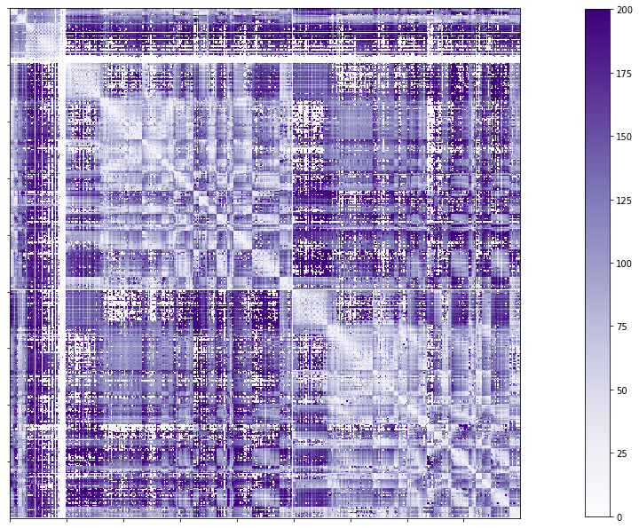

.. _matrices:

.. title:: Output matrices

Main output matrices
============================================================

.. contents:: Table of Contents

This section describes where are the main connectomes generated by the pipeline, and how you can visualize them using python or R.
All the outputs are BIDS conform and stored under their correspondent directory (e.g. ``mpc``, ``func``, ``dwi``, ``dist``).
This example will use the subject ``HC001``, session ``01`` from the MICs dataset, and all paths will be relative to the subject directory or ``out/micapipe/sub-HC001_ses01/``

Organization of the outputs
--------------------------------------------------------

If you are inside the ``out`` directory, where the pipeline's outputs are stored, two folders can be found inside, one for each pipeline used.
For this dataset, the main structure should look like this:

.. code-block:: bash

    out
    ├── fastsurfer
    └── micapipe_v0.2.0

Inside the directory called *micapipe_v0.2.0* a new directory will be created for each subject processed, defined with the string *sub-* and the subject's identification. Three more files can be found:

   - ``dataset_description.json``: This file contains the last version of micapipe that was used and, the inherited information about the dataset used.

   - ``micapipe_processed_sub.csv``: This is a csv table stores information about the modules processed by subject, date of last run and the status (complete or incomplete).

   - ``micapipe_group-QC.pdf``: This file is generated with the option ``-QC``, it is a pdf that eases the visualization of the processed subjects.

.. code-block:: bash
    :caption:  The subject list is truncated to the first three subjects

    micapipe_v0.2.0/
    ├── micapipe_processed_sub.csv
    ├── dataset_description.json
    ├── micapipe_group-QC.pdf
    ├── sub-HC001
    ├── sub-HC002
    ├── sub-HC003
    ...

Inside each subject's directory you'll find the session folders, unless you have a single session and you don't specify the ``ses-`` in your dataset.
Six main directories are inside each subject folder: *anat*, *dist*, *dwi*, *func*, *logs*, *maps*, *mpc*, *parc*, *QC* and *xfm*. The connectomes are stored in four main directories:

   - Geodesic distance connectome: ``dist``

   - Microstructural profile connectome: ``mpc/<acquisition>``

   - Structural connectome (DWI): ``dwi/connectomes``

   - Functional connectome (fMRI): ``func/<acquisition>/surf``

The structure of the subject ``HC001`` directories is shown below:

.. parsed-literal::

    sub-HC001/
    └── ses-01
        ├── **anat**
        ├── **dist**
        ├── **dwi**
        │   ├── **connectomes**      # DWI connectomes
        │   └── eddy                 # fsl eddy outputs
        ├── **func**
        │   ├── desc-me_task-rest_bold
        │   │   ├── surf
        │   │   └── volumetric
        │   └── desc-me_task-semantic_bold
        │       ├── surf
        │       └── volumetric
        ├── logs                     # log files
        ├── **maps**
        ├── **mpc**
        ├── QC
        │   └── eddy_QC              # fsl eddy_quad outputs
        ├── **surf**
        └── xfm                      # Transformation matrices and warpfields

In the following examples, we'll focus on how to load and visualize the connectome matrices of a single subject.
Even though we generate up to 18 connectomes, we'll only use the atlas ``schaefer-400`` for visualization and practicality purposes.
All the paths are relative to the subject's directory, which in our case is ``out/micapipe_v0.2.0/sub-HC001/ses-01``.

This example uses the packages ``nilearn``, ``nibabel``, ``numpy`` and ``matplotlib`` for **python**, and ``gifti``, ``RColorBrewer`` and ``viridis`` for **R**.
The first step in both languages is to set the environment:

.. tabs::

   .. code-tab:: py

    # Load required packages
    import os
    import numpy as np
    import nibabel as nib
    from nilearn import plotting
    import matplotlib as plt

    # Set the working directory to the 'out' directory
    os.chdir("/data_/mica3/BIDS_MICs/derivatives") # <<<<<<<<<<<< CHANGE THIS PATH TO YOUR OUT DIRECTORY

    # This variable will be different for each subject
    sub='HC001'           # <<<<<<<<<<<< CHANGE THIS SUBJECT's ID
    ses='01'              # <<<<<<<<<<<< CHANGE THIS SESSION
    subjectID=f'sub-{sub}_ses-{ses}'
    subjectDir=f'micapipe_v0.2.0/sub-{sub}/ses-{ses}'

    # Here we define the atlas
    atlas='schaefer-400'

   .. code-tab:: r R

    # Set the environment
    require("RColorBrewer")
    require("viridis")
    require("gifti")

    # Set the working directory to your subjec's directory
    setwd("out/micapipe_v0.2.0/sub-HC001/ses-01")

    # This variable will be different for each subject
    subjectID <- 'sub-HC001_ses-01'

    # Here we define the atlas
    atlas <- 'schaefer-400'

Structural connectome
--------------------------------------------------------

Structural connectomes are stored in the ``dwi/connectomes`` directory. One main connectomes is generated per atlas, and are identified with a specific string:
 - ``full-connectome``: Full connectome has cerebellar, subcortical and cortical nodes.

Additionally, the edge length of the previous connectomes is stored in a different file with the string ``edgeLengths``.

Two files per atlas are generated by the pipeline, the main organization is shown below:

.. parsed-literal::

    dwi/connectomes/
    ├── sub-HC005_ses-01_space-dwi_atlas-schaefer-400_desc-iFOD2-40M-SIFT2_full-connectome.shape.gii
    └── sub-HC005_ses-01_space-dwi_atlas-schaefer-400_desc-iFOD2-40M-SIFT2_full-edgeLengths.shape.gii

Full structural connectome
^^^^^^^^^^^^^^^^^^^^^^^^^^^^^^^^^^^^^^^^^^^^^^^^^^^^^^^^

.. tabs::

   .. code-tab:: py

    # Set the path to the the structural cortical connectome
    cnt_sc_cor = f'{subjectDir}/dwi/connectomes/{subjectID}_space-dwi_atlas-{atlas}_desc-iFOD2-40M-SIFT2_full-connectome.shape.gii'

    # Load the cortical connectome
    mtx_sc = nib.load(cnt_sc_cor).darrays[0].data

    # Fill the lower triangle of the matrix
    mtx_scSym = np.triu(mtx_sc,1)+mtx_sc.T

    # Plot the log matrix
    corr_plot = plotting.plot_matrix(np.log(mtx_scSym), figure=(10, 10), labels=None, cmap='Purples', vmin=0, vmax=10)

   .. code-tab:: r R

    # Set the path to the the structural cortical connectome
    cnt_sc_cor <- paste0('dwi/connectomes/', subjectID, '_space-dwi_atlas-', atlas, '_desc-iFOD2-40M-SIFT2_full-connectome.shape.gii')

    # Load the cortical connectome
    mtx_sc <- readGifti(cnt_sc_cor)$darrays[[1]]$data
    # mtx_sc <- as.matrix(read.csv(cnt_sc_cor, sep=" ", header <- FALSE,))

    # Fill the lower triangle of the matrix
    mtx_sc[lower.tri(mtx_sc)] <- t(mtx_sc)[lower.tri(mtx_sc)]

    # Plot the log matrix
    image(log(mtx_sc), axes=FALSE, main=paste0("SC ", atlas), col=brewer.pal(9, "Purples"))

.. figure:: SC_py.png
    :alt: alternate text
    :align: center
    :scale: 50 %

Full structural connectome edge lengths
^^^^^^^^^^^^^^^^^^^^^^^^^^^^^^^^^^^^^^^^^^^^^^^^^^^^^^^^

.. tabs::

   .. code-tab:: py

    # Set the path to the the structural cortical connectome
    cnt_sc_EL = cnt_sc_cor= f'{subjectDir}/dwi/connectomes/{subjectID}_space-dwi_atlas-{atlas}_desc-iFOD2-40M-SIFT2_full-edgeLengths.shape.gii'

    # Load the cortical connectome
    mtx_scEL = nib.load(cnt_sc_EL).darrays[0].data

    # Fill the lower triangle of the matrix
    mtx_scELSym = np.triu(mtx_scEL,1)+mtx_scEL.T

    # Plot the log matrix
    corr_plot = plotting.plot_matrix(mtx_scELSym, figure=(10, 10), labels=None, cmap='Purples', vmin=0, vmax=200)

   .. code-tab:: r R

    # Set the path to the the structural cortical connectome
    cnt_sc_EL <- paste0('dwi/connectomes/', subjectID, '_space-dwi_atlas-', atlas, '_desc-iFOD2-40M-SIFT2_full-edgeLengths.shape.gii')

    # Load the cortical connectome
    mtx_scEL <- readGifti(cnt_sc_EL)$darrays[[1]]$data
    # mtx_scEL <- as.matrix(read.csv(cnt_sc_EL, sep=" ", header=FALSE,))

    # Fill the lower triangle of the matrix
    mtx_scEL[lower.tri(mtx_scEL)] <- t(mtx_scEL)[lower.tri(mtx_scEL)]

    # Plot the log matrix
    image(log(mtx_scEL), axes=FALSE, main=paste0("SC ", atlas), col=brewer.pal(9, "Purples"))

Functional connectome
--------------------------------------------------------

For each atlas, one file is generated: the functional connectome (``desc-FC.shape.gii``) and
The time-series of that atlas is only stored in the surface fsLR-32k (``surf-fsLR-32k_desc-timeseries_clean.shape.gii``).

.. parsed-literal::

    func/<acquisition>/surf/
    └── sub-HC005_ses-01_surf-fsLR-32k_atlas-schaefer-400_desc-FC.shape.gii

.. tabs::

   .. code-tab:: py

    # Set the path to the the functional connectome
    # acquisitions
    func_acq='desc-se_task-rest_acq-AP_bold'
    cnt_fs = subjectDir + f'/func/{func_acq}/surf/{subjectID}_surf-fsLR-32k_atlas-{atlas}_desc-FC.shape.gii'

    # Load the cortical connectome
    mtx_fs = nib.load(cnt_fs).darrays[0].data

    # Fill the lower triangle of the matrix
    mtx_fcSym = np.triu(mtx_fs,1)+mtx_fs.T

    # Plot the matrix
    corr_plot = plotting.plot_matrix(mtx_fcSym, figure=(10, 10), labels=None, cmap='Reds', vmin=0, vmax=1)

   .. code-tab:: r R

    # Set the path to the the functional connectome
    cnt_fs <- paste0('func/desc-se_task-rest_acq-AP_bold/surf/', subjectID, '_surf-fsLR-32k_atlas-', atlas, '_desc-FC.shape.gii')

    # Load the cortical connectome
    mtx_fs <- readGifti(cnt_fs)$darrays[[1]]$data
    # mtx_fs <- as.matrix(read.csv(cnt_fs, sep=" ", header=FALSE))

    # Fill the lower triangle of the matrix
    mtx_fs[lower.tri(mtx_fs)] <- t(mtx_fs)[lower.tri(mtx_fs)]

    # Plot the matrix
    image(mtx_fs, axes=FALSE, main=paste0("FC ", atlas), col=brewer.pal(9, "Reds"))

Resting state time series
^^^^^^^^^^^^^^^^^^^^^^^^^^^^^^^^^^^^^^^^^^^^^^^^^^^^^^^^

.. tabs::

   .. code-tab:: py

    # Set the path to the the time series file
    cnt_time = subjectDir + f'/func/{func_acq}/surf/{subjectID}_surf-fsLR-32k_desc-timeseries_clean.shape.gii'

    # Load the time series
    mtx_time = nib.load(cnt_time).darrays[0].data

    # Plot as a matrix
    corr_plot = plotting.plot_matrix(mtx_time, figure=(300, 10), labels=None, cmap='plasma', vmin=-100, vmax=100)

   .. code-tab:: r R

    # Set the path to the the time series file
    cnt_time <- paste0('func/desc-se_task-rest_acq-AP_bold/surf/', subjectID, '_surf-fsLR-32k_desc-timeseries_clean.shape.gii')

    # Load the time series
    mtx_time <- readGifti(cnt_time)$darrays[[1]]$data
    # mtx_time <- as.matrix(read.csv(cnt_time, sep=" ", header=FALSE))

    # Plot as a matrix
    image(mtx_time, axes=FALSE, main=paste0("Time series ", atlas), col=plasma(64))

.. figure:: timeseries_py.png
    :alt: alternate text
    :align: center
    :scale: 50 %

MPC connectome
--------------------------------------------------------

For each atlas, two files are generated: the microstructural profile covariance connectome (``desc-MPC.shape.gii``) and the intensity profile of that atlas (``desc-intensity_profiles.shape.gii``).

.. parsed-literal::

    mpc/<acquisition>/
    ├── sub-HC005_ses-01_atlas-schaefer-400_desc-intensity_profiles.shape.gii
    └── sub-HC005_ses-01_atlas-schaefer-400_desc-MPC.shape.gii

.. tabs::

   .. code-tab:: py

    # Set the path to the the MPC cortical connectome
    mpc_acq='acq-T1map'
    ccnt_mpc = subjectDir + f'/mpc/{mpc_acq}/{subjectID}_atlas-{atlas}_desc-MPC.shape.gii'

    # Load the cortical connectome
    mtx_mpc = nib.load(cnt_mpc).darrays[0].data

    # Fill the lower triangle of the matrix
    mtx_mpcSym = np.triu(mtx_mpc,1)+mtx_mpc.T

    # Plot the matrix
    corr_plot = plotting.plot_matrix(mtx_mpcSym, figure=(10, 10), labels=None, cmap='Greens')

   .. code-tab:: r R

    # Set the path to the the MPC cortical connectome
    cnt_mpc <- paste0('mpc/acq-T1map/', subjectID, '_atlas-', atlas, '_desc-MPC.shape.gii')

    # Load the cortical connectome
    mtx_mpc <- readGifti(cnt_mpc)$darrays[[1]]$data

    # Fill the lower triangle of the matrix
    mtx_mpc[lower.tri(mtx_mpc)] <- t(mtx_mpc)[lower.tri(mtx_mpc)]

    # Plot the matrix
    image(mtx_mpc, axes=FALSE, main=paste0("MPC ", atlas), col=brewer.pal(9, "Greens"))

.. figure:: MPC_py.png
    :alt: alternate text
    :align: center
    :scale: 50 %

Intensity profiles
^^^^^^^^^^^^^^^^^^^^^^^^^^^^^^^^^^^^^^^^^^^^^^^^^^^^^^^^

.. tabs::

   .. code-tab:: py

    # Set the path to the Intensity profiles file
    cnt_int = subjectDir + f'/mpc/{mpc_acq}/{subjectID}_atlas-{atlas}_desc-intensity_profiles.shape.gii'

    # Load the Intensity profiles
    mtx_int = nib.load(cnt_int).darrays[0].data

    # Plot as a matrix
    corr_plot = plotting.plot_matrix(mtx_int, figure=(20,10), labels=None, cmap='Greens', colorbar=False)

   .. code-tab:: r R

    # Set the path to the Intensity profiles file
    cnt_int <- paste0('mpc/acq-T1map/', subjectID, '_atlas-', atlas, '_desc-intensity_profiles.shape.gii')

    # Load the time series
    mtx_mpc <- readGifti(cnt_int)$darrays[[1]]$data
    #mtx_int <- as.matrix(read.csv(cnt_int, sep=" ", header=FALSE))

    # Plot as a matrix
    image(mtx_int, axes=FALSE, main=paste0("Intensity profiles", atlas), col=brewer.pal(9, "Greens"))

Geodesic distance connectome
--------------------------------------------------------

Only one file per atlas is generated by this module:

.. parsed-literal::

    dist/
    └── sub-HC005_ses-01_atlas-schaefer-400_GD.shape.gii

.. tabs::

   .. code-tab:: py

    # Set the path to the the geodesic distance connectome
    cnt_gd = f'{subjectDir}/dist/{subjectID}_atlas-{atlas}_GD.shape.gii'

    # Load the cortical connectome
    mtx_gd = nib.load(cnt_gd).darrays[0].data

    # Plot the matrix
    corr_plot = plotting.plot_matrix(mtx_gd, figure=(10, 10), labels=None, cmap='Blues')

   .. code-tab:: r R

    # Set the path to the the geodesic distance connectome
    cnt_gd <- paste0('dist/', subjectID, '_atlas-', atlas, '_GD.shape.gii')

    # Load the cortical connectome
    mtx_gd <- readGifti(cnt_gd)$darrays[[1]]$data

    # Plot the matrix
    image(mtx_gd, axes=FALSE, main=paste0("GD ", atlas), col=brewer.pal(9, "Blues"))

Download code examples: matrices
--------------------------------------------------------

:download:`Python Jupyter notebook: 'tutorial_main_output_matrices.ipynb' <tutorial_main_output_matrices.ipynb>`

:download:`Python source code: 'tutorial_main_output_matrices.py' <tutorial_main_output_matrices.py>`

:download:`R source code: 'tutorial_main_output_matrices.R' <tutorial_main_output_matrices.R>`
