.. _surfaces:

.. title:: Visualization

*********************
Surface visualization
*********************

.. contents:: Table of Contents

This section describes the whereabouts of the main surfaces generated by the pipeline, and how you can visualized them using ``python`` or ``R``.
This example will use the subject ``HC001`` and session ``01`` from the MICs dataset, and all paths will be relative to the subject directory or ``out/micapipe/sub-HC001_ses01/``

In the following examples, we'll load and visualize single subject surfaces. Surfaces are distributed across different directories, namely:

.. parsed-literal::

    sub-HC001/
    └── ses-01
        ├── anat
        │   └── surfaces
        │       ├── **conte69          # conte69 surfaces**
        │       ├── **micro_profiles   # MPC connectomes and surfaces**
        │       └── **morphology       # Thickness and curvature surfaces**
        └── func
            └── **surfaces             # rsfMRI surfaces and connectomes**

Each native surface parcellation is found inside the subject's freesurfer directory and contains the string ``mics.annot``:

.. parsed-literal::

    freesurfer/
    └── sub-S03_ses-SES01
        └── label
            ├── lh.schaefer-400_**mics.annot**
            └── rh.schaefer-400_**mics.annot**

Setting the environment
--------------------------------------------------------

This example uses the packages the python packages ``os``, ``matplotlib``, ``numpy``, ``nibabel``, ``matplotlib`` and ``brainspace``.
If you are interested in plotting surfaces with BrainSpace, check the corresponding `documentation <https://brainspace.readthedocs.io/en/latest/>`_!!

**R** libraries are ``RColorBrewer``, ``viridis``, ``fsbrain``, ``freesurferformats`` and ``rgl``.
For further information about managing and visualizing surfaces with **R**, check the `fsbrain vignettes <https://cran.r-project.org/web/packages/fsbrain/vignettes/fsbrain.html>`_, `fsbrain github repository <https://github.com/dfsp-spirit/fsbrain>`_, and
`freesurferformats <https://github.com/dfsp-spirit/freesurferformats>`_

The first step in both languages is to set the environment.

.. tabs::

   .. code-tab:: py

    # Set the environment
    import os
    import numpy as np
    import matplotlib as plt
    import nibabel as nb
    from nibabel.freesurfer.mghformat import load
    from brainspace.plotting import plot_hemispheres
    from brainspace.mesh.mesh_io import read_surface
    from brainspace.datasets import load_conte69

    # Set the working directory to the 'out' directory
    os.chdir("~/out") # <<<<<<<<<<<< CHANGE THIS PATH

    # This variable will be different for each subject
    subjectID='sub-HC001_ses-01'           # <<<<<<<<<<<< CHANGE THIS SUBJECT's ID
    subjectDir='micapipe/sub-HC001/ses-01' # <<<<<<<<<<<< CHANGE THIS SUBJECT's DIRECTORY

    # Set paths and variables
    dir_FS = 'freesurfer/' + subjectID
    dir_conte = subjectDir + '/anat/surfaces/conte69/'
    dir_morph = subjectDir + '/anat/surfaces/morphology/'
    dir_mpc = subjectDir + '/anat/surfaces/micro_profiles/'

   .. code-tab:: r R

    # Set the environment        'R 3.6.3'
    require('RColorBrewer')      # version 1.1-2
    require('viridis')           # version 0.5.1
    require('fsbrain')           # version 0.4.2
    require('freesurferformats') # version 0.1.14
    require('rgl')               # version 0.1.54

    # Set the working directory to the out directory
    setwd("~/tmp/micaConn/micapipe_tutorials") # <<<<<<<<<<<< CHANGE THIS PATH

    # This variable will be different for each subject
    subjectID <- 'sub-HC001_ses-01' # <<<<<<<<<<<< CHANGE THIS SUBJECT's ID
    subjectDir <- 'micapipe/sub-HC001/ses-01' # <<<<<<<<<<<< CHANGE THIS SUBJECT's DIRECTORY

    # Here we define the atlas
    atlas <- 'schaefer-400' # <<<<<<<<<<<< CHANGE THIS ATLAS

    # Set paths and variables
    dir_conte <- paste0(subjectDir, '/anat/surfaces/conte69/')
    dir_morph <- paste0(subjectDir, '/anat/surfaces/morphology/')
    dir_mpc <- paste0(subjectDir, '/anat/surfaces/micro_profiles/')

Load the surfaces
--------------------------------------------------------

.. tabs::

   .. code-tab:: py

    # Load native pial surface
    pial_lh = read_surface(dir_FS+'/surf/lh.pial', itype='fs')
    pial_rh = read_surface(dir_FS+'/surf/rh.pial', itype='fs')

    # Load native mid surface
    mid_lh = read_surface(dir_FS+'/surf/lh.midthickness.surf.gii', itype='gii')
    mid_rh = read_surface(dir_FS+'/surf/rh.midthickness.surf.gii', itype='gii')

    # Load native white matter surface
    wm_lh = read_surface(dir_FS+'/surf/lh.white', itype='fs')
    wm_rh = read_surface(dir_FS+'/surf/rh.white', itype='fs')

    # Load native inflated surface
    inf_lh = read_surface(dir_FS+'/surf/lh.inflated', itype='fs')
    inf_rh = read_surface(dir_FS+'/surf/rh.inflated', itype='fs')

    # Load fsaverage5
    fs5_lh = read_surface('freesurfer/fsaverage5/surf/lh.pial', itype='fs')
    fs5_rh = read_surface('freesurfer//fsaverage5/surf/rh.pial', itype='fs')

    # Load fsaverage5 inflated
    fs5_inf_lh = read_surface('freesurfer/fsaverage5/surf/lh.inflated', itype='fs')
    fs5_inf_rh = read_surface('freesurfer//fsaverage5/surf/rh.inflated', itype='fs')

    # Load conte69
    c69_lh, c69_rh = load_conte69()

   .. code-tab:: r R

    # Helper function
    plot_surface <-function(brainMesh, legend='', view_angles=c('sd_lateral_lh', 'sd_medial_lh', 'sd_medial_rh', 'sd_lateral_rh'), img_only=FALSE) {
      try(img <- vis.export.from.coloredmeshes(brainMesh, colorbar_legend = legend, grid_like = FALSE, view_angles = view_angles, img_only = img_only, horizontal=TRUE))
      while (rgl.cur() > 0) { rgl.close() }; file.remove(list.files(path = getwd(), pattern = 'fsbrain'))
      return(img)
    }

Morphology
--------------------------------------------------------

Two surface based morphological features are plotted here: cortical thickness and curvature. Both measurements are generates in three main surfaces, native, fsaverage5 and conte69.
The curvature and thickness in fsaverage5 and conte69 are smoothed with a 10mm gaussian kernel.

Thickness: Inflated native surface
========================================================

.. tabs::

   .. code-tab:: py

    # Load data
    th_lh = dir_morph + subjectID + '_space-fsnative_desc-lh_thickness.mgh'
    th_rh = dir_morph + subjectID + '_space-fsnative_desc-rh_thickness.mgh'
    th_nat = np.hstack(np.concatenate((np.array(load(th_lh).get_fdata()),
                                       np.array(load(th_rh).get_fdata())), axis=0))

    # Plot the surface
    plot_hemispheres(inf_lh, inf_rh, array_name=th_nat, size=(900, 250), color_bar='bottom', zoom=1.25, embed_nb=True, interactive=False, share='both',
                     nan_color=(0, 0, 0, 1), color_range=(1.5, 4), cmap="inferno", transparent_bg=False)

   .. code-tab:: r R

    # Set the path to the surface
    th.lh <- paste0(dir_morph, subjectID, "_space-fsnative_desc-lh_thickness.mgh")
    th.rh <- paste0(dir_morph, subjectID, "_space-fsnative_desc-rh_thickness.mgh")

    # Plot the surface
    th_nat <- vis.data.on.subject('freesurfer/', subjectID, morph_data_lh=th.lh, morph_data_rh=th.rh, surface="inflated", draw_colorbar = TRUE,
                                  views=NULL, rglactions = list('trans_fun'=limit_fun(1.5, 4), 'no_vis'=T),  makecmap_options = list('colFn'=inferno))
    plot_surface(th_nat, 'Thickness [mm]')

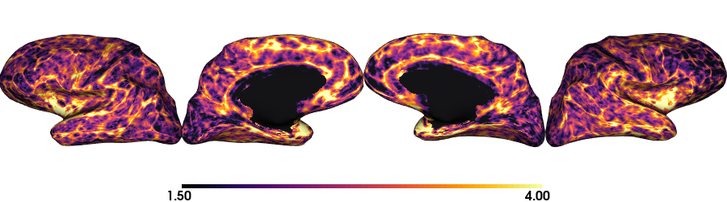

Thickness: Inflated fsaverage5
========================================================

.. tabs::

   .. code-tab:: py

    # Load data
    th_lh_fs5 = dir_morph + subjectID + '_space-fsaverage5_desc-lh_thickness.mgh'
    th_rh_fs5 = dir_morph + subjectID + '_space-fsaverage5_desc-rh_thickness.mgh'
    th_fs5 = np.hstack(np.concatenate((np.array(load(th_lh_fs5).get_fdata()),
                                       np.array(load(th_rh_fs5).get_fdata())), axis=0))

    # Plot the surface
    plot_hemispheres(fs5_inf_lh, fs5_inf_rh, array_name=th_fs5, size=(900, 250), color_bar='bottom', zoom=1.25, embed_nb=True, interactive=False, share='both',
                             nan_color=(0, 0, 0, 1), color_range=(1.5, 4), cmap="inferno", transparent_bg=False)

   .. code-tab:: r R

    # Set the path to the surface
    th.lh.fs5 <- paste0(dir_morph, subjectID, "_space-fsaverage5_desc-lh_thickness.mgh")
    th.rh.fs5 <- paste0(dir_morph, subjectID, "_space-fsaverage5_desc-rh_thickness.mgh")

    # Plot the surface
    th_fs5 <- vis.data.on.subject('freesurfer/', 'fsaverage5', morph_data_lh=th.lh.fs5, morph_data_rh=th.rh.fs5, surface="inflated", draw_colorbar = TRUE,
                                  views=NULL, rglactions = list('trans_fun'=limit_fun(1.5, 4), 'no_vis'=T),  makecmap_options = list('colFn'=inferno))
    plot_surface(th_fs5, 'Thickness [mm]')

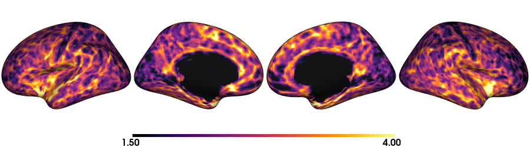

Thickness: conte69
========================================================

.. tabs::

   .. code-tab:: py

    # Load the data
    th_lh_c69 = dir_morph + subjectID + '_space-conte69-32k_desc-lh_thickness.mgh'
    th_rh_c69 = dir_morph + subjectID + '_space-conte69-32k_desc-rh_thickness.mgh'
    th_c69 = np.hstack(np.concatenate((np.array(load(th_lh_c69).get_fdata()),
                                       np.array(load(th_rh_c69).get_fdata())), axis=0))

    # Plot the surface
    plot_hemispheres(c69_lh, c69_rh, array_name=th_c69, size=(900, 250), color_bar='bottom', zoom=1.25, embed_nb=True, interactive=False, share='both',
                             nan_color=(0, 0, 0, 1), color_range=(1.5, 4), cmap="inferno", transparent_bg=False)

   .. code-tab:: r R

    # Set the path to the surface
    th.lh.c69 <- paste0(dir_morph, subjectID, '_space-conte69-32k_desc-lh_thickness.mgh')
    th.rh.c69 <- paste0(dir_morph, subjectID, '_space-conte69-32k_desc-rh_thickness.mgh')

    # Plot the surface
    th_c69 <- vis.data.on.subject('freesurfer/', 'conte69', morph_data_lh=th.lh.c69, morph_data_rh=th.rh.c69, surface='conte69.gii', draw_colorbar = TRUE,
                                  views=NULL, rglactions = list('trans_fun'=limit_fun(1.5, 4), 'no_vis'=T),  makecmap_options = list('colFn'=inferno))
    plot_surface(th_c69, 'Thickness [mm]')

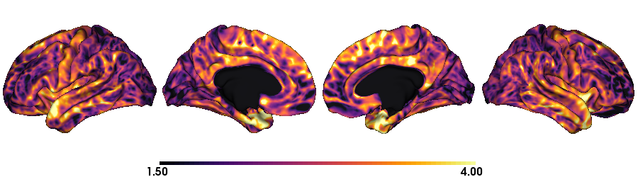

Curvature: Native inflated surface
========================================================

.. tabs::

   .. code-tab:: py

    # Load the data
    cv_lh = dir_morph + subjectID + '_space-fsnative_desc-lh_curvature.mgh'
    cv_rh = dir_morph + subjectID + '_space-fsnative_desc-rh_curvature.mgh'
    cv = np.hstack(np.concatenate((np.array(load(cv_lh).get_fdata()),
                                   np.array(load(cv_rh).get_fdata())), axis=0))

    # Plot the surface
    plot_hemispheres(inf_lh, inf_rh, array_name=cv, size=(900, 250), color_bar='bottom', zoom=1.25, embed_nb=True, interactive=False, share='both',
                             nan_color=(0, 0, 0, 1), color_range=(-0.2, 0.2), cmap='RdYlGn', transparent_bg=False)

   .. code-tab:: r R

    # Colormap
    RdYlGn <- colorRampPalette(brewer.pal(11,"RdYlGn"))

    ####  Curvature: Native surface
    # Set the path to the surface
    cv.lh <- paste0(dir_morph, subjectID, "_space-fsnative_desc-lh_curvature.mgh")
    cv.rh <- paste0(dir_morph, subjectID, "_space-fsnative_desc-rh_curvature.mgh")

    # Plot the surface
    cv_nat <- vis.data.on.subject('freesurfer/', subjectID, morph_data_lh=cv.lh, morph_data_rh=cv.rh, surface="inflated", draw_colorbar = TRUE,
                                  views=NULL, rglactions = list('trans_fun'=limit_fun(-0.2, 0.2), 'no_vis'=T),  makecmap_options = list('colFn'=RdYlGn))
    plot_surface(cv_nat, 'Curvature [1/mm]')

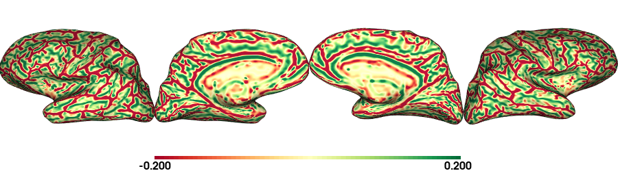

Curvature: fsaverage5
========================================================

.. tabs::

   .. code-tab:: py

    # Load the data
    cv_lh_fs5 = dir_morph + subjectID + '_space-fsaverage5_desc-lh_curvature.mgh'
    cv_rh_fs5 = dir_morph + subjectID + '_space-fsaverage5_desc-rh_curvature.mgh'
    cv_fs5 = np.hstack(np.concatenate((np.array(load(cv_lh_fs5).get_fdata()),
                                       np.array(load(cv_rh_fs5).get_fdata())), axis=0))

    # Plot the surface
    plot_hemispheres(fs5_inf_lh, fs5_inf_rh, array_name=cv_fs5, size=(900, 250), color_bar='bottom', zoom=1.25, embed_nb=True, interactive=False, share='both',
                             nan_color=(0, 0, 0, 1), color_range=(-0.2, 0.2), cmap='RdYlGn', transparent_bg=False)

   .. code-tab:: r R

    # Set the path to the surface
    cv.lh.fs5 <- paste0(dir_morph, subjectID, "_space-fsaverage5_desc-lh_curvature.mgh")
    cv.rh.fs5 <- paste0(dir_morph, subjectID, "_space-fsaverage5_desc-rh_curvature.mgh")

    # Plot the surface
    cv_fs5 <- vis.data.on.subject('freesurfer/', 'fsaverage5', morph_data_lh=cv.lh.fs5, morph_data_rh=cv.rh.fs5, surface="inflated", draw_colorbar = TRUE,
                                  views=NULL, rglactions = list('trans_fun'=limit_fun(-0.2, 0.2), 'no_vis'=T),  makecmap_options = list('colFn'=RdYlGn))
    plot_surface(cv_fs5, 'Curvature [1/mm]')

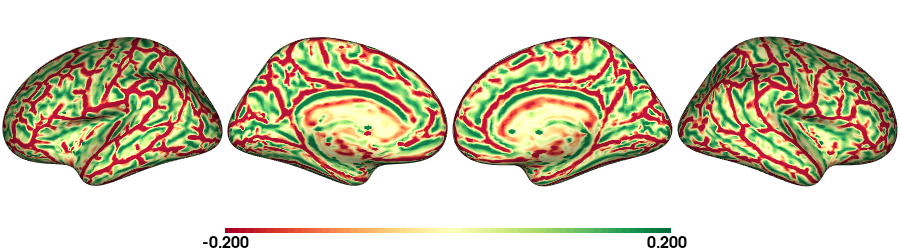

Curvature: conte69
========================================================

.. tabs::

   .. code-tab:: py

    # Load the data
    cv_lh_c69 = dir_morph + subjectID + '_space-conte69-32k_desc-lh_curvature.mgh'
    cv_rh_c69 = dir_morph + subjectID + '_space-conte69-32k_desc-rh_curvature.mgh'
    cv_c69 = np.hstack(np.concatenate((np.array(load(cv_lh_c69).get_fdata()),
                                       np.array(load(cv_rh_c69).get_fdata())), axis=0))

    # Plot the surface
    plot_hemispheres(c69_lh, c69_rh, array_name=cv_c69, size=(900, 250), color_bar='bottom', zoom=1.25, embed_nb=True, interactive=False, share='both',
                             nan_color=(0, 0, 0, 1), color_range=(-0.2, 0.2), cmap='RdYlGn', transparent_bg=False)

   .. code-tab:: r R

    # Set the path to the surface
    cv.lh.c69 <- paste0(dir_morph, subjectID, '_space-conte69-32k_desc-lh_curvature.mgh')
    cv.rh.c69 <- paste0(dir_morph, subjectID, '_space-conte69-32k_desc-rh_curvature.mgh')

    # Plot the surface
    cv_c69 <- vis.data.on.subject('freesurfer', 'conte69', morph_data_lh=cv.lh.c69, morph_data_rh=cv.rh.c69, surface='conte69.gii', draw_colorbar = TRUE,
                                  views=NULL, rglactions = list('trans_fun'=limit_fun(-0.2, 0.2), 'no_vis'=T),  makecmap_options = list('colFn'=RdYlGn))
    plot_surface(cv_c69, 'Curvature [1/mm]')

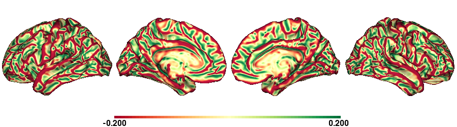

Morphology Smoothed
--------------------------------------------------------

Thickness fsaverage5 fwhm=10mm
========================================================

.. tabs::

   .. code-tab:: py

    # Load the data
    th_lh_fs5_10mm = dir_morph + subjectID + '_space-fsaverage5_desc-lh_thickness_10mm.mgh'
    th_rh_fs5_10mm = dir_morph + subjectID + '_space-fsaverage5_desc-rh_thickness_10mm.mgh'
    th_fs5_10mm = np.hstack(np.concatenate((np.array(load(th_lh_fs5_10mm).get_fdata()),
                                        np.array(load(th_rh_fs5_10mm).get_fdata())), axis=0))

    # Plot the surface
    plot_hemispheres(fs5_lh, fs5_rh, array_name=th_fs5_10mm, size=(900, 250), color_bar='bottom', zoom=1.25, embed_nb=True, interactive=False, share='both',
                             nan_color=(0, 0, 0, 1), color_range=(1.5, 4), cmap="inferno", transparent_bg=False)

   .. code-tab:: r R

    # Set the path to the surface
    th.lh.fs5.10mm <- paste0(dir_morph, subjectID, "_space-fsaverage5_desc-lh_thickness_10mm.mgh")
    th.rh.fs5.10mm <- paste0(dir_morph, subjectID, "_space-fsaverage5_desc-rh_thickness_10mm.mgh")

    # Plot the surface
    th_fs5.10mm <- vis.data.on.subject('freesurfer/', 'fsaverage5', morph_data_lh=th.lh.fs5.10mm, morph_data_rh=th.rh.fs5.10mm, surface="pial", draw_colorbar = TRUE,
                                  views=NULL, rglactions = list('trans_fun'=limit_fun(1.5, 4), 'no_vis'=T),  makecmap_options = list('colFn'=inferno))
    plot_surface(th_fs5.10mm, 'Thickness [mm]')

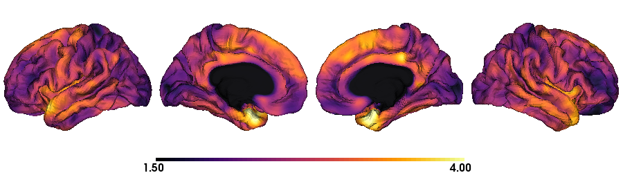

Thickness conte69 fwhm=10mm
========================================================

.. tabs::

   .. code-tab:: py

    # Load the data
    th_lh_c69_10mm = dir_morph + subjectID + '_space-conte69-32k_desc-lh_thickness_10mm.mgh'
    th_rh_c69_10mm = dir_morph + subjectID + '_space-conte69-32k_desc-rh_thickness_10mm.mgh'
    th_c69_10mm = np.hstack(np.concatenate((np.array(load(th_lh_c69_10mm).get_fdata()),
                                        np.array(load(th_rh_c69_10mm).get_fdata())), axis=0))

    # Plot the surface
    plot_hemispheres(c69_lh, c69_rh, array_name=th_c69_10mm, size=(900, 250), color_bar='bottom', zoom=1.25, embed_nb=True, interactive=False, share='both',
                             nan_color=(0, 0, 0, 1), color_range=(1.5, 4), cmap="inferno", transparent_bg=False)

   .. code-tab:: r R

    # Set the path to the surface
    th.lh.c69.10mm <- paste0(dir_morph, subjectID, '_space-conte69-32k_desc-lh_thickness_10mm.mgh')
    th.rh.c69.10mm <- paste0(dir_morph, subjectID, '_space-conte69-32k_desc-rh_thickness_10mm.mgh')

    # Plot the surface
    th_c69.10mm <- vis.data.on.subject('freesurfer/', 'conte69', morph_data_lh=th.lh.c69.10mm, morph_data_rh=th.rh.c69.10mm, surface='conte69.gii', draw_colorbar = TRUE,
                                       views=NULL, rglactions = list('trans_fun'=limit_fun(1.5, 4), 'no_vis'=T),  makecmap_options = list('colFn'=inferno))
    plot_surface(th_c69.10mm, 'Thickness [mm]')

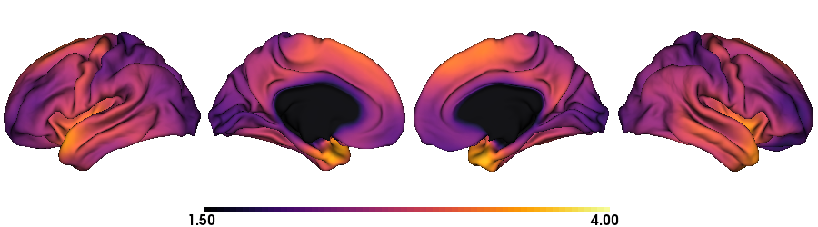

Curvature fsaverage5 fwhm=10mm
========================================================

.. tabs::

   .. code-tab:: py

    # Load the data
    cv_lh_fs5_10mm = dir_morph + subjectID + '_space-fsaverage5_desc-lh_curvature_10mm.mgh'
    cv_rh_fs5_10mm = dir_morph + subjectID + '_space-fsaverage5_desc-rh_curvature_10mm.mgh'
    cv_fs5_10mm = np.hstack(np.concatenate((np.array(load(cv_lh_fs5_10mm).get_fdata()),
                                       np.array(load(cv_rh_fs5_10mm).get_fdata())), axis=0))

    # Plot the surface
    plot_hemispheres(fs5_lh, fs5_rh, array_name=cv_fs5_10mm, size=(900, 250), color_bar='bottom', zoom=1.25, embed_nb=True, interactive=False, share='both',
                             nan_color=(0, 0, 0, 1), color_range=(-0.2, 0.2), cmap='RdYlGn', transparent_bg=False)

   .. code-tab:: r R

    # Set the path to the surface
    cv.lh.fs5.10mm <- paste0(dir_morph, subjectID, "_space-fsaverage5_desc-lh_curvature_10mm.mgh")
    cv.rh.fs5.10mm <- paste0(dir_morph, subjectID, "_space-fsaverage5_desc-rh_curvature_10mm.mgh")

    # Plot the surface
    cv_fs5.10mm <- vis.data.on.subject('freesurfer/', 'fsaverage5', morph_data_lh=cv.lh.fs5.10mm, morph_data_rh=cv.rh.fs5.10mm, surface="pial", draw_colorbar = TRUE,
                                  views=NULL, rglactions = list('trans_fun'=limit_fun(-0.2, 0.2), 'no_vis'=T),  makecmap_options = list('colFn'=RdYlGn))
    plot_surface(cv_fs5.10mm, 'Curvature [1/mm]')

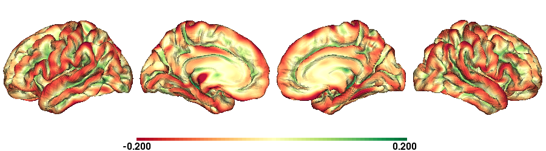

Curvature conte69 fwhm=10mm
========================================================

.. tabs::

   .. code-tab:: py

    # Load the data
    cv_lh_c69_10mm = dir_morph + subjectID + '_space-conte69-32k_desc-lh_curvature_10mm.mgh'
    cv_rh_c69_10mm = dir_morph + subjectID + '_space-conte69-32k_desc-rh_curvature_10mm.mgh'
    cv_c69_10mm = np.hstack(np.concatenate((np.array(load(cv_lh_c69_10mm).get_fdata()),
                                        np.array(load(cv_rh_c69_10mm).get_fdata())), axis=0))

    # Plot the surface
    plot_hemispheres(c69_lh, c69_rh, array_name=cv_c69_10mm, size=(900, 250), color_bar='bottom', zoom=1.25, embed_nb=True, interactive=False, share='both',
                             nan_color=(0, 0, 0, 1), color_range=(-0.1, 0.1), cmap='RdYlGn', transparent_bg=False)

   .. code-tab:: r R

    # Set the path to the surface
    cv.lh.c69.10mm <- paste0(dir_morph, subjectID, '_space-conte69-32k_desc-lh_curvature_10mm.mgh')
    cv.rh.c69.10mm <- paste0(dir_morph, subjectID, '_space-conte69-32k_desc-rh_curvature_10mm.mgh')

    # Plot the surface
    cv_c69.10mm <- vis.data.on.subject('freesurfer', 'conte69', morph_data_lh=cv.lh.c69.10mm, morph_data_rh=cv.rh.c69.10mm, surface='conte69.gii', draw_colorbar = TRUE,
                                  views=NULL, rglactions = list('trans_fun'=limit_fun(-0.2, 0.2), 'no_vis'=T),  makecmap_options = list('colFn'=RdYlGn))
    plot_surface(cv_c69.10mm, 'Curvature [1/mm]')

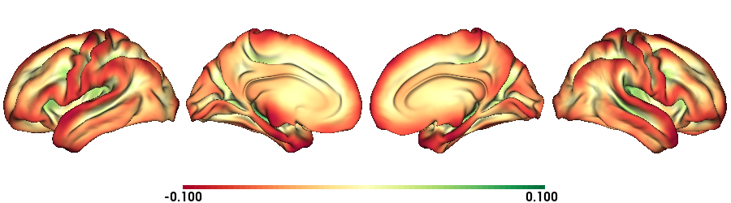

Conte69
--------------------------------------------------------

conte69: Pial surface
========================================================

.. tabs::

   .. code-tab:: py

    # Create a vector of zeros
    Val = np.repeat(0, c69_pial_lh_c69.n_points + c69_pial_rh_c69.n_points, axis=0)
    # Surface color
    grey = plt.colors.ListedColormap(np.full((256, 4), [0.65, 0.65, 0.65, 1]))

    # Native conte69 pial surface
    c69_pial_lh_c69 = read_surface(dir_conte+subjectID+'_space-conte69-32k_desc-lh_pial.surf.gii', itype='gii')
    c69_pial_rh_c69 = read_surface(dir_conte+subjectID+'_space-conte69-32k_desc-rh_pial.surf.gii', itype='gii')

    # Plot the surface
    plot_hemispheres(c69_pial_lh_c69, c69_pial_rh_c69, array_name=Val, size=(900, 250), zoom=1.25, embed_nb=True, interactive=False, share='both',
                     nan_color=(0, 0, 0, 1), color_range=(1.5, 4), cmap=grey, transparent_bg=False)

   .. code-tab:: r R

    # Colormap
    grays <- colorRampPalette(c('gray65', 'gray65', 'gray65'))

    # Set the path to the surface
    c69.pial.lh <- read.fs.surface(filepath = paste0(dir_conte, subjectID,'_space-conte69-32k_desc-lh_pial.surf.gii') )
    c69.pial.rh <- read.fs.surface(filepath = paste0(dir_conte, subjectID,'_space-conte69-32k_desc-rh_pial.surf.gii') )

    # Plot the surface
    cml = coloredmesh.from.preloaded.data(c69.pial.lh, morph_data = rep(0, nrow(c69.pial.lh$vertices)), makecmap_options = list('colFn'=grays) )
    cmr = coloredmesh.from.preloaded.data(c69.pial.rh, morph_data = rep(0, nrow(c69.pial.rh$vertices)), makecmap_options = list('colFn'=grays) )
    brainviews(views = 't4', coloredmeshes=list('lh'=cml, 'rh'=cmr), draw_colorbar = FALSE,
               rglactions = list('trans_fun'=limit_fun(-1, 1), 'no_vis'=F))

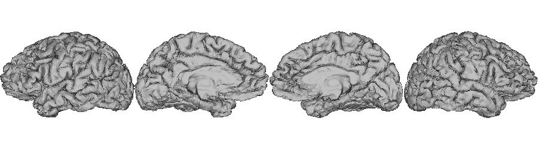

conte69: Middle surface
========================================================

.. tabs::

   .. code-tab:: py

    # Native conte69 midsurface
    c69_mid_lh = read_surface(dir_conte+subjectID+'_space-conte69-32k_desc-lh_midthickness.surf.gii', itype='gii')
    c69_mid_rh = read_surface(dir_conte+subjectID+'_space-conte69-32k_desc-rh_midthickness.surf.gii', itype='gii')

    # Plot the surface
    plot_hemispheres(c69_mid_lh, c69_mid_lh, array_name=Val, size=(900, 250), zoom=1.25, embed_nb=True, interactive=False, share='both',
                     nan_color=(0, 0, 0, 1), color_range=(-1,1), cmap=grey, transparent_bg=False)

   .. code-tab:: r R

    # Set the path to the surface
    c69.mid.lh <- read.fs.surface(filepath = paste0(dir_conte, subjectID,'_space-conte69-32k_desc-lh_midthickness.surf.gii') )
    c69.mid.rh <- read.fs.surface(filepath = paste0(dir_conte, subjectID,'_space-conte69-32k_desc-rh_midthickness.surf.gii') )

    # Plot the surface
    cml = coloredmesh.from.preloaded.data(c69.mid.lh, morph_data = rep(0, nrow(c69.mid.lh$vertices)), makecmap_options = list('colFn'=grays) )
    cmr = coloredmesh.from.preloaded.data(c69.mid.rh, morph_data = rep(0, nrow(c69.mid.rh$vertices)), makecmap_options = list('colFn'=grays) )
    brainviews(views = 't4', coloredmeshes=list('lh'=cml, 'rh'=cmr), draw_colorbar = FALSE,
               rglactions = list('trans_fun'=limit_fun(-1, 1), 'no_vis'=F))

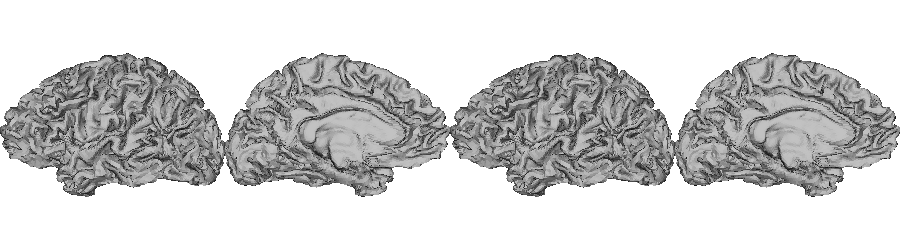

conte69: White matter surface
========================================================

.. tabs::

   .. code-tab:: py

    # Native conte69 white matter
    c69_wm_lh = read_surface(dir_conte+subjectID+'_space-conte69-32k_desc-lh_white.surf.gii', itype='gii')
    c69_wm_rh = read_surface(dir_conte+subjectID+'_space-conte69-32k_desc-rh_white.surf.gii', itype='gii')

    # Plot the surface
    plot_hemispheres(c69_wm_lh, c69_wm_lh, array_name=Val, size=(900, 250), zoom=1.25, embed_nb=True, interactive=False, share='both',
                     nan_color=(0, 0, 0, 1), color_range=(1.5, 4), cmap=grey, transparent_bg=False)

   .. code-tab:: r R

    # Set the path to the surface
    c69.wm.lh <- read.fs.surface(filepath = paste0(dir_conte, subjectID,'_space-conte69-32k_desc-lh_white.surf.gii') )
    c69.wm.rh <- read.fs.surface(filepath = paste0(dir_conte, subjectID,'_space-conte69-32k_desc-rh_white.surf.gii') )

    # Plot the surface
    cml = coloredmesh.from.preloaded.data(c69.wm.lh, morph_data = rep(0, nrow(c69.wm.lh$vertices)), makecmap_options = list('colFn'=grays) )
    cmr = coloredmesh.from.preloaded.data(c69.wm.rh, morph_data = rep(0, nrow(c69.wm.rh$vertices)), makecmap_options = list('colFn'=grays) )
    brainviews(views = 't4', coloredmeshes=list('lh'=cml, 'rh'=cmr), draw_colorbar = FALSE,
               rglactions = list('trans_fun'=limit_fun(-1, 1), 'no_vis'=F))

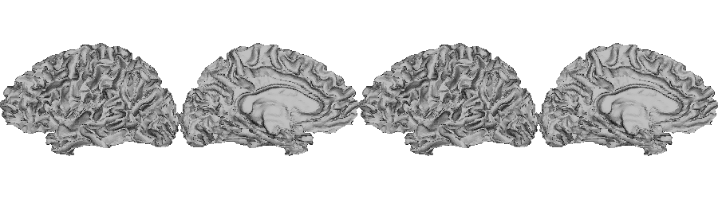

Native sphere
--------------------------------------------------------

.. tabs::

   .. code-tab:: py

    # Plot the surface
    plot_hemispheres(sph_lh, sph_rh, array_name=CV, size=(900, 250), zoom=1.25, embed_nb=True, interactive=False, share='both',
                     nan_color=(0, 0, 0, 1), color_range=(-0.2, 0.2), cmap="gray", transparent_bg=False)

   .. code-tab:: r R

    # Colormap
    grays <- colorRampPalette(c('white', 'gray65','black'))

    # Set the path to the surface
    sph.lh <- read.fs.surface(filepath = paste0(dir_conte, subjectID,'_lh_sphereReg.surf.gii'))
    sph.rh <- read.fs.surface(filepath = paste0(dir_conte, subjectID,'_rh_sphereReg.surf.gii'))

    # Set the color limits
    lf= limit_fun(-0.2, 0.2)

    # Create the coloredmeshes
    cml = coloredmesh.from.preloaded.data(sph.lh, morph_data = lf(read.fs.mgh(cv.lh)), hemi = 'lh', makecmap_options = list('colFn'=grays))
    cmr = coloredmesh.from.preloaded.data(sph.rh, morph_data = lf(read.fs.mgh(cv.rh)), hemi = 'rh', makecmap_options = list('colFn'=grays))
    sph.nat <- brainviews(views = 't4', coloredmeshes=list('lh'=cml, 'rh'=cmr), rglactions = list('no_vis'=T))

    # Plot the surface
    plot_surface(sph.nat, 'Native sphere curvature [1/mm]')

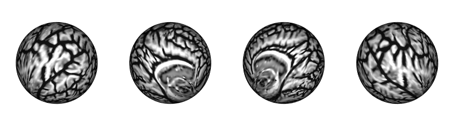

Microstructural profile
--------------------------------------------------------

The intracortical intensities are generated across 14 different surface layer from the white mater surface to the pial surface.
Furthermore they are available in the native surface, in fsaverage5 and conte69. In this example we will only plot the 10th surface.

MPC native surface-10
========================================================

.. tabs::

   .. code-tab:: py

    # Create a mask
    mask = np.hstack( np.where(th_nat < 0.5, 0, 1) )

    # Load the MPC
    mpc_lh = dir_mpc + subjectID + '_space-fsnative_desc-lh_MPC-10.mgh'
    mpc_rh = dir_mpc + subjectID + '_space-fsnative_desc-rh_MPC-10.mgh'
    mpc = np.hstack(np.concatenate((np.array(load(mpc_lh).get_fdata()),
                                    np.array(load(mpc_rh).get_fdata())), axis=0))*mask

    # Set color range based on MPC distribution
    Qt = (round(np.quantile(mpc[np.nonzero(mpc)],0.05),0), round(np.quantile(mpc[np.nonzero(mpc)],0.95),0))

    # Plot MPC on surface
    plot_hemispheres(pial_lh, pial_rh, array_name=mpc, size=(900, 250), color_bar='bottom', zoom=1.25, embed_nb=True, interactive=False, share='both',
                nan_color=(0, 0, 0, 1), color_range=Qt, cmap="viridis",transparent_bg=False)

   .. code-tab:: r R

    # Create a mask
    mask.lh <- ifelse(read.fs.morph(th.lh)<0.5,0,1)
    mask.rh <- ifelse(read.fs.morph(th.rh)<0.5,0,1)

    # Set the path to the surface
    mpc.lh <- paste0(dir_mpc, subjectID, "_space-fsnative_desc-lh_MPC-10.mgh")
    mpc.rh <- paste0(dir_mpc, subjectID, "_space-fsnative_desc-rh_MPC-10.mgh")

    # Load the data
    mpc <- list(lh=read.fs.morph(mpc.lh)*mask.lh,  rh=read.fs.morph(mpc.rh)*mask.rh )

    # Set color range based on MPC distribution
    Qt <- round(quantile(c(mpc$lh[mpc$lh!=0], mpc$rh[mpc$rh!=0]), probs = c(0.05,0.95)),1)

    # Plot the surface
    mpc.nat <- vis.data.on.subject('freesurfer/', subjectID, morph_data_lh=mpc$lh, morph_data_rh=mpc$rh, surface="pial", draw_colorbar = TRUE,
                                   views=NULL, rglactions = list('trans_fun'=limit_fun(Qt[1],Qt[2]), 'no_vis'=T),  makecmap_options = list('colFn'=viridis))
    plot_surface(mpc.nat, 'MPC-10')

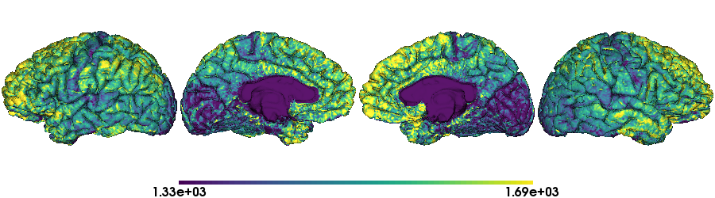

MPC fsaverage5 surface-10
========================================================

.. tabs::

   .. code-tab:: py

    # Create a mask
    mask_fs5 = np.hstack( np.where(th_fs5 < 0.5, 0, 1) )

    # Load the MPC
    mpc_lh_fs5 = dir_mpc + subjectID + '_space-fsaverage5_desc-lh_MPC-10.mgh'
    mpc_rh_fs5 = dir_mpc + subjectID + '_space-fsaverage5_desc-rh_MPC-10.mgh'
    mpc_fs5 = np.hstack(np.concatenate((np.array(load(mpc_lh_fs5).get_fdata()),
                                        np.array(load(mpc_rh_fs5).get_fdata())), axis=0))*mask_fs5

    # Plot MPC on surface
    plot_hemispheres(fs5_lh, fs5_rh, array_name=mpc_fs5, size=(900, 250), color_bar='bottom', zoom=1.25, embed_nb=True, interactive=False, share='both',
                nan_color=(0, 0, 0, 1), color_range=Qt, cmap="viridis",transparent_bg=False)

   .. code-tab:: r R

    # Load the surface
    # Create a mask
    mask.lh.fs5 <- ifelse(read.fs.morph(th.lh.fs5)<0.5,0,1)
    mask.rh.fs5 <- ifelse(read.fs.morph(th.rh.fs5)<0.5,0,1)

    # Set the path to the surface
    mpc.lh.fs5 <- paste0(dir_mpc, subjectID, "_space-fsaverage5_desc-lh_MPC-10.mgh")
    mpc.rh.fs5 <- paste0(dir_mpc, subjectID, "_space-fsaverage5_desc-rh_MPC-10.mgh")

    # Load the data
    mpc.fs5 <- list(lh=read.fs.morph(mpc.lh.fs5)*mask.lh.fs5,  rh=read.fs.morph(mpc.rh.fs5)*mask.rh.fs5 )

    # Plot the surface
    mpc.fs5 <- vis.data.on.subject('freesurfer/', 'fsaverage5', morph_data_lh=mpc.fs5$lh, morph_data_rh=mpc.fs5$rh, surface="pial", draw_colorbar = TRUE,
                                   views=NULL, rglactions = list('trans_fun'=limit_fun(Qt[1],Qt[2]), 'no_vis'=T),  makecmap_options = list('colFn'=viridis))
    plot_surface(mpc.fs5, 'MPC-10')

.. figure:: mpc_fs5.png
    :alt: alternate text
    :align: center

MPC conte69 surface-10
========================================================

.. tabs::

   .. code-tab:: py

    # Create a mask
    mask_c69 = np.hstack( np.where(th_c69 < 0.5, 0, 1) )

    # Load the MPC
    mpc_lh_c69 = dir_mpc + subjectID + '_space-conte69-32k_desc-lh_MPC-10.mgh'
    mpc_rh_c69 = dir_mpc + subjectID + '_space-conte69-32k_desc-rh_MPC-10.mgh'
    mpc_c69 = np.hstack(np.concatenate((np.array(load(mpc_lh_c69).get_fdata()),
                                        np.array(load(mpc_rh_c69).get_fdata())), axis=0))*mask_c69

    # Plot MPC on surface
    plot_hemispheres(c69_lh, c69_rh, array_name=mpc_c69, size=(900, 250), color_bar='bottom', zoom=1.25, embed_nb=True, interactive=False, share='both',
                nan_color=(0, 0, 0, 1), color_range=Qt, cmap="viridis",transparent_bg=False)

   .. code-tab:: r R

    # Create a mask
    mask.lh.c69 <- ifelse(read.fs.morph(th.lh.c69)<0.5,0,1)
    mask.rh.c69 <- ifelse(read.fs.morph(th.rh.c69)<0.5,0,1)

    # Set the path to the surface
    mpc.lh.c69 <- paste0(dir_mpc, subjectID, '_space-conte69-32k_desc-lh_MPC-10.mgh')
    mpc.rh.c69 <- paste0(dir_mpc, subjectID, '_space-conte69-32k_desc-rh_MPC-10.mgh')

    # Load the data
    mpc.c69 <- list(lh=read.fs.morph(mpc.lh.c69)*mask.lh.c69,  rh=read.fs.morph(mpc.rh.c69)*mask.rh.c69 )

    # Plot the surface
    mpc.c69 <- vis.data.on.subject('freesurfer/', 'conte69', morph_data_lh=mpc.c69$lh, morph_data_rh=mpc.c69$rh, surface='conte69.gii', draw_colorbar = TRUE,
                                   views=NULL, rglactions = list('trans_fun'=limit_fun(Qt[1],Qt[2]), 'no_vis'=T),  makecmap_options = list('colFn'=viridis))
    plot_surface(mpc.c69, 'MPC-10')

.. figure:: mpc_c69.png
    :alt: alternate text
    :align: center

Atlas labels on surface
--------------------------------------------------------

All the native surface labels geberate by *micapipe* are stored inside the subject's freesurfer directory.

Schaefer-400 labels
========================================================

.. tabs::

   .. code-tab:: py

    # Load annotation file
    annot = 'schaefer-400'
    annot_lh= dir_FS + '/label/lh.' + annot + '_mics.annot'
    annot_rh= dir_FS + '/label/rh.' + annot + '_mics.annot'
    label = np.concatenate((nb.freesurfer.read_annot(annot_lh)[0], nb.freesurfer.read_annot(annot_rh)[0]), axis=0)

    # plot labels on surface
    plot_hemispheres(pial_lh, pial_rh, array_name=label*mask, size=(900, 250), zoom=1.25, embed_nb=True, interactive=False, share='both',
                     nan_color=(0, 0, 0, 1), cmap='nipy_spectral', transparent_bg=False)

   .. code-tab:: r R

    # Plot the surface
    schaefer.400 <- vis.subject.annot('freesurfer/', subjectID, 'schaefer-400_mics', 'both', surface='pial',
                               views=NULL, rglactions = list('no_vis'=T))
    plot_surface(schaefer.400, 'Schaefer-400')

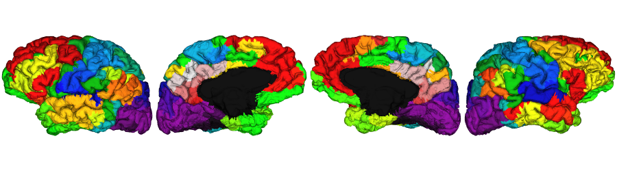

Extra: Economo labels
========================================================

.. tabs::

   .. code-tab:: py

    # Load annotation file
    annot = 'economo'
    annot_lh= dir_FS + '/label/lh.' + annot + '_mics.annot'
    annot_rh= dir_FS + '/label/rh.' + annot + '_mics.annot'
    label = np.concatenate((nb.freesurfer.read_annot(annot_lh)[0], nb.freesurfer.read_annot(annot_rh)[0]), axis=0)

    # plot labels on surface
    plot_hemispheres(pial_lh, pial_rh, array_name=label*mask, size=(900, 250), zoom=1.25, embed_nb=True, interactive=False, share='both',
                     nan_color=(0, 0, 0, 1), cmap='nipy_spectral', transparent_bg=False)

   .. code-tab:: r R

    # Plot the surface
    economo <- vis.subject.annot('freesurfer/', subjectID, 'economo_mics', 'both', surface='pial',
                               views=NULL, rglactions = list('no_vis'=T))
    plot_surface(economo, 'economo', img_only=TRUE)

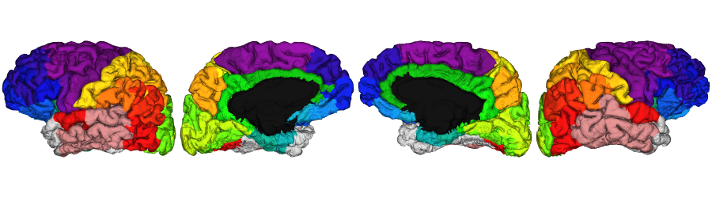

Download code examples: Surfaces
--------------------------------------------------------

:download:`Python Jupyter notebook: 'tutorial_surface_visualization.ipynb' <tutorial_surface_visualization.ipynb>`

:download:`Python source code: 'tutorial_surface_visualization.py' <tutorial_surface_visualization.py>`

:download:`R source code: 'tutorial_surface_visualization.R' <tutorial_surface_visualization.R>`
