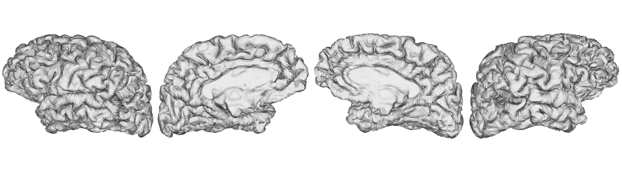

.. _surfaces:

.. title:: Visualization

*********************
Surface visualization
*********************

.. contents:: Table of Contents

This section describes the whereabouts of the main surfaces generated by the pipeline, and how you can visualized them using ``python`` or ``R``.
This example will use the subject ``HC001`` and session ``01`` from the MICs dataset, and all paths will be relative to the subject directory or ``out/micapipe/sub-HC001_ses01/``

In the following examples, we'll load and visualize single subject surfaces. Surfaces are distributed across different directories, namely:

.. parsed-literal::

    sub-HC001/
    └── ses-01
        ├── **surf**   # fsnative, fsaverage5, fsLR-32k, fsLR-5k surfaces**
        └── **maps**   # Thickness, curvature and quantitative maps**

Each native surface parcellation is found inside the subject's freesurfer directory and contains the string ``mics.annot``:

.. parsed-literal::

    freesurfer/
    └── sub-HC001_ses-01
        └── label
            ├── lh.schaefer-400_**mics.annot**
            └── rh.schaefer-400_**mics.annot**

Setting the environment
--------------------------------------------------------

This example uses the packages the python packages ``os``, ``matplotlib``, ``numpy``, ``nibabel``, ``matplotlib`` and ``brainspace``.
If you are interested in plotting surfaces with BrainSpace, check the corresponding `documentation <https://brainspace.readthedocs.io/en/latest/>`_!!

**R** libraries are ``RColorBrewer``, ``viridis``, ``fsbrain``, ``freesurferformats`` and ``rgl``.
For further information about managing and visualizing surfaces with **R**, check the `fsbrain vignettes <https://cran.r-project.org/web/packages/fsbrain/vignettes/fsbrain.html>`_, `fsbrain github repository <https://github.com/dfsp-spirit/fsbrain>`_, and
`freesurferformats <https://github.com/dfsp-spirit/freesurferformats>`_

The first step in both languages is to set the environment.

.. tabs::

   .. code-tab:: py

    # Set the environment
    import os
    import glob
    import numpy as np
    import nibabel as nib
    import seaborn as sns
    from brainspace.plotting import plot_hemispheres
    from brainspace.mesh.mesh_io import read_surface
    from brainspace.datasets import load_conte69

    # Set the working directory to the 'out' directory
    out='/data_/mica3/BIDS_MICs/derivatives' # <<<<<<<<<<<< CHANGE THIS PATH
    os.chdir(out)

    # This variable will be different for each subject
    sub='sub-HC001'
    ses='ses-01'
    subjectID=f'{sub}_{ses}'           # <<<<<<<<<<<< CHANGE THIS SUBJECT's ID
    subjectDir=f'micapipe_v0.2.0/{sub}/{ses}' # <<<<<<<<<<<< CHANGE THIS SUBJECT's DIRECTORY

    # Set paths and variables
    dir_FS = 'freesurfer/' + subjectID
    dir_surf = subjectDir + '/surf/'
    dir_maps = subjectDir + '/maps/'

    # Path to MICAPIPE
    micapipe=os.popen("echo $MICAPIPE").read()[:-1]

   .. code-tab:: r R

    # Set the environment        'R 4.3.1'
    require('RColorBrewer')      # version 1.1.3
    require('viridis')           # version 0.6.5
    require('fsbrain')           # version 0.5.5
    require('freesurferformats') # version 0.1.18
    require('rgl')               # version 1.2.8
    require('gifti')             # version 0.8.0

    # Define working directory and subject-specific information. CHANGE THESE      PATHS as appropriate.
    setwd('~/derivatives_RtD/')                      # working directory
    subjectID <- 'sub-HC001_ses-01'                  # subject ID
    subjectDir <- 'micapipe_v0.2.0/sub-HC001/ses-01' # subject directory path

    # Set paths for surface and morphometry data.
    dir_surf <- paste0(subjectDir, '/surf/')
    dir_maps <- paste0(subjectDir, '/maps/')

Load the surfaces
--------------------------------------------------------

.. tabs::

   .. code-tab:: py

    # Load native pial surface
    pial_lh = read_surface(dir_FS+'/surf/lh.pial', itype='fs')
    pial_rh = read_surface(dir_FS+'/surf/rh.pial', itype='fs')

    # Load native mid surface
    mid_lh = read_surface(dir_FS+'/surf/lh.midthickness.surf.gii', itype='gii')
    mid_rh = read_surface(dir_FS+'/surf/rh.midthickness.surf.gii', itype='gii')

    # Load native white matter surface
    wm_lh = read_surface(dir_FS+'/surf/lh.white', itype='fs')
    wm_rh = read_surface(dir_FS+'/surf/rh.white', itype='fs')

    # Load native inflated surface
    inf_lh = read_surface(dir_FS+'/surf/lh.inflated', itype='fs')
    inf_rh = read_surface(dir_FS+'/surf/rh.inflated', itype='fs')

    # Load fsaverage5
    fs5_lh = read_surface('freesurfer/fsaverage5/surf/lh.pial', itype='fs')
    fs5_rh = read_surface('freesurfer/fsaverage5/surf/rh.pial', itype='fs')

    # Load fsaverage5 inflated
    fs5_inf_lh = read_surface('freesurfer/fsaverage5/surf/lh.inflated', itype='fs')
    fs5_inf_rh = read_surface('freesurfer/fsaverage5/surf/rh.inflated', itype='fs')

    # Load fsLR 32k
    f32k_lh, f32k_rh = load_conte69()

    # Load fsLR 32k inflated
    f32k_inf_lh = read_surface(micapipe + '/surfaces/fsLR-32k.L.inflated.surf.gii', itype='gii')
    f32k_inf_rh = read_surface(micapipe + '/surfaces/fsLR-32k.R.inflated.surf.gii', itype='gii')

    # Load Load fsLR 5k
    f5k_lh = read_surface(micapipe + '/surfaces/fsLR-5k.L.surf.gii', itype='gii')
    f5k_rh = read_surface(micapipe + '/surfaces/fsLR-5k.R.surf.gii', itype='gii')

    # Load fsLR 5k inflated
    f5k_inf_lh = read_surface(micapipe + '/surfaces/fsLR-5k.L.inflated.surf.gii', itype='gii')
    f5k_inf_rh = read_surface(micapipe + '/surfaces/fsLR-5k.R.inflated.surf.gii', itype='gii')

   .. code-tab:: r R

    # Helper function to plot brain surfaces
    plot_surface <-function(brainMesh, legend='', view_angles=c('sd_lateral_lh', 'sd_medial_lh', 'sd_medial_rh', 'sd_lateral_rh'), img_only=FALSE) {
      try(img <- vis.export.from.coloredmeshes(brainMesh, colorbar_legend = legend, grid_like = FALSE, view_angles = view_angles, img_only = img_only, horizontal=TRUE))
      while (rgl.cur() > 0) { rgl.close() }; file.remove(list.files(path = getwd(), pattern = 'fsbrain'))
      return(img)
    }

    # Define color maps for brain visualization.
    RdYlGn <- colorRampPalette(brewer.pal(11,'RdYlGn'))
    bw <- colorRampPalette(c('black','gray65', 'white'))
    grays <- colorRampPalette(c('gray65', 'gray65', 'gray65'))
    
    # Set color limits for data visualization
    lft = limit_fun(1.5, 4)    # thickness color scale
    lfc = limit_fun(-0.2, 0.2) # curvature color scale

Morphology
--------------------------------------------------------

Two surface based morphological features are plotted here: cortical thickness and curvature. Both measurements are generates in three main surfaces, native, fsaverage5, fsLR-32k and fsLR-5k.

Thickness: Inflated native surface
========================================================

.. tabs::

   .. code-tab:: py

    # Load data
    th_lh = dir_maps + subjectID + '_hemi-L_surf-fsnative_label-thickness.func.gii'
    th_rh = dir_maps + subjectID + '_hemi-R_surf-fsnative_label-thickness.func.gii'
    th_nat = np.hstack(np.concatenate((nib.load(th_lh).darrays[0].data,
                                       nib.load(th_rh).darrays[0].data), axis=0))

    # Plot the surface
    plot_hemispheres(inf_lh, inf_rh, array_name=th_nat, size=(900, 250), color_bar='bottom', zoom=1.25, embed_nb=True, interactive=False, share='both',
                     nan_color=(0, 0, 0, 1), color_range=(1.5, 4), cmap="inferno", transparent_bg=False)

   .. code-tab:: r R

    # Define paths for left and right hemisphere thickness data using FreeSurfer's native format (fsnative).
    th.lh <- paste0(dir_maps, subjectID, "_hemi-L_surf-fsnative_label-thickness.func.gii")
    th.rh <- paste0(dir_maps, subjectID, "_hemi-R_surf-fsnative_label-thickness.func.gii")
    
    # Use 'vis.data.on.subject' to visualize thickness data on the inflated cortical surface, specific to FreeSurfer format.
    th_nat <- vis.data.on.subject('freesurfer', subjectID, morph_data_lh=th.lh, morph_data_rh=th.rh, surface='inflated', draw_colorbar = TRUE,
                                  views=NULL, rglactions = list('trans_fun'=limit_fun(1.5, 4), 'no_vis'=T),  makecmap_options = list('colFn'=inferno))
    
    # Display the native surface with mapped thickness data.
    plot_surface(th_nat, 'Thickness [mm]')

.. figure:: th_inf_nat.png
    :alt: alternate text
    :align: center

Thickness: ``fsaverage5``
========================================================

.. tabs::

   .. code-tab:: py

    # Load data
    th_lh_fs5 = dir_maps + subjectID + '_hemi-L_surf-fsaverage5_label-thickness.func.gii'
    th_rh_fs5 = dir_maps + subjectID + '_hemi-R_surf-fsaverage5_label-thickness.func.gii'
    th_fs5 = np.hstack(np.concatenate((nib.load(th_lh_fs5).darrays[0].data,
                                       nib.load(th_rh_fs5).darrays[0].data), axis=0))

    # Plot the surface
    plot_hemispheres(fs5_inf_lh, fs5_inf_rh, array_name=th_fs5, size=(900, 250), color_bar='bottom', zoom=1.25, embed_nb=True, interactive=False, share='both',
                             nan_color=(0, 0, 0, 1), color_range=(1.5, 4), cmap="inferno", transparent_bg=False)

   .. code-tab:: r R

    # This section provides a pathway for visualizing thickness without requiring FreeSurfer-formatted surfaces, utilizing the fsaverage5 template.
    # Load fsaverage5 surface paths for left and right hemispheres.
    fs5.lh <-  read.fs.surface(filepath = 'micapipe/surfaces/fsaverage5/surf/lh.inflated')
    fs5.rh <-  read.fs.surface(filepath = 'micapipe/surfaces/fsaverage5/surf/rh.inflated')
    
    # Define paths for thickness morphometric data on fsaverage5 for each hemisphere.
    fs5.lh.th <- paste0(dir_maps, subjectID, '_hemi-L_surf-fsaverage5_label-thickness.func.gii')
    fs5.rh.th <- paste0(dir_maps, subjectID, '_hemi-R_surf-fsaverage5_label-thickness.func.gii')
    
    # Create colored meshes for both hemispheres based on thickness data.
    cml.fs5.th <- coloredmesh.from.preloaded.data(fs5.lh, morph_data = lft(unlist(readgii(fs5.lh.th)$data)), hemi = 'lh', makecmap_options = list('colFn'=inferno))
    cmr.fs5.th <- coloredmesh.from.preloaded.data(fs5.rh, morph_data = lft(unlist(readgii(fs5.rh.th)$data)), hemi = 'rh', makecmap_options = list('colFn'=inferno))
    th_fs5 <- brainviews(views = 't4', coloredmeshes=list('lh'=cml.fs5.th, 'rh'=cmr.fs5.th), rglactions = list('no_vis'=T))
    
    # Display the fsaverage5 surface with thickness data.
    plot_surface(th_fs5, 'Thickness [mm]')

.. figure:: th_inf_fs5.png
    :alt: alternate text
    :align: center

Thickness: ``fsLR-32k``
========================================================

.. tabs::

   .. code-tab:: py

    # Load the data
    th_lh_fsLR32k = dir_maps + subjectID + '_hemi-L_surf-fsLR-32k_label-thickness.func.gii'
    th_rh_fsLR32k = dir_maps + subjectID + '_hemi-R_surf-fsLR-32k_label-thickness.func.gii'
    th_fsLR32k = np.hstack(np.concatenate((nib.load(th_lh_fsLR32k).darrays[0].data,
                                           nib.load(th_rh_fsLR32k).darrays[0].data), axis=0))

    # Plot the surface
    plot_hemispheres(f32k_inf_lh, f32k_inf_rh, array_name=th_fsLR32k, size=(900, 250), color_bar='bottom', zoom=1.25, embed_nb=True, interactive=False, share='both',
                             nan_color=(0, 0, 0, 1), color_range=(1.5, 4), cmap="inferno", transparent_bg=False)

   .. code-tab:: r R

    # Load fsLR-32k surface paths for left and right hemispheres.
    f32k.lh <-  read.fs.surface(filepath = 'micapipe/surfaces/fsLR-32k.L.surf.gii', format = "gii")
    f32k.rh <-  read.fs.surface(filepath = 'micapipe/surfaces/fsLR-32k.R.surf.gii', format = "gii")
    
    # Define paths for thickness morphometry data on fsLR-32k for each hemisphere.
    f32k.lh.th <- paste0(dir_maps, subjectID, '_hemi-L_surf-fsLR-32k_label-thickness.func.gii')
    f32k.rh.th <- paste0(dir_maps, subjectID, '_hemi-R_surf-fsLR-32k_label-thickness.func.gii')
    
    # Create colored meshes based on thickness data.
    cml.f32k.th <- coloredmesh.from.preloaded.data(f32k.lh, morph_data = lft(unlist(readgii(f32k.lh.th)$data)), hemi = 'lh', makecmap_options = list('colFn'=inferno))
    cmr.f32k.th <- coloredmesh.from.preloaded.data(f32k.rh, morph_data = lft(unlist(readgii(f32k.rh.th)$data)), hemi = 'rh', makecmap_options = list('colFn'=inferno))
    th_f32k <- brainviews(views = 't4', coloredmeshes=list('lh'=cml.f32k.th, 'rh'=cmr.f32k.th), rglactions = list('no_vis'=T))
    
    # Display the fsLR-32k surface with thickness data.
    plot_surface(th_f32k, 'Thickness [mm]')

Thickness: ``fsLR-5k``
========================================================

.. tabs::

   .. code-tab:: py

    # Load the data
    th_lh_fsLR5k = dir_maps + subjectID + '_hemi-L_surf-fsLR-5k_label-thickness.func.gii'
    th_rh_fsLR5k = dir_maps + subjectID + '_hemi-R_surf-fsLR-5k_label-thickness.func.gii'
    th_fsLR5k = np.hstack(np.concatenate((nib.load(th_lh_fsLR5k).darrays[0].data,
                                           nib.load(th_rh_fsLR5k).darrays[0].data), axis=0))

    # Plot the surface
    plot_hemispheres(f5k_inf_lh, f5k_inf_rh, array_name=th_fsLR5k, size=(900, 250), color_bar='bottom', zoom=1.25, embed_nb=True, interactive=False, share='both',
                             nan_color=(0, 0, 0, 1), color_range=(1.5, 4), cmap="inferno", transparent_bg=False)

   .. code-tab:: r R

    # Load fsLR-5k surface paths for left and right hemispheres.
    f5k.lh <-  read.fs.surface(filepath = 'micapipe/surfaces/fsLR-5k.L.surf.gii', format = "gii")
    f5k.rh <-  read.fs.surface(filepath = 'micapipe/surfaces/fsLR-5k.R.surf.gii', format = "gii")
    
    # Define paths for thickness morphometry data on fsLR-5k for each hemisphere.
    f5k.lh.th <- paste0(dir_maps, subjectID, '_hemi-L_surf-fsLR-5k_label-thickness.func.gii')
    f5k.rh.th <- paste0(dir_maps, subjectID, '_hemi-R_surf-fsLR-5k_label-thickness.func.gii')
    
    # Create colored meshes based on thickness data.
    cml.f5k.th <- coloredmesh.from.preloaded.data(f5k.lh, morph_data = lft(unlist(readgii(f5k.lh.th)$data)), hemi = 'lh', makecmap_options = list('colFn'=inferno))
    cmr.f5k.th <- coloredmesh.from.preloaded.data(f5k.rh, morph_data = lft(unlist(readgii(f5k.rh.th)$data)), hemi = 'rh', makecmap_options = list('colFn'=inferno))
    th_f5k <- brainviews(views = 't4', coloredmeshes=list('lh'=cml.f5k.th, 'rh'=cmr.f5k.th), rglactions = list('no_vis'=T))
    
    # Display the fsLR-5k surface with thickness data.
    plot_surface(th_f5k, 'Thickness [mm]')

.. figure:: th_inf_f5k.png
    :alt: alternate text
    :align: center

Curvature: Native inflated surface
========================================================

.. tabs::

   .. code-tab:: py

    # Load the data
    cv_lh = dir_maps + subjectID + '_hemi-L_surf-fsnative_label-curv.func.gii'
    cv_rh = dir_maps + subjectID + '_hemi-R_surf-fsnative_label-curv.func.gii'
    cv = np.hstack(np.concatenate((nib.load(cv_lh).darrays[0].data,
                                   nib.load(cv_rh).darrays[0].data), axis=0))

    # Plot the surface
    plot_hemispheres(inf_lh, inf_rh, array_name=cv, size=(900, 250), color_bar='bottom', zoom=1.25, embed_nb=True, interactive=False, share='both',
                             nan_color=(0, 0, 0, 1), color_range=(-0.2, 0.2), cmap='RdYlGn', transparent_bg=False)

   .. code-tab:: r R

    # Define paths for left and right hemisphere curvature data in FreeSurfer's native format (fsnative).
    cv.lh <- paste0(dir_maps, subjectID, '_hemi-L_surf-fsnative_label-curv.func.gii')
    cv.rh <- paste0(dir_maps, subjectID, '_hemi-R_surf-fsnative_label-curv.func.gii')
    
    # Use 'vis.data.on.subject' to visualize curvature on the subject's inflated surface.
    cv_nat <- vis.data.on.subject('freesurfer/', subjectID, morph_data_lh=cv.lh, morph_data_rh=cv.rh, surface='inflated', draw_colorbar = TRUE,
                                  views=NULL, rglactions = list('trans_fun'=limit_fun(-0.2, 0.2), 'no_vis'=T),  makecmap_options = list('colFn'=RdYlGn))
    
    # Display the native surface with mapped curvature data.
    plot_surface(cv_nat, 'Curvature [1/mm]')

.. figure:: cv_inf_nat.png
    :alt: alternate text
    :align: center

Curvature: ``fsaverage5``
========================================================

.. tabs::

   .. code-tab:: py

    # Load the data
    cv_lh_fs5 = dir_maps + subjectID + '_hemi-L_surf-fsaverage5_label-curv.func.gii'
    cv_rh_fs5 = dir_maps + subjectID + '_hemi-R_surf-fsaverage5_label-curv.func.gii'
    cv_fs5 = np.hstack(np.concatenate((nib.load(cv_lh_fs5).darrays[0].data,
                                       nib.load(cv_rh_fs5).darrays[0].data), axis=0))

    # Plot the surface
    plot_hemispheres(fs5_inf_lh, fs5_inf_rh, array_name=cv_fs5, size=(900, 250), color_bar='bottom', zoom=1.25, embed_nb=True, interactive=False, share='both',
                             nan_color=(0, 0, 0, 1), color_range=(-0.2, 0.2), cmap='RdYlGn', transparent_bg=False)

   .. code-tab:: r R

    # Load fsaverage5 surface paths for left and right hemispheres.
    fs5.lh <- read.fs.surface(filepath = 'micapipe/surfaces/fsaverage5/surf/lh.inflated')
    fs5.rh <- read.fs.surface(filepath = 'micapipe/surfaces/fsaverage5/surf/rh.inflated')
    
    # Define paths to the morphometry data on fsaverage5.
    fs5.lh.cv <- paste0(dir_maps, subjectID, '_hemi-L_surf-fsaverage5_label-curv.func.gii')
    fs5.rh.cv <- paste0(dir_maps, subjectID, '_hemi-R_surf-fsaverage5_label-curv.func.gii')
    
    # Generate colored meshes using morphometry data.
    cml_fs5 <- coloredmesh.from.preloaded.data(fs5.lh, morph_data = lfc(unlist(readgii(fs5.lh.cv)$data)), hemi = 'lh', makecmap_options = list('colFn'=RdYlGn))
    cmr_fs5 <- coloredmesh.from.preloaded.data(fs5.rh, morph_data = lfc(unlist(readgii(fs5.rh.cv)$data)), hemi = 'rh', makecmap_options = list('colFn'=RdYlGn))
    cv_fs5 <- brainviews(views = 't4', coloredmeshes=list('lh'=cml_fs5, 'rh'=cmr_fs5), rglactions = list('no_vis'=T))
    
    # Display the fsaverage5 surface with morphometry data.
    plot_surface(cv_fs5, 'Curvature [1/mm]')

.. figure:: cv_inf_fs5.png
    :alt: alternate text
    :align: center

Curvature: ``fsLR-32k``
========================================================

.. tabs::

   .. code-tab:: py

    # Load the data
    cv_lh_fsLR32k = dir_maps + subjectID + '_hemi-L_surf-fsLR-32k_label-curv.func.gii'
    cv_rh_fsLR32k = dir_maps + subjectID + '_hemi-R_surf-fsLR-32k_label-curv.func.gii'
    cv_fsLR32k = np.hstack(np.concatenate((nib.load(cv_lh_fsLR32k).darrays[0].data,
                                           nib.load(cv_rh_fsLR32k).darrays[0].data), axis=0))
    # Plot the surface
    plot_hemispheres(f32k_inf_lh, f32k_inf_rh, array_name=cv_fsLR32k, size=(900, 250), color_bar='bottom', zoom=1.25, embed_nb=True, interactive=False, share='both',
                             nan_color=(0, 0, 0, 1), color_range=(-0.2, 0.2), cmap='RdYlGn', transparent_bg=False)

   .. code-tab:: r R

    # Load fsLF-32k surface paths for left and right hemispheres.
    f32k.lh <- read.fs.surface(filepath = 'micapipe/surfaces/fsLR-32k.L.inflated.surf.gii')
    f32k.rh <- read.fs.surface(filepath = 'micapipe/surfaces/fsLR-32k.R.inflated.surf.gii')
    
    # Define paths to the morphometry data on fsLF32k.
    f32k.lh.cv <- paste0(dir_maps, subjectID, '_hemi-L_surf-fsLR-32k_label-curv.func.gii')
    f32k.rh.cv <- paste0(dir_maps, subjectID, '_hemi-R_surf-fsLR-32k_label-curv.func.gii')
    
    # Generate colored meshes using morphometry data.
    cml_f32k <- coloredmesh.from.preloaded.data(f32k.lh, morph_data = lfc(unlist(readgii(f32k.lh.cv)$data)), hemi = 'lh', makecmap_options = list('colFn'=RdYlGn))
    cmr_f32k <- coloredmesh.from.preloaded.data(f32k.rh, morph_data = lfc(unlist(readgii(f32k.rh.cv)$data)), hemi = 'rh', makecmap_options = list('colFn'=RdYlGn))
    cv.f32k <- brainviews(views = 't4', coloredmeshes=list('lh'=cml_f32k, 'rh'=cmr_f32k), rglactions = list('no_vis'=T))
    
    # Display the fsLR-32k surface with morphometry data.
    plot_surface(cv.f32k, 'Curvature [1/mm]')

Curvature: ``fsLR-5k``
========================================================

.. tabs::

   .. code-tab:: py

    # Load the data
    cv_lh_fsLR5k = dir_maps + subjectID + '_hemi-L_surf-fsLR-5k_label-curv.func.gii'
    cv_rh_fsLR5k = dir_maps + subjectID + '_hemi-R_surf-fsLR-5k_label-curv.func.gii'
    cv_fsLR5k = np.hstack(np.concatenate((nib.load(cv_lh_fsLR5k).darrays[0].data,
                                           nib.load(cv_rh_fsLR5k).darrays[0].data), axis=0))
    # Plot the surface
    plot_hemispheres(f5k_inf_lh, f5k_inf_rh, array_name=cv_fsLR5k, size=(900, 250), color_bar='bottom', zoom=1.25, embed_nb=True, interactive=False, share='both',
                             nan_color=(0, 0, 0, 1), color_range=(-0.2, 0.2), cmap='RdYlGn', transparent_bg=False)

   .. code-tab:: r R

    # Load fsLF-5k surface paths for left and right hemispheres.
    f5k.lh <- read.fs.surface(filepath = 'micapipe/surfaces/fsLR-5k.L.inflated.surf.gii')
    f5k.rh <- read.fs.surface(filepath = 'micapipe/surfaces/fsLR-5k.R.inflated.surf.gii')
    
    # Define paths to the morphometry data on fsLR-5k.
    f5k.lh.cv <- paste0(dir_maps, subjectID, '_hemi-L_surf-fsLR-5k_label-curv.func.gii')
    f5k.rh.cv <- paste0(dir_maps, subjectID, '_hemi-R_surf-fsLR-5k_label-curv.func.gii')
    
    # Generate colored meshes using morphometry data.
    cml_f5k <- coloredmesh.from.preloaded.data(f5k.lh, morph_data = lfc(unlist(readgii(f5k.lh.cv)$data)), hemi = 'lh', makecmap_options = list('colFn'=RdYlGn))
    cmr_f5k <- coloredmesh.from.preloaded.data(f5k.rh, morph_data = lfc(unlist(readgii(f5k.rh.cv)$data)), hemi = 'rh', makecmap_options = list('colFn'=RdYlGn))
    cv.f5k <- brainviews(views = 't4', coloredmeshes=list('lh'=cml_f5k, 'rh'=cmr_f5k), rglactions = list('no_vis'=T))
    
    # Display the fsLR-5k surface with morphometry data.
    plot_surface(cv.f5k, 'Curvature [1/mm]')

``fsLR-32k``
--------------------------------------------------------

``fsLR-32k``: Pial surface
========================================================

.. tabs::

   .. code-tab:: py

    # Native conte69 pial surface
    fsLR32k_pial_lh = read_surface(dir_surf+subjectID+'_hemi-L_space-nativepro_surf-fsLR-32k_label-pial.surf.gii', itype='gii')
    fsLR32k_pial_rh = read_surface(dir_surf+subjectID+'_hemi-R_space-nativepro_surf-fsLR-32k_label-pial.surf.gii', itype='gii')

    # Plot the surface
    plot_hemispheres(fsLR32k_pial_lh, fsLR32k_pial_rh, size=(900, 250), zoom=1.25, embed_nb=True, interactive=False, share='both',
                     nan_color=(0, 0, 0, 1), color_range=(1.5, 4), cmap='Greys', transparent_bg=False)

   .. code-tab:: r R

    # Load fsLR-32k pial surfaces for left and right hemispheres.
    f32k.pial.lh <- read.fs.surface(filepath = paste0(dir_surf, subjectID,'_hemi-L_space-nativepro_surf-fsLR-32k_label-pial.surf.gii') )
    f32k.pial.rh <- read.fs.surface(filepath = paste0(dir_surf, subjectID,'_hemi-R_space-nativepro_surf-fsLR-32k_label-pial.surf.gii') )
    
    # Prepare and plot the surfaces for visualization.
    cml = coloredmesh.from.preloaded.data(f32k.pial.lh, morph_data = rnorm(nrow(f32k.pial.lh$vertices),5,1), makecmap_options = list('colFn'=grays) )
    cmr = coloredmesh.from.preloaded.data(f32k.pial.rh, morph_data = rnorm(nrow(f32k.pial.rh$vertices),5,1), makecmap_options = list('colFn'=grays) )
    f32k.pial <- brainviews(views = 't4', coloredmeshes=list('lh'=cml, 'rh'=cmr), draw_colorbar = FALSE,
               rglactions = list('trans_fun'=limit_fun(-1, 1), 'no_vis'=T))
    plot_surface(f32k.pial, 'fsLR-32k pial')

``fsLR-32k``: Middle surface
========================================================

.. tabs::

   .. code-tab:: py

    # Native fsLR-32k midsurface
    fsLR32k_mid_lh = read_surface(dir_surf+subjectID+'_hemi-L_space-nativepro_surf-fsLR-32k_label-midthickness.surf.gii', itype='gii')
    fsLR32k_mid_rh = read_surface(dir_surf+subjectID+'_hemi-R_space-nativepro_surf-fsLR-32k_label-midthickness.surf.gii', itype='gii')

    # Plot the surface
    plot_hemispheres(fsLR32k_mid_lh, fsLR32k_mid_rh, size=(900, 250), zoom=1.25, embed_nb=True, interactive=False, share='both',
                     nan_color=(0, 0, 0, 1), color_range=(-1,1), cmap='Greys', transparent_bg=False)

   .. code-tab:: r R

    # Load fsLR-32k middle surfaces for left and right hemispheres.
    f32k.mid.lh <- read.fs.surface(filepath = paste0(dir_surf, subjectID,'_hemi-L_space-nativepro_surf-fsLR-32k_label-midthickness.surf.gii') )
    f32k.mid.rh <- read.fs.surface(filepath = paste0(dir_surf, subjectID,'_hemi-R_space-nativepro_surf-fsLR-32k_label-midthickness.surf.gii') )
    
    # Prepare and plot the surfaces for visualization.
    cml = coloredmesh.from.preloaded.data(f32k.mid.lh, morph_data = rnorm(nrow(f32k.mid.lh$vertices),5,1), makecmap_options = list('colFn'=grays) )
    cmr = coloredmesh.from.preloaded.data(f32k.mid.rh, morph_data = rnorm(nrow(f32k.mid.rh$vertices),5,1), makecmap_options = list('colFn'=grays) )
    f32k.mid <- brainviews(views = 't4', coloredmeshes=list('lh'=cml, 'rh'=cmr), draw_colorbar = FALSE,
               rglactions = list('trans_fun'=limit_fun(-1, 1), 'no_vis'=T))
    plot_surface(f32k.mid, 'fsLR-32k mid')

``fsLR-32k``: White matter surface
========================================================

.. tabs::

   .. code-tab:: py

    # Native fsLR-32k white matter
    fsLR32k_wm_lh = read_surface(dir_surf+subjectID+'_hemi-L_space-nativepro_surf-fsLR-32k_label-white.surf.gii', itype='gii')
    fsLR32k_wm_rh = read_surface(dir_surf+subjectID+'_hemi-R_space-nativepro_surf-fsLR-32k_label-white.surf.gii', itype='gii')

    # Plot the surface
    plot_hemispheres(fsLR32k_wm_lh, fsLR32k_wm_lh, size=(900, 250), zoom=1.25, embed_nb=True, interactive=False, share='both',
                     nan_color=(0, 0, 0, 1), color_range=(1.5, 4), cmap='Greys', transparent_bg=False)

   .. code-tab:: r R

    # Load fsLR-32k white surfaces for left and right hemispheres.
    f32k.wm.lh <- read.fs.surface(filepath = paste0(dir_surf, subjectID,'_hemi-L_space-nativepro_surf-fsLR-32k_label-white.surf.gii') )
    f32k.wm.rh <- read.fs.surface(filepath = paste0(dir_surf, subjectID,'_hemi-R_space-nativepro_surf-fsLR-32k_label-white.surf.gii') )
    
    # Prepare and plot the surfaces for visualization.
    cml <- coloredmesh.from.preloaded.data(f32k.wm.lh, morph_data = rnorm(nrow(f32k.wm.lh$vertices),5,1), makecmap_options = list('colFn'=grays) )
    cmr <- coloredmesh.from.preloaded.data(f32k.wm.rh, morph_data = rnorm(nrow(f32k.wm.rh$vertices),5,1), makecmap_options = list('colFn'=grays) )
    f32k.wm <- brainviews(views = 't4', coloredmeshes=list('lh'=cml, 'rh'=cmr), draw_colorbar = FALSE,
               rglactions = list('trans_fun'=limit_fun(-1, 1), 'no_vis'=T))
    plot_surface(f32k.wm, 'fsLR-32k white')

.. figure:: f32k_wm.png
    :alt: alternate text
    :align: center

Native sphere
--------------------------------------------------------

.. tabs::

   .. code-tab:: py

    # Native sphere
    sph_lh = read_surface(dir_surf+subjectID+'_hemi-L_surf-fsnative_label-sphere.surf.gii', itype='gii')
    sph_rh = read_surface(dir_surf+subjectID+'_hemi-R_surf-fsnative_label-sphere.surf.gii', itype='gii')

    # Plot the surface
    plot_hemispheres(sph_lh, sph_rh, array_name=cv, size=(900, 250), zoom=1.25, embed_nb=True, interactive=False, share='both',
                     nan_color=(0, 0, 0, 1), color_range=(-0.2, 0.2), cmap="gray", transparent_bg=False)

   .. code-tab:: r R

    # Load native sphere surfaces for left and right hemispheres.
    sph.lh <- read.fs.surface(filepath = paste0(dir_surf, subjectID,'_hemi-L_surf-fsnative_label-sphere.surf.gii'))
    sph.rh <- read.fs.surface(filepath = paste0(dir_surf, subjectID,'_hemi-R_surf-fsnative_label-sphere.surf.gii'))
    
    # Prepare colored meshes with curvature data.
    cml <- coloredmesh.from.preloaded.data(sph.lh, morph_data = lfc(readgii(cv.lh)$data$unknown), hemi = 'lh', makecmap_options = list('colFn'=bw))
    cmr <- coloredmesh.from.preloaded.data(sph.rh, morph_data = lfc(readgii(cv.rh)$data$unknown), hemi = 'rh', makecmap_options = list('colFn'=bw))
    sph.nat <- brainviews(views = 't4', coloredmeshes=list('lh'=cml, 'rh'=cmr), rglactions = list('no_vis'=T))
    
    # Display the native sphere surface with mapped curvature data.
    plot_surface(sph.nat, 'Native sphere curvature [1/mm]')

.. figure:: nat_sph.png
    :alt: alternate text
    :align: center

Superficial White Matter (SWM) in ``fsnative`` surface
--------------------------------------------------------

The superficial white matter surfaces are generated across 3 different surface layer from the white mater to 1, 2 and 3mm deeps.
Then each quantitative map from ``/maps`` is resample from ``fsnative`` to ``fsaverage5``, ``fsLR-32k`` and ``fsLR-5k``. In this example we will only plot the native surfaces.

SWM Surfaces
========================================================

.. tabs::

   .. code-tab:: py

    # Function to load and plot each SWM surfaces
    def plot_swm(mm='1'):
        # SWM fsnative 1mm
        swm_lh = read_surface(f'{dir_surf}{subjectID}_hemi-L_surf-fsnative_label-swm{mm}.0mm.surf.gii', itype='gii')
        swm_rh = read_surface(f'{dir_surf}{subjectID}_hemi-R_surf-fsnative_label-swm{mm}.0mm.surf.gii', itype='gii')

        # Plot the surface
        fig = plot_hemispheres(swm_lh, swm_rh, size=(900, 250), zoom=1.25, embed_nb=True, interactive=False, share='both',
                         nan_color=(0, 0, 0, 1), color_range=(1.5, 4), cmap='Greys', transparent_bg=False)
        return(fig)

   .. code-tab:: r R

    # Function to visualize SWM at varying depths (1mm, 2mm, 3mm).
    mesh_swm <- function(mm = '1') {
      
      # Load SWM surface data for specified depth for both hemispheres.
      f32k.swm.lh <- read.fs.surface(filepath = paste0(dir_surf, subjectID,'_hemi-L_surf-fsnative_label-swm',mm,'.0mm.surf.gii') )
      f32k.swm.rh <- read.fs.surface(filepath = paste0(dir_surf, subjectID,'_hemi-R_surf-fsnative_label-swm',mm,'.0mm.surf.gii') )
      
      # Generate colored meshes using random morphometric data for visualization.
      cml = coloredmesh.from.preloaded.data(f32k.swm.lh, morph_data = rnorm(nrow(f32k.swm.lh$vertices),5,1), makecmap_options = list('colFn'=grays) )
      cmr = coloredmesh.from.preloaded.data(f32k.swm.rh, morph_data = rnorm(nrow(f32k.swm.rh$vertices),5,1), makecmap_options = list('colFn'=grays) )
      bv <- brainviews(views = 't4', coloredmeshes=list('lh'=cml, 'rh'=cmr), draw_colorbar = FALSE,
                 rglactions = list('trans_fun'=limit_fun(-1, 1), 'no_vis'=T))
      return(bv)
    }

SWM 1mm
========================================================

.. tabs::

   .. code-tab:: py

    # SWM 1mm
    plot_swm(mm='1')

   .. code-tab:: r R

    # SWM 1mm
    plot_surface(mesh_swm('1'), 'Superficial white matter 1mm depth')

.. figure:: swm1.png
    :alt: alternate text
    :align: center

SWM 2mm
========================================================

.. tabs::

   .. code-tab:: py

    # SWM 2mm
    plot_swm(mm='2')

   .. code-tab:: r R

    # SWM 2mm
    plot_surface(mesh_swm('2'), 'Superficial white matter 2mm depth')

SWM 3mm
========================================================

.. tabs::

   .. code-tab:: py

    # SWM 3mm
    plot_swm(mm='3')

   .. code-tab:: r R

    # SWM 3mm
    plot_surface(mesh_swm('3'), 'Superficial white matter 3mm depth')

.. figure:: swm3.png
    :alt: alternate text
    :align: center

``/maps``: ``fsnative``, ``fsaverage5``, ``fsLR-32k`` and ``fsLR-5k``
--------------------------------------------------------

- Each file map with the extension ``func.gii`` corresponds to the data map from a NIFTI image at a certain deep.
- The deep from where it was mapped is in the name after the string ``label-``.
- The hemisphere is either ``L`` for left or ``R`` for right.
- The surface will match the number of points of the surface that corresponds that file map. The options are: ``fsnative``, ``fsLR-32k``, ``fsLR-5k`` and ``fsaverage5``.

.. admonition:: Note ❕

    For example the file below corresponds to the left native surface mapped from midthicknes of the T1map nifti image:
    ``sub-001_hemi-L_surf-fsnative_label-midthickness_T1map.func.gii``

- The maps on the surfaces ``fsnative``, ``fsLR-32k``, ``fsLR-5k``, can be plot on their native surface or on the standard surface (regular or inflated).

.. warning::
    There is **NO inherent smoothing** applied to the map. If the user desires smoothing, they should customize it according to their preferences and requirements.

.. tabs::

   .. code-tab:: py

    def load_qmri(qmri='', surf='fsLR-32k'):
        '''
        This function loads the qMRI intensity maps from midthickness surface
        '''
        # List the files
        files_lh = sorted(glob.glob(f"{dir_maps}/*_hemi-L_surf-{surf}_label-midthickness_{qmri}.func.gii"))
        files_rh = sorted(glob.glob(f"{dir_maps}/*_hemi-R_surf-{surf}_label-midthickness_{qmri}.func.gii"))

        # Load map data
        surf_map=np.concatenate((nib.load(files_lh[0]).darrays[0].data, nib.load(files_rh[0]).darrays[0].data), axis=0)

        return(surf_map)

    def plot_qmri(qmri='',  surf='fsLR-32k', label='pial', cmap='rocket', rq=(0.15, 0.95)):
        '''
        This function plots the qMRI intensity maps on the pial surface
        '''
        # Load the data
        map_surf = load_qmri(qmri, surf)
        print('Number of vertices: ' + str(map_surf.shape[0]))

        # Load the surfaces
        surf_lh=read_surface(f'{dir_surf}/{subjectID}_hemi-L_space-nativepro_surf-{surf}_label-{label}.surf.gii', itype='gii')
        surf_rh=read_surface(f'{dir_surf}/{subjectID}_hemi-R_space-nativepro_surf-{surf}_label-{label}.surf.gii', itype='gii')

        # Color range based in the quantiles
        crange=(np.quantile(map_surf, rq[0]), np.quantile(map_surf, rq[1]))

        # Plot the group T1map intensitites
        fig = plot_hemispheres(surf_lh, surf_rh, array_name=map_surf, size=(900, 250), color_bar='bottom', zoom=1.25, embed_nb=True, interactive=False, share='both',
                         nan_color=(0, 0, 0, 1), cmap=cmap, color_range=crange, transparent_bg=False, screenshot = False)
        return(fig)

   .. code-tab:: r R

    # Function to aggregate qMRI surface data paths for a given type and surface.
    surf_qmri <- function(qmri = '', surf = 'fsLR-32k') {
      
      # Compile file paths for qMRI data across hemispheres.
      files_lh <- paste0(dir_maps, subjectID, '_hemi-L_surf-', surf, '_label-midthickness_', qmri, '.func.gii')
      files_rh <- paste0(dir_maps, subjectID, '_hemi-R_surf-', surf, '_label-midthickness_', qmri, '.func.gii')
      
      # Combine left and right hemisphere data into a single array.
      surf_map <- c(readgii(files_lh)$data, readgii(files_rh)$data)
      
      return(surf_map)
    }
    
    # Function to visualize qMRI data on a specified brain surface.
    mesh_qmri <- function(qmri = '', surf = 'fsLR-32k', label = 'pial', rq = c(0.15, 0.95), cmap = inferno) {
      
      # Retrieve qMRI data mapped to specified surface.
      map_surf <- surf_qmri(qmri, surf)
      
      # Load associated surface data for visualization.
      surf.lh <- read.fs.surface(filepath = paste0(dir_surf, '/', subjectID, '_hemi-L_space-nativepro_surf-', surf, '_label-', label, '.surf.gii' ) )
      surf.rh <- read.fs.surface(filepath = paste0(dir_surf, '/', subjectID, '_hemi-R_space-nativepro_surf-', surf, '_label-', label, '.surf.gii' ) )
      
      # Determine data range for color mapping based on specified quantiles.
      crange <- quantile(c(map_surf[[1]], map_surf[[2]]), probs = rq)
      
      # Set the color limits
      lf= limit_fun(crange[1], crange[2])
      
      # Apply color mapping based on the data range.
      cml = coloredmesh.from.preloaded.data(surf.lh, morph_data = lf(map_surf[[1]]), makecmap_options = list('colFn'=cmap) )
      cmr = coloredmesh.from.preloaded.data(surf.rh, morph_data = lf(map_surf[[2]]), makecmap_options = list('colFn'=cmap) )
      
      # Generate and return the visual representation.
      return(brainviews(views = 't4', coloredmeshes=list('lh'=cml, 'rh'=cmr), draw_colorbar = FALSE, rglactions = list('trans_fun'=limit_fun(-1, 1), 'no_vis'=T)))
    }

T1map on ``fsnative``
========================================================

.. tabs::

   .. code-tab:: py

    # Plot of T1map on fsnative
    plot_qmri('T1map', 'fsnative')

   .. code-tab:: r R

    # T1 map on fsnative surface
    plot_surface(mesh_qmri(qmri = 'T1map', surf = 'fsnative'))

    # Plot of T1map on fsnative
    plot_qmri('T1map', 'fsnative')

.. figure:: qMRI_fsnat.png
    :alt: alternate text
    :align: center

T1map on ``fsaverage5`` native
========================================================

.. tabs::

   .. code-tab:: py

    # Plot of T1map on fsaverage5
    plot_qmri('T1map', 'fsaverage5')

   .. code-tab:: r R

    # T1 map on fsaverage5 surface
    plot_surface(mesh_qmri(qmri = 'T1map', surf = 'fsaverage5'))

T1map on ``fsLR-32k`` native
========================================================

.. tabs::

   .. code-tab:: py

    # Plot of T1map on fsLR-32k
    plot_qmri('T1map', 'fsLR-32k')

   .. code-tab:: r R

    # T1 map on fsLR-32k surface
    plot_surface(mesh_qmri(qmri = 'T1map', surf = 'fsLR-32k'))

T1map on ``fsLR-5k`` native
========================================================

.. tabs::

   .. code-tab:: py

    # Plot of T1map on fsLR-5k
    plot_qmri('T1map', 'fsLR-5k')

   .. code-tab:: r R

    # T1 map on fsLR-5k surface
    plot_surface(mesh_qmri(qmri = 'T1map', surf = 'fsLR-5k'))

.. figure:: qMRI_5k.png
    :alt: alternate text
    :align: center

``/maps``: ``fsaverage5``, ``fsLR-32k`` and ``fsLR-5k`` on standard
-------------------------------------------------------------------

T1map on ``fsaverage5`` standard
========================================================

.. tabs::

   .. code-tab:: py

    # Load the T1map data on fsaverage5
    map_data = load_qmri('T1map', 'fsaverage5')

    # Color range based in the quantiles
    crange=(np.quantile(map_data, 0.15), np.quantile(map_data, 0.95))

    # Plot data on standard surface
    plot_hemispheres(fs5_lh, fs5_rh, array_name=map_data, size=(900, 250), color_bar='bottom', zoom=1.25, embed_nb=True, interactive=False, share='both',
                             nan_color=(0, 0, 0, 1), color_range=crange, cmap="rocket", transparent_bg=False)

T1map on ``fsLR-32k`` stardard
========================================================

.. tabs::

   .. code-tab:: py

    # Load the T1map data on fsLR-32k
    map_data = load_qmri('T1map', 'fsLR-32k')

    # Plot data on standard surface
    plot_hemispheres(f32k_lh, f32k_rh, array_name=map_data, size=(900, 250), color_bar='bottom', zoom=1.25, embed_nb=True, interactive=False, share='both',
                             nan_color=(0, 0, 0, 1), color_range=crange, cmap="rocket", transparent_bg=False)

.. figure:: qMRI_32k_std.png
    :alt: alternate text
    :align: center

T1map on ``fsLR-5k`` stardard
========================================================

.. tabs::

   .. code-tab:: py

    # Load the T1map data on fsLR-5k
    map_data = load_qmri('T1map', 'fsLR-5k')

    # Plot data on standard surface
    plot_hemispheres(f5k_lh, f5k_rh, array_name=map_data, size=(900, 250), color_bar='bottom', zoom=1.25, embed_nb=True, interactive=False, share='both',
                             nan_color=(0, 0, 0, 1), color_range=crange, cmap="rocket", transparent_bg=False)

Atlas labels on surface
--------------------------------------------------------

All the native surface labels generated by *micapipe* are stored inside the subject's freesurfer directory.

Schaefer-400 labels
========================================================

.. tabs::

   .. code-tab:: py

    # Load annotation file
    annot = 'schaefer-400'
    annot_lh= dir_FS + '/label/lh.' + annot + '_mics.annot'
    annot_rh= dir_FS + '/label/rh.' + annot + '_mics.annot'
    label = np.concatenate((nib.freesurfer.read_annot(annot_lh)[0], nib.freesurfer.read_annot(annot_rh)[0]), axis=0)

    # plot labels on surface
    plot_hemispheres(pial_lh, pial_rh, array_name=label, size=(900, 250), zoom=1.25, embed_nb=True, interactive=False, share='both',
                     nan_color=(0, 0, 0, 1), cmap='nipy_spectral', transparent_bg=False)

   .. code-tab:: r R

    # Generate and visualize Schaefer-400 labels on the pial surface.
    schaefer.400 <- vis.subject.annot('freesurfer/', subjectID, 'schaefer-400_mics', 'both', surface='pial',
                               views=NULL, rglactions = list('no_vis'=T))

    plot_surface(schaefer.400, 'Schaefer-400')

Extra: Economo labels
========================================================

.. tabs::

   .. code-tab:: py

    # Load annotation file
    annot = 'economo'
    annot_lh= dir_FS + '/label/lh.' + annot + '_mics.annot'
    annot_rh= dir_FS + '/label/rh.' + annot + '_mics.annot'
    label = np.concatenate((nib.freesurfer.read_annot(annot_lh)[0], nib.freesurfer.read_annot(annot_rh)[0]), axis=0)

    # plot labels on surface
    plot_hemispheres(pial_lh, pial_rh, array_name=label, size=(900, 250), zoom=1.25, embed_nb=True, interactive=False, share='both',
                     nan_color=(0, 0, 0, 1), cmap='nipy_spectral', transparent_bg=False)

   .. code-tab:: r R

    # Generate and visualize Economo cortical labels on the pial surface.
    economo <- vis.subject.annot('freesurfer/', subjectID, 'economo_mics', 'both', surface='pial',
                               views=NULL, rglactions = list('no_vis'=T))
    plot_surface(economo, 'economo', img_only=TRUE)

Download code examples: Surfaces
--------------------------------------------------------

:download:`Python Jupyter notebook: 'tutorial_surface_visualization.ipynb' <tutorial_surface_visualization.ipynb>`

:download:`Python source code: 'tutorial_surface_visualization.py' <tutorial_surface_visualization.py>`

:download:`R source code: 'tutorial_surface_visualization.R' <tutorial_surface_visualization.R>`
