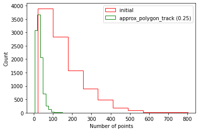
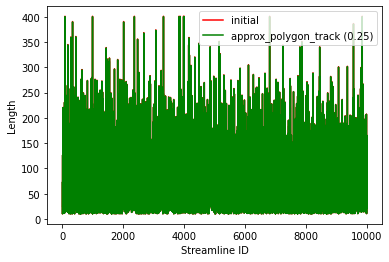

.. _tckdownsample:

.. title:: downsample tractograms

How to downsample a tractogram
#########################################################
By default, our pipeline does not save the tractograms or compress them after connectome calculations (``-SC``). The main reason is storage and computational time, which is a significant issue even when compression is used (for 10 million streamlines, uncompressed/compressed tractograms are ~14G/3G per case). When running the pipeline, it is possible to keep tractograms (optional argument ``-keep_tck``), but it’s up to the final user to compress them.
Below you can check the estimated sizes and computation times of different tractograms.

+-----------------+----------------------+---------------------+------------------------------+
| **Streamlines** | **Original size MB** | **Reduced size MB** | **Computing time (seconds)** |
+-----------------+----------------------+---------------------+------------------------------+
| 10,000          | 19                   | 4                   | 2.86                         |
+-----------------+----------------------+---------------------+------------------------------+
| 100,000         | 152                  | 32                  | 21.05                        |
+-----------------+----------------------+---------------------+------------------------------+
| 1,000,000       | 1,428                | 303                 | 479.52                       |
+-----------------+----------------------+---------------------+------------------------------+
| 10,000,000      | 1,4262               | 3,019               | 28920.14                     |
+-----------------+----------------------+---------------------+------------------------------+

Our example is based on the tutorial provided by DIPY called `Streamline length and size reduction <https://dipy.org/documentation/1.1.1./examples_built/streamline_length/>`_, but applied to ``micapipe``'s outputs.
After a tractogram was saved (using the flags ``-SC -keep_tck``), it could be downsampled using ``DIPY 1.5.0`` and ``nibabel 3.2.1`` tools.

We use the function ``approx_polygon_track`` which reduces the number of points on each streamline without changing the length or shape, thus is an ideal methods for lossy compression of streamlines.
The following figures show how this procedure reduces the number of points without changing the length, therefore reducing the file size (we used a 10,000 streamlines tractogram for the figures).

Changes before and after downsampling a tractogram
*********************************************************

Number of points
=========================================================

.. raw:: html

     

Streamlines lengths
=========================================================

.. raw:: html

     

Code example in python
*********************************************************

Bellow you can find an example of downsampling a tractogram. The code is mean to run from the ``derivatives/micapipe`` directory:

.. tabs::

   .. code-tab:: py
      :linenos:

      # Set enviroment
      import nibabel as nib
      from dipy.io.streamline import load_tractogram, save_tractogram
      from dipy.tracking.distances import approx_polygon_track

      # Function to downsample a tractogram
      def compress_tck(file_name):

          # Load reference anatomy
          reference_anatomy=nib.load(subject + '/dwi/' + subject + '_ses-01_space-dwi_desc-b0.nii.gz')

          # load tractogram
          bundle = load_tractogram(file_name, reference_anatomy, bbox_valid_check=False)
          print('This bundle has %d streamlines' % len(bundle))

          #tractogram size reduction
          bundle_downsampled = [approx_polygon_track(s, 0.25) for s in bundle.streamlines]

          # Replace the tractogram with the downsample
          bundle.streamlines = bundle_downsampled

          # Save new TCK file
          save_tractogram(bundle, file_name.replace('.tck','_downsampled.tck'))
          print('Downsampled tractogram was saved')

      # Compress a tractogram
      subject = 'sub-01'
      tck = subject + '/dwi/' + subject + '_space-dwi_desc-iFOD1-10M_tractography.tck'
      compress_tck(tck)
