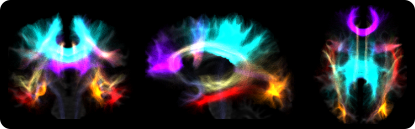

.. _autotract:

.. title:: Automatic Bundle Segmentation

Automatic Bundle Segmentation
================================================

This section describes the integrated automatic virtual dissection of the main brain tracts based on `auto_tracto <https://github.com/rcruces/auto_tracto/blob/master/Readme.md>`_. This tool was implemented using ANTs registration tools. The main purpose of the script ``03_auto_tracts.sh`` is to split a tck tractogram into `35 white matter tracts <https://github.com/lconcha/auto_tracto/blob/master/tract_definitions.md>`_, using already established automatic dissection protocols, which were manually tuned for optimal performance.

Derived from a full brain tractogram, 35 bundles are virtually dissected using the `LANIREM protocols <https://github.com/rcruces/auto_tracto/tree/master/lanirem/protocols>`_. The quality of the full brain tractogram will determine the quality of bundle separation. It is highly recommended to provide a tractogram with more than one million streamlines, and quality controlled for any errors. Strategies such as anatomically-contstrained tractography (ACT) and spherical deconvolution informed filtering of tractograms (SIFT), available in MRTrix3, should aid in obtaining such high-quality tractograms.



.. tabs::

      .. tab:: Processing steps

         - Non-linear (SyN) registration of the native FA map to the FA atlas (FMRIB58_FA_1mm)
         - Apply transformation to each bundle protocol to register them to the native FA space (DWI)
         - Verify stop criterion conditionals
         - Filter each white matter bundle according to the dissection protocols


      .. tab:: Usage

          There are two ways to run the *automatic bundle segmentation*. The first is integrated within the main script ``mica-pipe`` under the ``-SC`` module by adding a specific flag for this purpose, as shown in the following example:

         .. code-block:: bash
            :linenos:
            :caption: Integrated usage within ``mica-pipe -SC``
            :emphasize-lines: 6

            mica-pipe \
                 -sub <subject> \
                 -ses <session> \
                 -out <outputDirectory> \
                 -bids <BIDS> \
                 -SC -autoTract \
                 -tracts 40M

         Automatic bundle segmentation can also be performed using the stand alone script ``03_auto_tracts.sh``. Note that the stand alone script requires that all inputs are in DWI space.

         .. code-block:: bash
            :linenos:
            :caption: Example usage for standalone script

            03_auto_tracts.sh \
                 -tck sub-01_full_brain_tractogram.tck \
                 -outbase sub-01_tract \
                 -mask sub-01_binary_brain_mask.nii.gz \
                 -fa sub-01_FA_map.nii.gz \
                 -weights sub-01_full_brain_tractogram_weights.txt

         .. list-table::
            :widths: 10 1000
            :header-rows: 1

            * - **Options**
              - **Description**
            * - ``-tck`` ``path``
              - Full path to full tractogram file *tck* (ideally SIFTED)
            * - ``-outbase`` ``string``
              - Base name for all outputs
            * - ``-mask`` ``path``
              - Binary brain mask in the subject's DWI space
            * - ``fa`` ``path``
              - FA map in subject's DWI space. This input is used for registration to the template

         Additional **optional arguments** can also be specified:

         .. list-table::
            :widths: 10 1000
            :header-rows: 1

            * - **Optional argument**
              - **Description**
            * - ``-keep_tmp``
              - If specific, the temporary directory will not be delted after processing is completed
            * - ``-tmpDir`` ``path``
              - Specify location of temporary directory
            * - ``-minStreamlinesPerVoxel`` ``num``
              - Streamlines are truncated if voxel contains less than this number of streamlines. Default is 1
            * - ``-robust``
              - This option to run a ROBUST registration, at the expense of more computation time
            * - ``-weights`` ``path``
              - Use this option if you calculated a weights file from SIFT2
            * - ``threads`` ``num``
              - Number of threads (Default is 6)
            * - ``version```
              - Print software version


      .. tab:: Outputs

         Directories created by this script will be in the selected ``outbase``.
         The outputs generated by the micapipe integrated script are located in *<outputDirectory>/micapipe/<sub>/dwi/auto_tract*

         .. parsed-literal::
              dwi/auto_tract/
              ├── <sub>_space-dwi_desc-iFOD2-40M-SIFT2_AC.tck
              ├── <sub>_space-dwi_desc-iFOD2-40M-SIFT2_AF_L.tck
              ├── <sub>_space-dwi_desc-iFOD2-40M-SIFT2_AF_R.tck
              ├── <sub>_space-dwi_desc-iFOD2-40M-SIFT2_atlas2fa.nii.gz
              ├── <sub>_space-dwi_desc-iFOD2-40M-SIFT2_CC_MID.tck
              ├── <sub>_space-dwi_desc-iFOD2-40M-SIFT2_CGFP_L.tck
              ├── <sub>_space-dwi_desc-iFOD2-40M-SIFT2_CGFP_R.tck
              ├── <sub>_space-dwi_desc-iFOD2-40M-SIFT2_CGH_L.tck
              ├── <sub>_space-dwi_desc-iFOD2-40M-SIFT2_CGH_R.tck
              ├── <sub>_space-dwi_desc-iFOD2-40M-SIFT2_CG_L.tck
              ├── <sub>_space-dwi_desc-iFOD2-40M-SIFT2_CGR_L.tck
              ├── <sub>_space-dwi_desc-iFOD2-40M-SIFT2_CGR_R.tck
              ├── <sub>_space-dwi_desc-iFOD2-40M-SIFT2_CG_R.tck
              ├── <sub>_space-dwi_desc-iFOD2-40M-SIFT2_CST_L.tck
              ├── <sub>_space-dwi_desc-iFOD2-40M-SIFT2_CST_R.tck
              ├── <sub>_space-dwi_desc-iFOD2-40M-SIFT2_FA_L.tck
              ├── <sub>_space-dwi_desc-iFOD2-40M-SIFT2_FA_R.tck
              ├── <sub>_space-dwi_desc-iFOD2-40M-SIFT2_FMA.tck
              ├── <sub>_space-dwi_desc-iFOD2-40M-SIFT2_FMI.tck
              ├── <sub>_space-dwi_desc-iFOD2-40M-SIFT2_FX_L.tck
              ├── <sub>_space-dwi_desc-iFOD2-40M-SIFT2_FX_R.tck
              ├── <sub>_space-dwi_desc-iFOD2-40M-SIFT2_IFOF_L.tck
              ├── <sub>_space-dwi_desc-iFOD2-40M-SIFT2_IFOF_R.tck
              ├── <sub>_space-dwi_desc-iFOD2-40M-SIFT2_ILF_L.tck
              ├── <sub>_space-dwi_desc-iFOD2-40M-SIFT2_ILF_R.tck
              ├── <sub>_space-dwi_desc-iFOD2-40M-SIFT2_MLF_L.tck
              ├── <sub>_space-dwi_desc-iFOD2-40M-SIFT2_MLF_R.tck
              ├── <sub>_space-dwi_desc-iFOD2-40M-SIFT2_OR_L.tck
              ├── <sub>_space-dwi_desc-iFOD2-40M-SIFT2_OR_R.tck
              ├── <sub>_space-dwi_desc-iFOD2-40M-SIFT2_SLF_L.tck
              ├── <sub>_space-dwi_desc-iFOD2-40M-SIFT2_SLF_R.tck
              ├── <sub>_space-dwi_desc-iFOD2-40M-SIFT2_summary.txt
              ├── <sub>_space-dwi_desc-iFOD2-40M-SIFT2_TAPETUM.tck
              ├── <sub>_space-dwi_desc-iFOD2-40M-SIFT2_UF_L.tck
              ├── <sub>_space-dwi_desc-iFOD2-40M-SIFT2_UF_R.tck
              ├── <sub>_space-dwi_desc-iFOD2-40M-SIFT2_VOF_L.tck
              └── <sub>_space-dwi_desc-iFOD2-40M-SIFT2_VOF_R.tck

         The description (``desc-``) refers to the algorithm used to generate the tractogram (here, *iFOD2*), its number of streamlines (here, *40M*) and the filtering algorithm (here, *SIFT2*).

List of names and their acronyms obtained with the integrated automatic virtual dissection of the main brain tracts based on auto_tracto:

          +---------+--------------------------------------+
          | Acronym | Tract name                           |
          +=========+======================================+
          | AC      | Anterior Commissure                  |
          +---------+--------------------------------------+
          | AF      | Arcuate Fasciculus                   |
          +---------+--------------------------------------+
          | CC_MID  | Corpus Callosum middle portion       |
          +---------+--------------------------------------+
          | CGFP    | Cingulum, fronto-parietal portion    |
          +---------+--------------------------------------+
          | CGH     | Cingulum, parahippocampal portion    |
          +---------+--------------------------------------+
          | CG      | Cingulum, whole                      |
          +---------+--------------------------------------+
          | CGR     | Cingulum, rostral and subgenual      |
          +---------+--------------------------------------+
          | CST     | Corticospinal tract                  |
          +---------+--------------------------------------+
          | FA      | Frontal aslant                       |
          +---------+--------------------------------------+
          | FMA     | Forceps major of corpus callosum     |
          +---------+--------------------------------------+
          | FMI     |Forceps minor of corpus callosum      |
          +---------+--------------------------------------+
          | FX      | Fornix                               |
          +---------+--------------------------------------+
          | IFOF    | Inferior fronto-occipital fasciculus |
          +---------+--------------------------------------+
          | ILF     | Inferior longitudinal fasciculus     |
          +---------+--------------------------------------+
          | MLF     | Middle longitudinal fasciculus       |
          +---------+--------------------------------------+
          | OR      | Optic radiation                      |
          +---------+--------------------------------------+
          | SLF     | Superior longitudinal fasciculus     |
          +---------+--------------------------------------+
          | UF      | Uncinate fasciculus                  |
          +---------+--------------------------------------+
          | VOF     | Vertical occipital fasciculus        |
          +---------+--------------------------------------+
