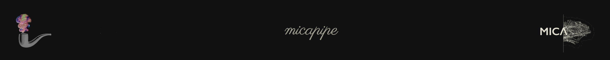
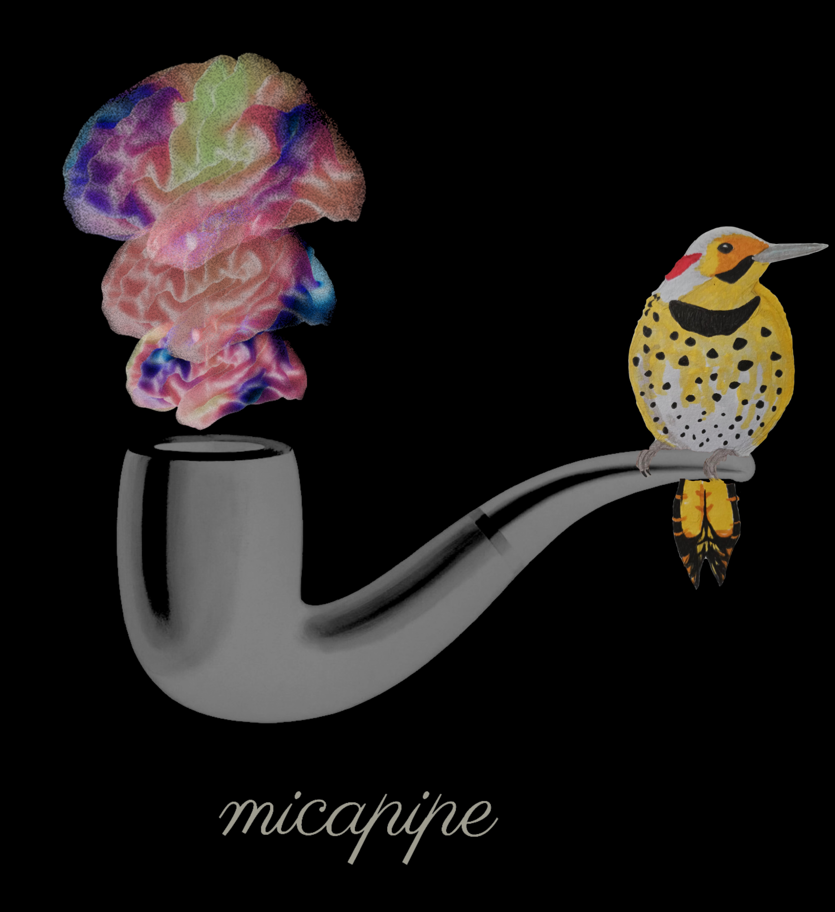
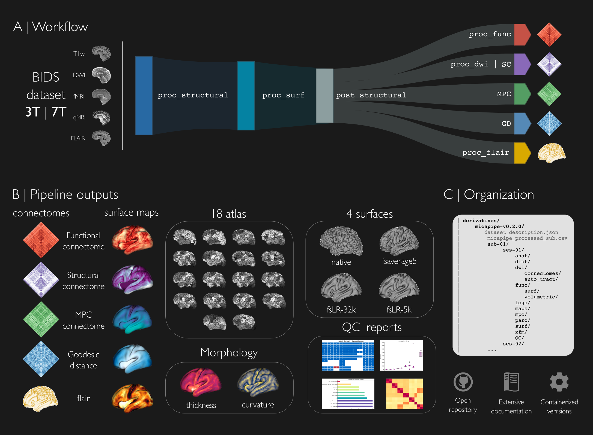

## Multimodal connectome processing with the `micapipe` ##

[`micapipe`](micapipe.readthedocs.io) is developed by [MICA-lab](https://mica-mni.github.io) at McGill University for use at [the Neuro](https://www.mcgill.ca/neuro/), McConnell Brain Imaging Center ([BIC](https://www.mcgill.ca/bic/)).  
> The main goal of this pipeline is to provide a semi-flexible and robust framework to process MRI images and generate ready to use modality based connectomes.    
> The `micapipe` utilizes a set of known software dependencies, different brain atlases, and software developed in our laboratory.
> The basic cutting edge processing of our pipelines aims the *T1 weighted images*, *resting state fMRI*, *quantitative MRI* and *Diffusion weighted images*.

## Documentation ##
You can find the documentation in [micapipe.readthedocs.io](http://micapipe.readthedocs.io/en/latest/)

## Container ##
You can find the latest version of the container in [Docker](https://hub.docker.com/r/micalab/micapipe/)

## Reference ##
> Raúl R. Cruces, Jessica Royer, Peer Herholz, Sara Larivière, Reinder Vos de Wael, Casey Paquola, Oualid Benkarim, Bo-yong Park, Janie Degré-Pelletier, Mark Nelson, Jordan DeKraker, Ilana Leppert, Christine Tardif, Jean-Baptiste Poline, Luis Concha, Boris C. Bernhardt. (2022). *Micapipe: a pipeline for multimodal neuroimaging and connectome analysis.* NeuroImage, 2022, 119612, ISSN 1053-8119. doi: https://doi.org/10.1016/j.neuroimage.2022.119612

## Workflow ##

## Advantages ##
-   Microstructure Profile Covariance ([Paquola C et al. Plos Biology 2019](https://doi.org/10.1371/journal.pbio.3000284)).  
-   Multiple parcellations (18 x 3).  
-   Includes cerebellum and subcortical areas.  
-   Surface based analysis.  
-   Latest version of software dependencies.  
-   Ready to use outputs.  
-   Easy to use.  
-   Standardized format (BIDS).  

## Dependencies ##
| *Software*   |     *Version*   | *Further info* |
|------------|---------------|--------------|  
| dcm2niix   | v1.0.20190902 | https://github.com/rordenlab/dcm2niix |
| Freesurfer | 7.3.2         | https://surfer.nmr.mgh.harvard.edu/ |
| FSl        | 6.0.2          | https://fsl.fmrib.ox.ac.uk/fsl/fslwiki |
| AFNI       | 20.3.03       | https://afni.nimh.nih.gov/download |
| MRtrix3    | 3.0.1         | https://www.mrtrix.org |
| ANTs       | 2.3.3         | https://github.com/ANTsX/ANTs |
| workbench  | 1.3.2         | https://www.humanconnectome.org/software/connectome-workbench |
| FIX        | 1.06          | https://fsl.fmrib.ox.ac.uk/fsl/fslwiki/FIX |
| R          | 3.6.3         | https://www.r-project.org |
| python     | 3.9.16         | https://www.python.org/downloads/ |
| conda     | 22.11.1         | https://docs.conda.io/en/latest/ |

 > The FIX package (FMRIB's ICA-based Xnoiseifier) requires FSL, R and one of MATLAB Runtime Component, full MATLAB or Octave. We recommend the use of the MATLAB Runtime Component. Additionally, it requires the following R libraries:  'kernlab 0.9.24','ROCR 1.0.7','class 7.3.14','party 1.0.25','e1071 1.6.7','randomForest 4.6.12'

### `python` mandatory packages `conda` ###
|       *Package*        |  *Version* |
|------------------------|------------|
| nibabel                |  4.0.2     |
| numpy                  |  1.21.5    |
| pandas                 |  1.4.4     |
| vtk                    |  9.2.2     |
| pyvirtualdisplay       |  3.0       |

### `python` mandatory packages `pip` ###
|       *Package*        |  *Version* |
|------------------------|------------|
| argparse               |  1.1       |
| brainspace             |  0.1.10    |
| tedana                 |  0.0.12    |
| pyhanko                |  0.17.2    |
| mapca                  |  0.0.3     |
| xhtml2pdf              |  0.2.9     |
| oscrypto               |  1.3.0     |
| tzdata                 |  2022.7    |
| arabic-reshaper        |  3.0.0     |
| cssselect2             |  0.7.0     |
| pygeodesic             |  0.1.8     |
| seaborn                |  0.11.2    |

### `R` libraries ###
| *library*    | *version* |
|:------------:|:--------:|
| scales       | 1.1.1    |
| randomForest | 4.6-14   |
| e1071        | 1.7-4    |
| party        | 1.3-5    |
| strucchange  | 1.5-2    |
| sandwich     | 2.5-1    |
| zoo          | 1.8-7    |
| modeltools   | 0.2-23   |
| mvtnorm      | 1.1-1    |
| class        | 7.3-17   |
| ROCR         | 1.0-11   |
| kernlab      | 0.9-29   |
| coin         | 1.3-1    |
| pkgconfig    | 2.0.3    |
| MASS         | 7.3-51.5 |
| libcoin      | libcoin  |
| Matrix       | 1.2-18   |
